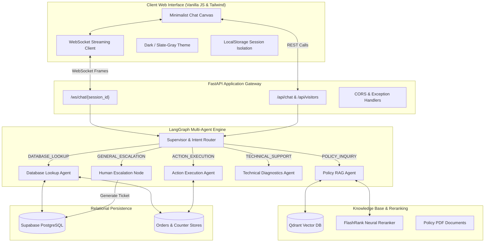

# ⚡ ResolveX — Enterprise AI Customer Support & Ticket Automation

[](https://www.python.org/)
[](https://fastapi.tiangolo.com)
[](https://github.com/langchain-ai/langgraph)
[](https://qdrant.tech/)
[](https://github.com/PrithivirajDamodaran/FlashRank)
[](https://supabase.com)
[](https://redis.io/)
[]()
[](LICENSE)
[](https://resolvex-ai.netlify.app/)
[](https://resolvex-bd8o.onrender.com)

> 🚀 **Live Demo:** Try the deployed multi-agent customer support assistant live at **[https://resolvex-ai.netlify.app/](https://resolvex-ai.netlify.app/)**  
> 🔗 **Backend API Service:** `https://resolvex-bd8o.onrender.com`

**ResolveX** is an enterprise-grade AI customer support and resolution platform designed to automate high-volume e-commerce customer inquiries (order tracking, payment reconciliation, policy inquiries, order cancellations, and technical diagnostics) with strict groundedness, conversational memory, and autonomous human escalation.

Built with **FastAPI**, **LangGraph Multi-Agent Architecture**, **Qdrant Vector DB**, **FlashRank Neural Reranking**, and **Supabase PostgreSQL**, ResolveX pairs a robust backend with a minimalist, high-contrast WebSocket client inspired by Gemini and ChatGPT.

---

## 🌐 Live Production Deployment

ResolveX is fully deployed and accessible in production across cloud environments:

| Component | Platform | Live URL / Endpoint | Details |
| :--- | :--- | :--- | :--- |
| **Frontend Interface** | **Netlify** | [https://resolvex-ai.netlify.app/](https://resolvex-ai.netlify.app/) | Hosted with global CDN caching, SPA redirects, and WebSocket streaming UI |
| **Backend Orchestrator & API** | **Render** | [https://resolvex-bd8o.onrender.com](https://resolvex-bd8o.onrender.com) | FastAPI multi-agent engine with LangGraph, Qdrant Vector Cloud, and Supabase integrations |
| **Interactive API Documentation** | **Render** | [https://resolvex-bd8o.onrender.com/docs](https://resolvex-bd8o.onrender.com/docs) | Complete OpenAPI / Swagger UI docs and interactive endpoint testing |

- **Frontend Interface:** Hosted on **Netlify** with global CDN caching, SPA redirects, and WebSocket streaming UI (`https://resolvex-ai.netlify.app/`).
- **Backend Orchestrator & API:** Hosted on **Render** running FastAPI with LangGraph, Qdrant, and Supabase integrations (`https://resolvex-bd8o.onrender.com`).
- **Interactive API Documentation:** Link to OpenAPI Swagger docs at `https://resolvex-bd8o.onrender.com/docs`.

---

## 🌟 Key Features

### 1. 🧠 Multi-Agent Orchestration (LangGraph)
- **Triage & Intent Router**: Accurately classifies customer intent (`POLICY_INQUIRY`, `DATABASE_LOOKUP`, `ACTION_EXECUTION`, `TECHNICAL_SUPPORT`, `GENERAL_ESCALATION`).
- **Domain Specialist Nodes**:
  - **Policy Agent**: Grounded RAG with Qdrant vector retrieval and citation attribution.
  - **Database Agent**: Transactional order and payment lookups with Pydantic validation.
  - **Action Agent**: Order cancellations and mutations with guardrails.
  - **Diagnostics Agent**: Multi-turn troubleshooting workflows for technical issues.
  - **Escalation Specialist**: Automatic human ticket creation (`TCK-XXXX`) with prioritized context pass-off.

### 2. 📚 Grounded Policy RAG Engine
- **Hybrid Retrieval & Reranking**: Combines dense vector search via Qdrant with cross-encoder neural reranking via **FlashRank** / Reciprocal Rank Fusion (RRF).
- **Document Chunking & Attribution**: Chunks corporate support policies (e.g., 30-day refund window, shipping terms, cancellation rules) with citation references.
- **Strict Groundedness**: Threshold validation ($\ge 0.75$) prevents hallucinations; queries falling below threshold cleanly escalate with generated ticket references.

### 3. 🛡️ Comprehensive Guardrails & Error Handling (9 Production Handlers)
1. **Input Sanitization**: Rejects blank queries, whitespace abuse, and prompt injection attempts.
2. **Deterministic Fallbacks**: Helpful messaging for unrecognized order IDs without tool exceptions.
3. **Slot-Filling**: Automatically prompts for missing identifiers when intent is recognized.
4. **Tool Fault Tolerance**: Comprehensive `try/except` wraps around external services with graceful error recovery.
5. **LLM Circuit Breaker**: Deterministic fallback messaging during API timeouts or rate limits.
6. **Knowledge Base Fallback**: Automatically escalates to human specialist when documentation yields zero confident matches.
7. **Safe State Transitions**: Recovers smoothly from corrupted agent states or unexpected routing payloads.
8. **WebSocket Heartbeats**: Auto-reconnect with non-blocking inline toasts instead of disruptive browser dialogs.
9. **Ticket Reference Tracking**: All escalations include unique tracking codes (e.g., `Ticket #TCK-XXXX`).

### 4. 💻 Modern Minimalist Frontend
- **Dual Aesthetic Themes**: Seamless switching between dark mode and comfortable slate-gray light mode with WCAG-compliant color contrast.
- **Bi-Directional Streaming**: Real-time token streaming and lifecycle state pills (`INIT`, `ROUTING`, `RAG`, `DONE`).
- **Client-Side Session Isolation**: Partitioned `localStorage` prevents cross-user message leakage.
- **Recent Chat Restoration**: Restores past conversations, telemetry pills, and active highlights upon clicking sidebar sessions.
- **Real-Time Telemetry Modal**: Round-trip client latency, dynamic token counts, and cross-encoder confidence percentages.
- **Live Visitor Counter**: Server-persisted global visitor counter (`GET /api/visitors`).

---

## 🏗️ System Architecture



---

## 📁 Repository Structure

```text
ResolveX/
├── Backend/
│   ├── agent/                 # LangGraph Multi-Agent Orchestrator
│   │   ├── graph.py           # StateGraph definition and lifecycle compilation
│   │   ├── nodes.py           # Specialist execution nodes (Policy, Orders, Action, Escalation)
│   │   ├── router.py          # Intent classification and triage logic
│   │   └── state.py           # Pydantic AgentState and conversation context
│   ├── api/                   # FastAPI Endpoints & WebSockets
│   │   ├── routes.py          # REST endpoints (/api/chat, /health, /api/visitors)
│   │   ├── schemas.py         # Request/Response validation schemas
│   │   └── websocket.py       # Bi-directional WebSocket stream handler
│   ├── db/                    # Persistence Clients
│   │   ├── qdrant_client.py   # Qdrant client & collection manager
│   │   └── supabase_client.py # Supabase PostgreSQL connection
│   ├── rag/                   # Knowledge Base & Ingestion
│   │   ├── chunking.py        # PDF text extractor and semantic chunker
│   │   ├── embeddings.py      # Dense vector embeddings generator
│   │   ├── ingest.py          # Knowledge base indexing script
│   │   ├── reranking.py       # FlashRank & RRF cross-encoder rerankers
│   │   └── retrieval.py       # Hybrid retrieval and threshold filtering
│   ├── schemas/               # Pydantic Domain Models
│   │   ├── customer.py        # Customer domain schema
│   │   ├── order.py           # Order and shipment schemas
│   │   ├── payment.py         # Payment transaction schemas
│   │   └── ticket.py          # Escalation ticket schema
│   ├── services/              # Business Service Layer
│   │   ├── customer_service.py
│   │   ├── order_service.py
│   │   ├── payment_service.py
│   │   └── ticket_service.py
│   └── main.py                # Application entrypoint & ASGI factory
├── data/                      # Data Stores & Mock Data
│   ├── knowledge_base/        # Policy PDF source files
│   ├── orders.json            # Seed orders database (ORD-1001, ORD-8832, etc.)
│   └── visitor_count.txt      # Global persistent visitor counter
├── database/migrations/       # PostgreSQL Schema & RLS Migrations
│   └── 001_initial_schema.sql # 7 relational tables, triggers, and indexes
├── docs/                      # Technical Documentation
│   ├── architecture.md        # Comprehensive system architectural reference
│   └── implementation_guide.md# Step-by-step milestone execution guide
├── frontend/                  # Modern Minimalist Web Client
│   ├── index.html             # Single-page chat interface & modals
│   └── script.js              # WebSocket client, telemetry & theme manager
├── tests/                     # Automated Test Suite (229 Tests)
│   ├── test_agent_nodes.py
│   ├── test_agent_orchestrator.py
│   ├── test_agent_router.py
│   ├── test_api_endpoints.py
│   ├── test_guardrails_error_handling.py
│   ├── test_rag_ingestion.py
│   └── ...
├── requirements.txt           # Python dependencies
└── README.md                  # Project documentation
```

---

## 🚀 Quickstart Guide

### 1. Prerequisites
- **Python 3.10+** (Tested on Python 3.12)
- Modern web browser (Chrome, Edge, Firefox, Safari)

### 2. Clone and Setup Environment
```bash
# Clone the repository
git clone https://github.com/princeVerma73/ResolveX.git
cd ResolveX

# Create and activate virtual environment
python -m venv .venv

# Windows:
.venv\Scripts\activate
# Linux/macOS:
source .venv/bin/activate

# Install dependencies
pip install -r requirements.txt
```

### 3. Configure Environment Variables
Copy `.env.example` to `.env` and provide your credentials:
```bash
cp .env.example .env
```
Example `.env`:
```env
# Supabase Configuration
SUPABASE_URL=https://your-project.supabase.co
SUPABASE_PUBLISHABLE_KEY=your-supabase-key

# Optional external LLM API keys
# GEMINI_API_KEY=your-gemini-key
# GROQ_API_KEY=your-groq-key
```

### 4. Ingest Policy Knowledge Base
Index the corporate policy documents into the local Qdrant vector database:
```bash
python -m Backend.rag.ingest
```

### 5. Start the Backend API Server
```bash
uvicorn Backend.main:app --host 0.0.0.0 --port 8000 --reload
```
The server will start on `http://localhost:8000`. You can inspect the interactive OpenAPI documentation at `http://localhost:8000/docs`.

### 6. Launch the Frontend Client
Simply open `frontend/index.html` in your web browser, or serve it using any HTTP server:
```bash
# Optional static file server:
python -m http.server 3000 --directory frontend
```
Navigate to `http://localhost:3000` to interact with ResolveX.

---

## 🧪 Testing & Verification

ResolveX includes a comprehensive suite of **229 automated tests** covering database schemas, Pydantic models, RAG retrieval and reranking, LangGraph agent nodes, REST/WebSocket API endpoints, and production guardrails.

To run the complete test suite:
```bash
pytest
```

To run a specific test category:
```bash
# Test multi-agent orchestration
pytest tests/test_agent_orchestrator.py

# Test guardrails and error handling
pytest tests/test_guardrails_error_handling.py

# Test RAG retrieval and reranking
pytest tests/test_rag_retrieval.py tests/test_rag_reranking.py
```

---

## 📡 API & WebSocket Reference

### REST Endpoints
| Method | Endpoint | Description |
| :--- | :--- | :--- |
| `GET` | `/health` | System diagnostics & connectivity check |
| `POST` | `/api/chat` | Synchronous REST chat interaction |
| `GET` | `/api/chat/history/{session_id}` | Retrieve persistent chat message turns |
| `GET` | `/api/visitors` | Global live visitor counter (persisted) |

### WebSocket Interface
- **Endpoint**: `ws://localhost:8000/ws/chat/{session_id}`
- **Client Frame**:
  ```json
  { "query": "Where is order ORD-8832?" }
  ```
- **Server Event Stream**:
  - `start`: Analysis initialized
  - `routing`: Current classified intent (`DATABASE_LOOKUP`, `POLICY_INQUIRY`, etc.)
  - `retrieval`: Chunks retrieved from knowledge base
  - `token`: Delta chunk streamed token-by-token
  - `done`: Final response, tokens, citations, and latency metrics
  - `error`: Handled error payload

---

## 📦 Mock Orders for Testing

The following seed orders are available in `data/orders.json` for validation:
- **`ORD-1001`**: Status `Delivered` | Carrier `FedEx` | Items: *1x Wireless Headphones*
- **`ORD-8832`**: Status `In Transit` | Carrier `FedEx` | Delivery: *Tomorrow* | Items: *1x Mechanical Keyboard*
- **`ORD-5511`**: Status `Processing` | Carrier `UPS` | Delivery: *In 2 days* | Items: *1x Smart Fitness Band*

---

## 📄 License
This project is open-source and licensed under the [MIT License](LICENSE).
