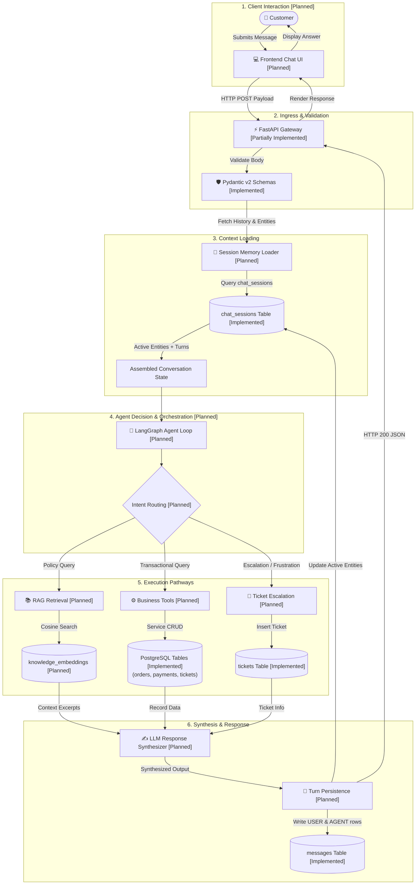
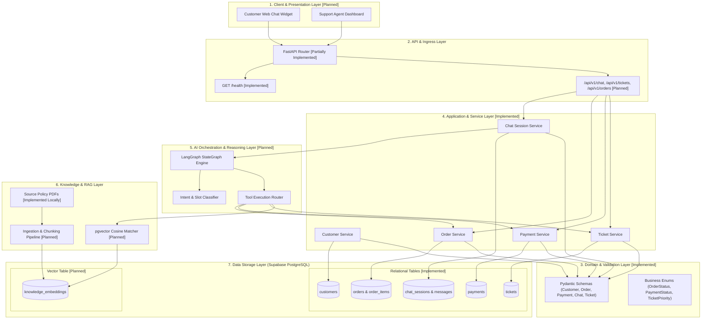
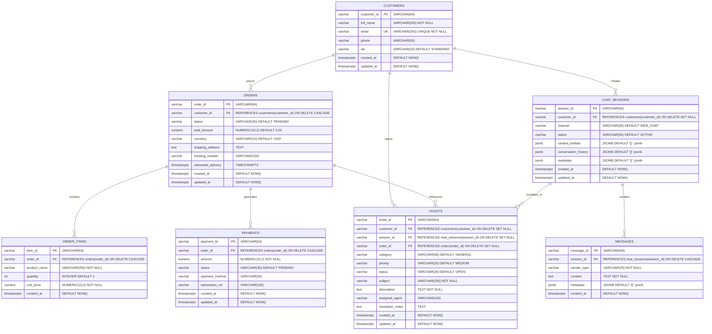
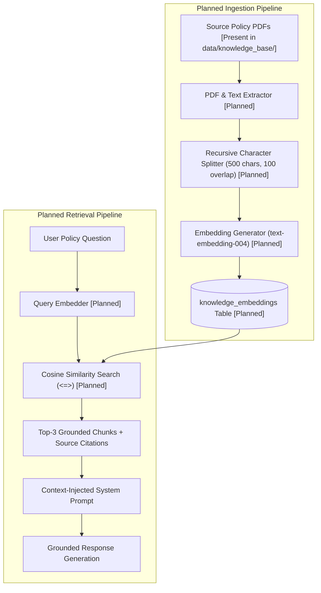
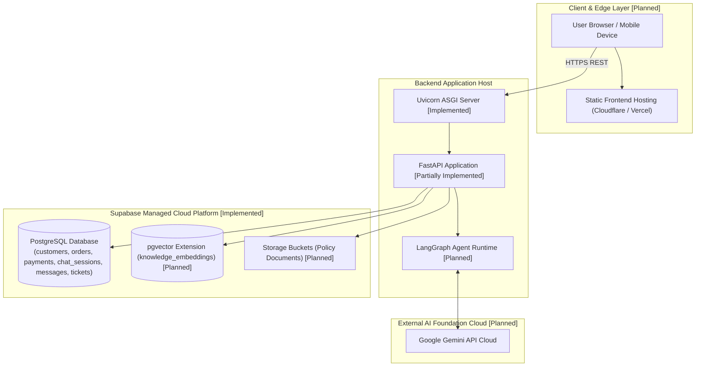
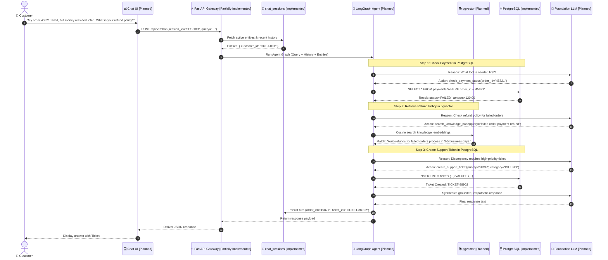
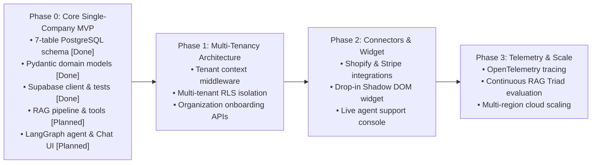

# 🏗️ ResolveX — System Architecture & Technical Design Reference

> **Document Type**: Technical System Architecture Specification  
> **Repository Baseline**: ResolveX Platform (`Python 3.10+`, `FastAPI`, `Supabase PostgreSQL`, `Pydantic v2`)  
> **Status**: Authoritative Architectural Reference (Distinguishing Verified Implemented Components from Planned Subsystems)

---

## 📑 Table of Contents

1. [Project Overview](#1-project-overview)
2. [System Scope & Implementation Status Matrix](#2-system-scope--implementation-status-matrix)
3. [Technology Stack & Status](#3-technology-stack--status)
4. [Complete End-to-End Workflow](#4-complete-end-to-end-workflow)
5. [High-Level System Architecture](#5-high-level-system-architecture)
6. [Backend Layered Architecture](#6-backend-layered-architecture)
7. [Database Architecture (Supabase PostgreSQL)](#7-database-architecture-supabase-postgresql)
8. [Chat & Conversation Memory Architecture](#8-chat--conversation-memory-architecture)
9. [RAG Architecture (Knowledge Retrieval Engine)](#9-rag-architecture-knowledge-retrieval-engine)
10. [AI Agent & LangGraph Orchestration Architecture](#10-ai-agent--langgraph-orchestration-architecture)
11. [Business Tools & Service Layer](#11-business-tools--service-layer)
12. [API Architecture & Gateway Design](#12-api-architecture--gateway-design)
13. [Frontend & Client Architecture](#13-frontend--client-architecture)
14. [Security Architecture & Data Protection](#14-security-architecture--data-protection)
15. [Error Handling, Resilience & Fallback Architecture](#15-error-handling-resilience--fallback-architecture)
16. [Testing Architecture & Verification Strategy](#16-testing-architecture--verification-strategy)
17. [Deployment & Infrastructure Architecture](#17-deployment--infrastructure-architecture)
18. [Complete Architectural Mermaid Diagrams](#18-complete-architectural-mermaid-diagrams)
19. [Future Evolution & Roadmap](#19-future-evolution--roadmap)

---

## 1. Project Overview

### 1.1 What is ResolveX?
**ResolveX** is an AI customer support and ticket automation system designed to handle routine e-commerce customer inquiries (such as order status checks, payment inquiries, and policy questions) while automatically escalating complex or high-friction issues to human support agents.

### 1.2 Problem Statement
- **High Repetitive Inquiry Volume**: Routine requests (order tracking, refund eligibility, shipping timelines) consume substantial support bandwidth.
- **Limitations of Keyword Chatbots**: Keyword bots struggle with conversational context (e.g., resolving pronouns such as *"Where is it?"*) and cannot query transactional databases.
- **LLM Hallucinations & Non-Determinism**: Generic LLMs can generate inaccurate policy explanations if not strictly grounded in company policy documents, and cannot perform transactional mutations reliably without structured validation.
- **Context Loss on Escalation**: When automated bots fail, customers are often transferred to human agents without context, forcing customers to repeat their issues.

### 1.3 Main Objectives
1. **Grounded Policy Retrieval**: Ground customer responses in official corporate policy documents to improve accuracy and provide source attribution.
2. **Deterministic Database Operations**: Use structured database queries and Pydantic validation for transactional lookups (order status, payment details, ticket creation).
3. **Conversational Memory**: Maintain multi-turn conversation state and extract key business entities (`order_id`, `customer_id`, `ticket_id`) across dialogue turns.
4. **Planned Multi-Step Reasoning**: Enable autonomous multi-step reasoning (e.g., verify order $\rightarrow$ check refund policy $\rightarrow$ create support ticket) via an agentic decision loop.
5. **Structured Human Escalation**: Automatically create categorized and prioritized support tickets when human intervention is required.

### 1.4 Intended Users
- **End Customers**: Users interacting with the support chat interface to check orders, ask policy questions, and resolve issues.
- **Human Support Agents**: Support specialists who review escalated tickets containing conversation history and diagnostic summaries.
- **System Administrators**: Technical staff managing policies, reviewing system performance, and monitoring database integrity.

---

## 2. System Scope & Implementation Status Matrix

Every component in ResolveX is classified into one of three architectural statuses:
- **Implemented**: Code exists in the repository, schema is migrated, and automated tests pass.
- **Partially Implemented**: Core skeleton or schemas exist; full business logic, routes, or integration is in progress.
- **Planned**: Architecturally designed and specified, but no functional implementation currently exists in the codebase.

### Subsystem Implementation Matrix

| Subsystem / Component | Architectural Status | Current Repository Artifact / Planned Target |
| :--- | :---: | :--- |
| **Supabase Client & Connection** | **Implemented** | [`Backend/db/supabase_client.py`](file:///c:/INTERNSHIP/ResolveX/Backend/db/supabase_client.py) |
| **Relational Schema (7 Tables)** | **Implemented** | [`database/migrations/001_initial_schema.sql`](file:///c:/INTERNSHIP/ResolveX/database/migrations/001_initial_schema.sql) |
| **PostgreSQL Triggers & Indexes** | **Implemented** | [`database/migrations/001_initial_schema.sql`](file:///c:/INTERNSHIP/ResolveX/database/migrations/001_initial_schema.sql) |
| **Row Level Security & Grants** | **Implemented** | [`database/migrations/001_initial_schema.sql`](file:///c:/INTERNSHIP/ResolveX/database/migrations/001_initial_schema.sql) |
| **Pydantic v2 Domain Schemas** | **Implemented** | [`Backend/schemas/`](file:///c:/INTERNSHIP/ResolveX/Backend/schemas) (`common`, `customer`, `order`, `payment`, `chat`, `ticket`) |
| **Policy Source Documents (PDFs)** | **Implemented** | [`data/knowledge_base/`](file:///c:/INTERNSHIP/ResolveX/data/knowledge_base) (7 local policy PDFs present) |
| **FastAPI Core Gateway** | **Partially Implemented** | [`Backend/main.py`](file:///c:/INTERNSHIP/ResolveX/Backend/main.py) (`GET /health` implemented; business routes planned) |
| **Verification Test Suite** | **Implemented** | [`tests/test_database_schema.py`](file:///c:/INTERNSHIP/ResolveX/tests/test_database_schema.py), [`test_domain_models.py`](file:///c:/INTERNSHIP/ResolveX/tests/test_domain_models.py), [`test_domain_services.py`](file:///c:/INTERNSHIP/ResolveX/tests/test_domain_services.py), [`test_services_foundation.py`](file:///c:/INTERNSHIP/ResolveX/tests/test_services_foundation.py), [`test_supabase_connection.py`](file:///c:/INTERNSHIP/ResolveX/tests/test_supabase_connection.py) |
| **Database Service Layer** | **Implemented** | [`Backend/services/`](file:///c:/INTERNSHIP/ResolveX/Backend/services) (`base.py`, `customer_service.py`, `order_service.py`, `payment_service.py`, `chat_service.py`, `ticket_service.py`) |
| **RAG Ingestion & pgvector Table** | *Planned* | `Backend/rag/` (`chunking.py`, `embeddings.py`, `retriever.py`, `knowledge_embeddings` table) |
| **LangGraph Agent Orchestrator** | *Planned* | `Backend/agents/` (`orchestrator.py`, `state.py`, `nodes.py`, `router.py`) |
| **Business Function Tools** | *Planned* | `Backend/tools/` (`order_tools.py`, `payment_tools.py`, `ticket_tools.py`, `rag_tools.py`) |
| **Conversation Memory Manager** | *Planned* | `Backend/memory/` (`session_memory.py`, `entity_tracker.py`) |
| **Business REST API Endpoints** | *Planned* | `Backend/api/routes/` (`chat.py`, `tickets.py`, `orders.py`, `payments.py`, `escalate.py`) |
| **Supabase Remote Storage Buckets**| *Planned* | Remote storage bucket provisioning for policy documents |
| **Frontend Web Chat & Dashboard** | *Planned* | `frontend/` (Chat UI, Agent ticket console) |

---

## 3. Technology Stack & Status

| Technology / Library | Current Status | Architectural Purpose | Technical Notes & Rationale |
| :--- | :---: | :--- | :--- |
| **Python 3.10+ / 3.12** | **Implemented** | Primary programming language | Standard runtime for backend logic, data validation, and AI integration. |
| **FastAPI** | **Implemented** (Core) | Asynchronous web framework & API gateway | High-performance ASGI framework with native Pydantic support and automatic OpenAPI documentation. |
| **Pydantic v2** | **Implemented** | Data modeling, validation, and schema definitions | Enforces data integrity, handles schema serialization, and defines tool calling contracts. |
| **Supabase PostgreSQL** | **Implemented** | Primary relational database | Cloud-hosted PostgreSQL providing ACID transactions, triggers, foreign key constraints, and RLS. |
| **supabase-py** (`>=2.0.0`) | **Implemented** | Supabase Python client SDK | Provides PostgREST and storage interfaces for database interactions. |
| **python-dotenv** (`>=1.0.0`) | **Implemented** | Environment variable management | Loads secrets from root `.env` without hardcoding credentials in source code. |
| **Pytest** | **Implemented** | Automated test suite | Used for connection testing, schema verification, and domain model validation. |
| **Supabase pgvector** | *Planned* | Vector similarity search for RAG | Native PostgreSQL extension for storing chunk embeddings (`knowledge_embeddings` table). |
| **Google Gemini (Primary Target)** | *Planned* | Planned foundation LLM | Target model family for natural language understanding and agent reasoning (configured via `GEMINI_API_KEY`). |
| **LangGraph / LangChain** | *Planned* | Agentic orchestration engine | Framework for building stateful, multi-step decision graphs and tool-calling loops. |
| **Embedding Models** | *Planned* | Dense vector embeddings generation | Target models include `text-embedding-004` (Gemini) or `sentence-transformers` for policy indexing. |
| **Modern Web UI** | *Planned* | Frontend client interface | Planned interactive chat interface and ticket management view in `frontend/`. |

---

## 4. Complete End-to-End Workflow

The diagram below illustrates the intended end-to-end request lifecycle, explicitly distinguishing between currently implemented database infrastructure and planned processing nodes.



---

## 5. High-Level System Architecture

ResolveX is structured into distinct functional layers:



---

## 6. Backend Layered Architecture

### 6.1 Directory Layout & Status

```
Backend/
├── main.py                     # [Partially Implemented] FastAPI entry point with GET /health
├── core/                       # [Planned] Application settings and global constants
│   └── __init__.py
├── db/                         # [Implemented] Supabase client initialization & connection check
│   ├── __init__.py             # Exports get_supabase_client, verify_connection
│   └── supabase_client.py      # Singleton client provider using .env configuration
├── schemas/                    # [Implemented] Pydantic v2 domain schemas and enums
│   ├── __init__.py             # Centralized schema exports
│   ├── common.py               # Enums (CustomerTier, OrderStatus, TicketStatus) & Base Schema
│   ├── customer.py             # CustomerCreate, CustomerUpdate, CustomerResponse
│   ├── order.py                # OrderCreate, OrderItemCreate, OrderResponse, OrderWithDetailsResponse
│   ├── payment.py              # PaymentCreate, PaymentUpdate, PaymentResponse
│   ├── chat.py                 # ChatSessionCreate, MessageCreate, ChatSessionWithMessagesResponse
│   └── ticket.py               # TicketCreate, TicketUpdate, TicketResponse
├── models/                     # [Planned] Database entity ORM/mapping abstractions
│   └── __init__.py
├── services/                   # [Implemented] Business logic & database operations
│   ├── __init__.py             # Exports BaseService and 5 domain services
│   ├── base.py                 # BaseService table wrapper and db error handler
│   ├── customer_service.py     # Customer CRUD and lookups
│   ├── order_service.py        # Order and order items CRUD with status guards
│   ├── payment_service.py      # Payment transaction management
│   ├── chat_service.py         # Chat session and message thread persistence
│   └── ticket_service.py       # Support ticket operations and human escalation
├── api/                        # [Planned] HTTP route handlers
│   ├── __init__.py
│   └── routes/
│       └── __init__.py
├── agents/                     # [Planned] LangGraph decision graph and nodes
│   └── __init__.py
├── tools/                      # [Planned] Business tool wrappers for agent execution
│   └── __init__.py
├── rag/                        # [Planned] PDF parsing, chunking, embeddings, and vector retrieval
│   └── __init__.py
├── memory/                     # [Planned] Session state manager and entity coreference tracker
│   └── __init__.py
└── utils/                      # [Planned] Helper functions, formatters, and custom loggers
    └── __init__.py
```

### 6.2 Architectural Separation
- **Schemas (`Backend/schemas/`)**: Pure validation layer. Converts raw incoming JSON payloads or Supabase rows into typed Python models with validation rules.
- **Services (`Backend/services/`)**: Encapsulates deterministic business operations (querying orders, calculating balances, inserting tickets).
- **Agents (`Backend/agents/`)**: Manages conversational reasoning, intent classification, and tool selection.
- **Database (`Backend/db/`)**: Manages the underlying client connection to Supabase PostgreSQL.

---

## 7. Database Architecture (Supabase PostgreSQL)

The database schema is defined in [`database/migrations/001_initial_schema.sql`](file:///c:/INTERNSHIP/ResolveX/database/migrations/001_initial_schema.sql).

### 7.1 Verified Relational Schema (7 Tables)



### 7.2 Detailed Table Specifications

1. **`customers` [Implemented]**:
   - `customer_id` (PK, `VARCHAR(64)`), `full_name` (`VARCHAR(255)`), `email` (`VARCHAR(255)` UNIQUE), `phone` (`VARCHAR(50)`), `tier` (`VARCHAR(20)` with `CHECK (tier IN ('STANDARD', 'GOLD', 'PLATINUM'))`), `created_at`, `updated_at`.
2. **`orders` [Implemented]**:
   - `order_id` (PK, `VARCHAR(64)`), `customer_id` (FK $\rightarrow$ `customers` ON DELETE CASCADE), `status` (`CHECK (status IN ('PENDING', 'PROCESSING', 'SHIPPED', 'DELIVERED', 'CANCELLED', 'FAILED', 'RETURNED'))`), `total_amount` (`CHECK (total_amount >= 0)`), `currency`, `shipping_address`, `tracking_number`, `estimated_delivery`, `created_at`, `updated_at`.
3. **`order_items` [Implemented]**:
   - `item_id` (PK, `VARCHAR(64)`), `order_id` (FK $\rightarrow$ `orders` ON DELETE CASCADE), `product_name`, `quantity` (`CHECK (quantity > 0)`), `unit_price` (`CHECK (unit_price >= 0)`), `created_at`.
4. **`payments` [Implemented]**:
   - `payment_id` (PK, `VARCHAR(64)`), `order_id` (FK $\rightarrow$ `orders` ON DELETE CASCADE), `amount` (`CHECK (amount >= 0)`), `status` (`CHECK (status IN ('PENDING', 'SUCCESS', 'FAILED', 'REFUNDED'))`), `payment_method` (`CHECK (payment_method IN ('CREDIT_CARD', 'DEBIT_CARD', 'PAYPAL', 'UPI', 'BANK_TRANSFER', 'WALLET'))`), `transaction_ref`, `created_at`, `updated_at`.
5. **`chat_sessions` [Implemented]**:
   - `session_id` (PK, `VARCHAR(64)`), `customer_id` (FK $\rightarrow$ `customers` ON DELETE SET NULL), `channel` (`DEFAULT 'WEB_CHAT'`), `status` (`CHECK (status IN ('ACTIVE', 'CLOSED', 'ARCHIVED'))`), `context_entities` (`JSONB NOT NULL DEFAULT '{}'::jsonb`), `conversation_history` (`JSONB NOT NULL DEFAULT '[]'::jsonb`), `metadata` (`JSONB NOT NULL DEFAULT '{}'::jsonb`), `created_at`, `updated_at`.
6. **`messages` [Implemented]**:
   - `message_id` (PK, `VARCHAR(64)`), `session_id` (FK $\rightarrow$ `chat_sessions` ON DELETE CASCADE), `sender_type` (`CHECK (sender_type IN ('USER', 'AGENT', 'SYSTEM', 'TOOL'))`), `content` (`TEXT NOT NULL`), `metadata` (`JSONB NOT NULL DEFAULT '{}'::jsonb`), `created_at`.
7. **`tickets` [Implemented]**:
   - `ticket_id` (PK, `VARCHAR(64)`), `customer_id` (FK $\rightarrow$ `customers` ON DELETE SET NULL), `session_id` (FK $\rightarrow$ `chat_sessions` ON DELETE SET NULL), `order_id` (FK $\rightarrow$ `orders` ON DELETE SET NULL), `category` (`CHECK (category IN ('ORDER', 'BILLING', 'TECHNICAL', 'POLICY', 'GENERAL', 'REFUND', 'SHIPPING'))`), `priority` (`CHECK (priority IN ('LOW', 'MEDIUM', 'HIGH', 'URGENT'))`), `status` (`CHECK (status IN ('OPEN', 'IN_PROGRESS', 'ESCALATED', 'RESOLVED', 'CLOSED'))`), `subject`, `description`, `assigned_agent`, `resolution_notes`, `created_at`, `updated_at`.

### 7.3 Planned Vector Storage Table (`knowledge_embeddings`)
The vector embeddings table is **Planned** and will be provisioned in the upcoming RAG implementation phase:
```sql
-- Planned DDL for Step 5 (RAG Pipeline)
CREATE EXTENSION IF NOT EXISTS vector;

CREATE TABLE IF NOT EXISTS knowledge_embeddings (
    id BIGSERIAL PRIMARY KEY,
    document_name VARCHAR(255) NOT NULL,
    section_title VARCHAR(255),
    chunk_content TEXT NOT NULL,
    embedding vector(768) NOT NULL,
    metadata JSONB NOT NULL DEFAULT '{}'::jsonb,
    created_at TIMESTAMPTZ NOT NULL DEFAULT NOW()
);
```

---

## 8. Chat & Conversation Memory Architecture

### 8.1 Implemented Relational Memory Schema
The persistent relational foundation for conversation history is **Implemented**:
- The `chat_sessions` table persists session state with `context_entities` (`JSONB NOT NULL DEFAULT '{}'::jsonb`), `conversation_history` (`JSONB NOT NULL DEFAULT '[]'::jsonb`), and session metadata.
- The `messages` table records each dialogue turn with role attribution (`USER`, `AGENT`, `SYSTEM`, `TOOL`) referencing `session_id`.
- Pydantic models in `Backend/schemas/chat.py` define validation models for creating and querying session and message records.

### 8.2 Planned Memory Manager & Coreference Logic [Planned]
Application-level memory orchestration is **Planned** for implementation in `Backend/memory/`:
1. **Session Memory Loader [Planned]**: Service logic to query `chat_sessions` and `messages`, formatting the recent $N$ dialogue turns into LLM prompt context.
2. **Entity Coreference Tracker [Planned]**: Logic to detect and bind active conversational entities (e.g. `active_order_id`, `active_customer_id`) from user dialogue into `context_entities`.
3. **Turn Persistence Hook [Planned]**: Post-response execution to update `context_entities` JSONB and insert dialogue rows into `messages`.

---

## 9. RAG Architecture (Knowledge Retrieval Engine)

### 9.1 Current Implementation (Source Documents)
The repository contains 7 official corporate policy documents in PDF format in [`data/knowledge_base/`](file:///c:/INTERNSHIP/ResolveX/data/knowledge_base):
- `refund_policy.pdf` (30-day return conditions, inspection processes)
- `cancellation_policy.pdf` (Order cancellation windows prior to dispatch)
- `shipping_policy.pdf` (Standard vs. express delivery timelines, regional rates)
- `payment_policy.pdf` (Accepted payment methods, failed charges, double-charge resolutions)
- `account_policy.pdf` (Password resets, security, account management)
- `faq.pdf` & `support_guidelines.pdf` (Support working hours, SLA definitions, escalation criteria)

### 9.2 Planned Implementation (Ingestion & Retrieval Pipeline)
The upcoming RAG pipeline is **Planned** to provide grounded answers:



- **Grounding Goal**: Designed to retrieve policy excerpts and provide citations (e.g. `[refund_policy.pdf#Section-2]`) to reduce hallucination and improve factual accuracy.

---

## 10. AI Agent & LangGraph Orchestration Architecture

The AI agent orchestrator is **Planned** and will be constructed using **LangGraph** to manage multi-step reasoning.

```mermaid
flowchart TD
    Start([User Message Received]) --> Node_Context[Node: Load Context & Entities [Planned]]
    Node_Context --> Node_Intent[Node: Intent Classifier [Planned]]

    Node_Intent --> Router{Intent Classification}

    Router -->|Policy Inquiry| Node_RAG[Node: RAG Document Search [Planned]]
    Router -->|Order Inquiry| Node_Order[Node: check_order_status Tool [Planned]]
    Router -->|Payment Inquiry| Node_Payment[Node: check_payment_status Tool [Planned]]
    Router -->|Escalation Request| Node_Escalate[Node: Human Escalation [Planned]]
    Router -->|General / Greeting| Node_General[Node: Conversational Response [Planned]]

    Node_Order --> CheckResult{Tool Result Valid?}
    Node_Payment --> CheckResult
    Node_RAG --> CheckResult

    CheckResult -->|Success| Node_Synth[Node: Synthesize Response [Planned]]
    CheckResult -->|Missing Parameter| Node_Ask[Node: Ask Clarification [Planned]]
    CheckResult -->|Database / Tool Error| Node_Escalate

    Node_Escalate --> Node_CreateTicket[Node: Insert Escalated Ticket in DB [Planned]]
    Node_CreateTicket --> Node_Synth

    Node_Synth --> Node_Save[Node: Persist Message & Update State [Planned]]
    Node_Ask --> Node_Save
    Node_General --> Node_Save

    Node_Save --> End([Return Response])
```

### 10.1 Planned Agent State Definition
```python
# Planned LangGraph State Schema
from typing import Sequence, TypedDict
from langchain_core.messages import BaseMessage

class AgentState(TypedDict):
    session_id: str
    customer_id: str | None
    messages: Sequence[BaseMessage]
    current_intent: str | None
    extracted_entities: dict
    retrieved_documents: list[dict]
    tool_observations: list[dict]
    requires_escalation: bool
    escalation_reason: str | None
```

---

## 11. Business Tools & Service Layer

The service layer cleanly separates non-deterministic language generation from deterministic database queries. Domain services are **Implemented** in `Backend/services/`, providing validated, type-safe operations ready for LangGraph agent tool bindings in Step 6.

### 11.1 Implemented Domain Services (`Backend/services/`)

| Domain Service Class | Implementation Status | Bound PostgreSQL Tables | Primary Domain Methods | Invariant Guards & Protections |
| :--- | :---: | :--- | :--- | :--- |
| [`CustomerService`](file:///c:/INTERNSHIP/ResolveX/Backend/services/customer_service.py) | **Implemented** | `customers` | `get_customer_by_id`, `get_customer_by_email`, `create_customer`, `update_customer` | Raises `ResourceNotFoundError` for missing customers; auto-generates IDs (`CUST-...`). |
| [`OrderService`](file:///c:/INTERNSHIP/ResolveX/Backend/services/order_service.py) | **Implemented** | `orders`, `order_items`, `payments` | `get_order_by_id`, `get_order_items`, `get_order_with_details`, `create_order`, `update_order_status` | Forbids cancelling `DELIVERED` orders; forbids shipping `CANCELLED` orders. |
| [`PaymentService`](file:///c:/INTERNSHIP/ResolveX/Backend/services/payment_service.py) | **Implemented** | `payments` | `get_payment_by_id`, `get_payments_by_order_id`, `create_payment`, `verify_payment_status`, `update_payment_status` | Blocks state modifications on `REFUNDED` transactions. |
| [`ChatService`](file:///c:/INTERNSHIP/ResolveX/Backend/services/chat_service.py) | **Implemented** | `chat_sessions`, `messages` | `create_session`, `get_session`, `update_session`, `add_message`, `get_messages`, `get_session_with_messages` | Validates session existence before message insertion; maintains chronological order. |
| [`TicketService`](file:///c:/INTERNSHIP/ResolveX/Backend/services/ticket_service.py) | **Implemented** | `tickets` | `create_ticket`, `get_ticket_by_id`, `get_tickets_by_customer_id`, `update_ticket_status`, `escalate_ticket` | Forbids escalating `CLOSED` tickets; elevates priority to `URGENT` with audit notes. |

### 11.2 Planned Business Tool Wrappers (`Backend/tools/` [Planned])

| Planned Agent Tool Function | Status | Underlying Implemented Service Method | Operation Type | Planned Input Parameters |
| :--- | :---: | :--- | :--- | :--- |
| `check_order_status` | *Planned* | `OrderService.get_order_with_details(order_id)` | Read (SELECT) | `order_id: str` |
| `check_payment_status` | *Planned* | `PaymentService.get_payment_by_id(payment_id)` | Read (SELECT) | `order_id: str` or `payment_id: str` |
| `create_support_ticket` | *Planned* | `TicketService.create_ticket(payload)` | Write (INSERT) | `customer_id`, `subject`, `description`, `category`, `priority` |
| `get_delivery_status` | *Planned* | `OrderService.get_order_by_id(order_id)` | Read (SELECT) | `order_id: str` |
| `search_knowledge_base` | *Planned* | `KnowledgeRetriever.search(query, top_k)` | Read (Vector Match) | `query: str`, `top_k: int = 3` |
| `escalate_to_human` | *Planned* | `TicketService.escalate_ticket(ticket_id, ...)` | Write (UPDATE/INSERT) | `ticket_id: str` or `session_id: str`, `reason: str` |

---

## 12. API Architecture & Gateway Design

FastAPI serves as the API gateway. Only verified routes are listed as Implemented.

### 12.1 Endpoint Status & Specification

| Method | Endpoint | Status | Description | Request Payload | Response Schema |
| :--- | :--- | :---: | :--- | :--- | :--- |
| `GET` | `/health` | **Implemented** | Lightweight health check endpoint | None | `{"status": "ok"}` |
| `POST` | `/api/v1/chat` | *Planned* | Process conversational customer message | `{"session_id": "...", "message": "..."}` | `ChatSessionWithMessagesResponse` |
| `GET` | `/api/v1/tickets` | *Planned* | Query support tickets | Query parameters (`status`, `customer_id`) | `list[TicketResponse]` |
| `POST` | `/api/v1/tickets` | *Planned* | Create new support ticket | `TicketCreate` | `TicketResponse` |
| `GET` | `/api/v1/tickets/{id}` | *Planned* | Fetch individual ticket details | Path parameter `ticket_id` | `TicketResponse` |
| `GET` | `/api/v1/orders/{id}` | *Planned* | Look up order with line items & payment | Path parameter `order_id` | `OrderWithDetailsResponse` |
| `GET` | `/api/v1/payments/{id}` | *Planned* | Look up payment transaction status | Path parameter `payment_id` | `PaymentResponse` |
| `POST` | `/api/v1/escalate` | *Planned* | Force human escalation & ticket creation | `{"session_id": "...", "reason": "..."}` | `TicketResponse` |

---

## 13. Frontend & Client Architecture

The frontend is **Planned** and will reside in `frontend/`.

### 13.1 Planned Interfaces
1. **Customer Support Chat Widget**:
   - Multi-turn conversational interface displaying messages, loading indicators, and source citation chips.
   - Dynamic UI cards rendering order status details and ticket reference badges.
2. **Support Agent Console**:
   - Queue view listing open and escalated tickets from the `tickets` table.
   - Detailed view rendering customer profile, order history, and full chat session transcript from `chat_sessions`.

---

## 14. Security Architecture & Data Protection

### 14.1 Current Security Controls [Implemented]
- **Environment Variable Protection**: Secrets (`SUPABASE_URL`, `SUPABASE_PUBLISHABLE_KEY`) are managed via `.env` using `python-dotenv` and excluded from version control.
- **Two-Gate Database Security Model**:
  - **Gate 1 (PostgreSQL Role Privileges)**: PostgREST queries using the publishable key assume the `anon` role. Table-level DML privileges are explicitly granted in the migration.
  - **Gate 2 (Row Level Security)**: `ALTER TABLE ... ENABLE ROW LEVEL SECURITY` is enabled across all 7 core tables with idempotent RLS policies.
- **Pydantic Type Coercion & Validation**: All domain inputs (email format, positive quantities, non-negative monetary amounts, valid enum choices) are validated before reaching the database.

### 14.2 Planned Security Objectives & Controls [Planned]
- **Prompt Injection Mitigations**: System prompts will use boundary delimiters and instructions to prevent user overrides. (Requires implementation and testing).
- **Service Role Isolation**: Administrative mutations will be restricted to backend service calls using `SUPABASE_SERVICE_ROLE_KEY`.
- **PII Masking**: Planned filtering for sensitive payment transaction references and customer phone numbers in logs.

---

## 15. Error Handling, Resilience & Fallback Architecture

The system's error handling design provides structured fallbacks for runtime exceptions:

| Failure Scenario | Root Cause | Detection Point | Planned Fallback Strategy |
| :--- | :--- | :--- | :--- |
| **Invalid Order ID** | Typo in ID (e.g. `#99999`) | Service query returns empty result | Agent politely informs the customer: *"I couldn't find order #99999. Please double-check your order number."* |
| **Missing Parameter** | User asks *"Where is my item?"* without ID | Slot extraction detects empty `order_id` | Agent checks `context_entities`; if not found, asks the user for their Order ID. |
| **Database Disconnect** | Network timeout or Supabase outage | `try-except` block in database client | Traps exception, logs error, creates an emergency support ticket, and provides an incident reference to the user. |
| **Low-Confidence RAG Result** | Out-of-scope question | Cosine similarity score $< 0.65$ | Agent avoids making up answers: *"I don't have policy information on that topic. Would you like me to connect you with our support team?"* |
| **LLM Provider Timeout** | Upstream AI API latency $> 8\text{s}$ | Asynchronous timeout handler | Returns a graceful retry message and logs the state. |

---

## 16. Testing Architecture & Verification Strategy

### 16.1 Active Test Suites in Repository
The repository contains 3 active test suites covering connection setup, database schema integrity, and domain model validation:
1. [`tests/test_supabase_connection.py`](file:///c:/INTERNSHIP/ResolveX/tests/test_supabase_connection.py):
   - Verifies client initialization from `.env` credentials.
   - Performs reachability check against Supabase storage.
2. [`tests/test_database_schema.py`](file:///c:/INTERNSHIP/ResolveX/tests/test_database_schema.py):
   - Validates SQL migration file syntax, table definitions, constraints, indexes, triggers, and RLS policies.
   - Tests PostgREST table accessibility on all 7 tables (`customers`, `orders`, `order_items`, `payments`, `chat_sessions`, `messages`, `tickets`).
   - Tests isolated conversational CRUD lifecycle (`chat_sessions` and `messages` insert, query, and cleanup).
3. [`tests/test_domain_models.py`](file:///c:/INTERNSHIP/ResolveX/tests/test_domain_models.py):
   - Validates Pydantic schemas for customers, orders, items, payments, chat sessions, messages, and tickets.
   - Tests validation errors for invalid emails, check constraint violations, negative amounts, and invalid enums.

### 16.2 Planned Verification Suites [Planned]
- **RAG Retrieval Quality Suite**: Testing chunk recall, relevance thresholds, and citation accuracy.
- **Agent Tool Execution Suite**: Testing multi-step decision paths and ReAct loop convergence with mock tools.
- **API Endpoint Integration Suite**: Testing FastAPI route responses, status codes, and WebSocket streaming.

---

## 17. Deployment & Infrastructure Architecture



---

## 18. Complete Architectural Mermaid Diagrams

### 18.1 Master End-to-End Workflow Diagram



---

## 19. Future Evolution & Roadmap



### Key Evolutionary Focus Areas:
1. **Multi-Tenant SaaS Migration**: Introduce `tenant_id` scoping across all relational tables, RLS policies, and vector embeddings.
2. **Universal E-Commerce Connectors**: Develop integration adapters for Shopify, Stripe, WooCommerce, and OpenAPI 3.0 endpoints.
3. **Embeddable Shadow DOM Widget**: Deliver a drop-in JavaScript widget supporting real-time streaming and customized brand themes.
4. **Automated RAG Evaluation**: Implement evaluation pipelines measuring faithfulness, context relevance, and answer groundedness.
