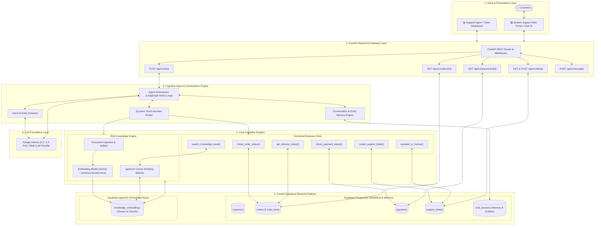
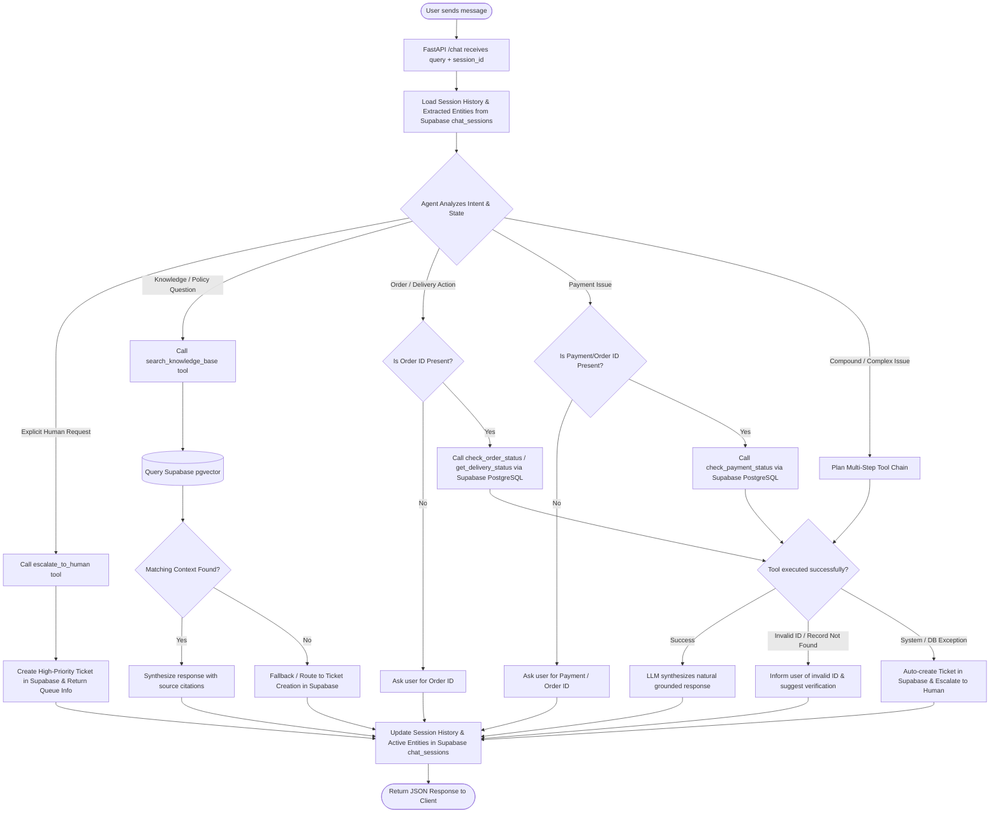
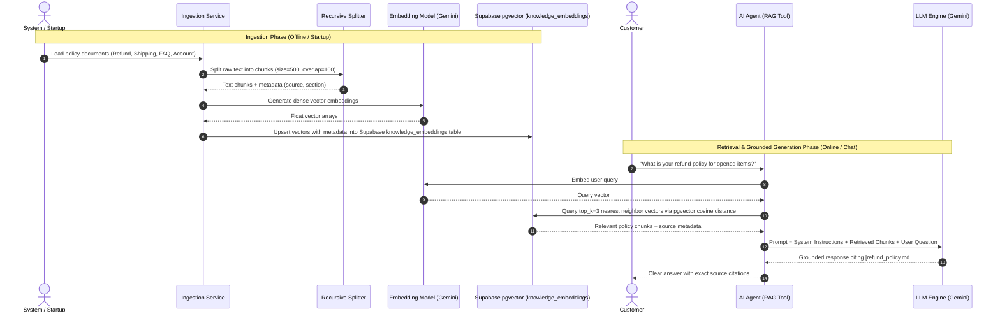
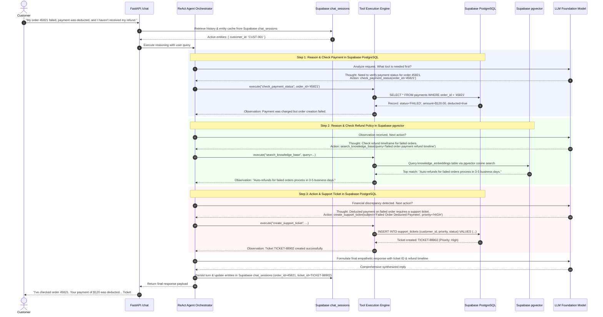
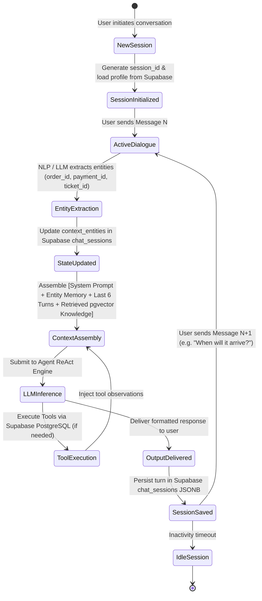
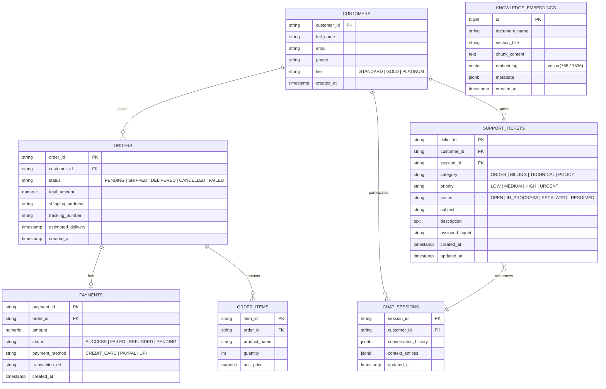
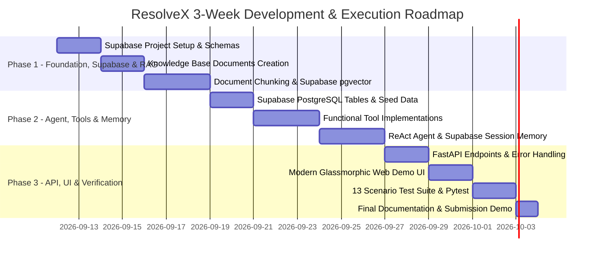

# 🏗️ ResolveX — AI Customer Support & Ticket Automation System
## Complete System Architecture, Tech Stack, Intuition & Workflow Blueprint

---

## 📑 Table of Contents
1. [Executive Summary & High-Level Intuition (What, Why, How)](#1-executive-summary--high-level-intuition-what-why-how)
2. [Why Supabase? (Unified Data & Vector Platform)](#2-why-supabase-unified-data--vector-platform)
3. [End-to-End System Architecture](#3-end-to-end-system-architecture)
4. [Curated Technology Stack & Technical Rationale](#4-curated-technology-stack--technical-rationale)
5. [Component-by-Component Deep Dive](#5-component-by-component-deep-dive)
   - [A. Knowledge Base & RAG Engine (Supabase pgvector)](#a-knowledge-base--rag-engine-supabase-pgvector)
   - [B. AI Agent & Multi-Tool Orchestrator (LangGraph / Function Calling)](#b-ai-agent--multi-tool-orchestrator-langgraph--function-calling)
   - [C. Conversation Memory & Coreference Engine (Supabase PostgreSQL)](#c-conversation-memory--coreference-engine-supabase-postgresql)
   - [D. Business Tools & Operational Database Schema](#d-business-tools--operational-database-schema)
   - [E. Human Escalation & Ticket Management System](#e-human-escalation--ticket-management-system)
   - [F. FastAPI Backend & Gateway Layer](#f-fastapi-backend--gateway-layer)
6. [Complete Mermaid Visual Diagrams](#6-complete-mermaid-visual-diagrams)
   - [1. System Context & Component Architecture](#1-system-context--component-architecture)
   - [2. End-to-End Request & Decision Flowchart](#2-end-to-end-request--decision-flowchart)
   - [3. RAG Document Ingestion & Query Retrieval Sequence](#3-rag-document-ingestion--query-retrieval-sequence)
   - [4. Agentic ReAct Tool Loop & Multi-Step Reasoning Sequence](#4-agentic-react-tool-loop--multi-step-reasoning-sequence)
   - [5. Memory & Context State Lifecycle](#5-memory--context-state-lifecycle)
   - [6. Entity-Relationship (ER) Database Schema](#6-entity-relationship-er-database-schema)
7. [Error Handling, Resilience & Fallback Matrix](#7-error-handling-resilience--fallback-matrix)
8. [13 Mandatory Test Scenarios & Verification Matrix](#8-13-mandatory-test-scenarios--verification-matrix)
9. [Step-by-Step Implementation Roadmap](#9-step-by-step-implementation-roadmap)
10. [Finalized Architecture Summary](#10-finalized-architecture-summary)

---

## 1. Executive Summary & High-Level Intuition (What, Why, How)

### 💡 The Core Problem & Intuition
Modern customer service centers suffer from high-volume, repetitive customer requests (e.g., order tracking, refund eligibility, payment issues, policy explanations). Traditional keyword chatbots fail because they lack reasoning capabilities, cannot query dynamic databases, fail to track conversational context (e.g., *"When will it arrive?"*), and cannot perform transactional operations. Conversely, raw LLMs hallucinate policies, lack real-time transaction data, and cannot reliably escalate complex issues to human agents.

**ResolveX** bridges this gap by combining **Deterministic Tools + Grounded RAG + Autonomous Agentic Reasoning + Conversational Memory + Unified Supabase Data Platform**.

```
┌──────────────────────────────────────────────────────────────────────────┐
│                             WHAT IS RESOLVEX?                            │
│  An enterprise-grade, agentic customer support and ticket automation     │
│  platform that intelligently routes customer inquiries between grounded │
│  policy retrieval (RAG via Supabase pgvector), live operational database │
│  tools (Supabase PostgreSQL), and human escalation with automated       │
│  support ticket management.                                              │
└──────────────────────────────────────────────────────────────────────────┘
```

| Dimension | **WHAT** | **WHY** | **HOW** |
| :--- | :--- | :--- | :--- |
| **Knowledge Retrieval (RAG)** | Semantically searchable company policies (Refunds, Shipping, Accounts, FAQs). | Prevents LLM hallucination; ensures responses are 100% compliant with company rules and include exact source citations. | Markdown policy documents $\rightarrow$ Recursive Character Chunking $\rightarrow$ Dense Vector Embeddings $\rightarrow$ Stored in **Supabase pgvector** $\rightarrow$ Cosine similarity vector search $\rightarrow$ Context injected into Gemini prompt. |
| **Tool Execution (Action Engine)** | Dynamic tool callers (`check_order_status`, `check_payment_status`, `create_support_ticket`, `get_delivery_status`). | Real customer support requires transactional data lookups and database state mutation, not static canned responses. | LangGraph / Function Calling with Pydantic validation schemas connected directly to **Supabase PostgreSQL** relational tables. |
| **Agentic Reasoning** | Autonomous LLM controller with ReAct (Reasoning + Acting) loop. | Single complex queries often require multi-step actions (e.g. *"I was charged twice for order #102, can I get a refund?"* requires payment lookup + policy check + ticket escalation). | The LLM parses user intent, extracts arguments, plans a tool execution sequence, validates tool observations, and composes a coherent final response. |
| **Memory & Context** | Multi-turn conversational memory + entity extraction tracker. | Customers use pronouns and follow-up phrases (*"Where is it?"*, *"Cancel that"*). The system must preserve state across conversation turns. | **Supabase PostgreSQL** `chat_sessions` table storing conversational message history JSONB and entity memory state (`active_order_id`, `active_customer_id`, `active_ticket_id`). |
| **Human Escalation** | Automated severity, sentiment, and failure detection triggering ticket creation. | Edge cases, frustrated users, or transactional anomalies must gracefully hand off to human support without losing context. | Intent triggers + Sentiment check + Tool failure fallbacks $\rightarrow$ Support ticket created in **Supabase PostgreSQL** with full conversation transcript $\rightarrow$ Handoff message to user. |

---

## 2. Why Supabase? (Unified Data & Vector Platform)

Modern AI systems often suffer from database fragmentation: a relational database for business entities, a standalone vector database for embeddings, and an in-memory cache for session history. **ResolveX adopts Supabase as its central, unified backend data platform**, combining relational data, semantic search, and conversation memory into a single robust engine.

```
┌──────────────────────────────────────────────────────────────────────────┐
│                     SUPABASE UNIFIED DATA ARCHITECTURE                   │
│                                                                          │
│  ┌───────────────────────────────┐    ┌───────────────────────────────┐  │
│  │   Supabase PostgreSQL Engine  │    │     Supabase pgvector Store   │  │
│  ├───────────────────────────────┤    ├───────────────────────────────┤  │
│  │ • Customers                   │    │ • Policy Documents & Metadata │  │
│  │ • Orders & Order Items        │    │ • Dense Vector Embeddings     │  │
│  │ • Payments & Transactions     │    │ • Semantic Cosine Search      │  │
│  │ • Support Tickets             │    │ • Top-K Grounded Context      │  │
│  │ • Chat Sessions & Memory      │    │                               │  │
│  └───────────────────────────────┘    └───────────────────────────────┘  │
│                                  ▲                                       │
│                                  │ One Client / One Connection Pool      │
│                    FastAPI Backend & LangGraph Agent                     │
└──────────────────────────────────────────────────────────────────────────┘
```

### Key Architectural Advantages:
1. **PostgreSQL Relational Data**: Provides ACID-compliant, structured storage for business entities (Customers, Orders, Order Items, Payments, Support Tickets) with strict foreign key constraints and transactional consistency.
2. **Native `pgvector` Semantic Search**: Stores knowledge base chunk embeddings directly inside PostgreSQL tables. Performs fast cosine distance / inner product vector searches alongside relational metadata filters without needing an external vector service.
3. **Conversational Memory in PostgreSQL**: Stores session messages and extracted context entities in JSONB columns (`chat_sessions`), eliminating the operational complexity and synchronization overhead of an external session cache.
4. **Architectural Simplicity**: A single connection string, unified client SDK (`supabase-py`), consolidated backup/restore strategies, and zero multi-database drift.
5. **Production-Ready & Scalable**: Provides built-in connection pooling (Supavisor), Row-Level Security (RLS), instant REST/GraphQL capabilities, and high-throughput vector indexing (`HNSW` / `IVFFlat`).

---

## 3. End-to-End System Architecture



---

## 4. Curated Technology Stack & Technical Rationale

| Category | Finalized Technology | Alternatives Considered | Rationale & Why This Choice |
| :--- | :--- | :--- | :--- |
| **Backend Framework** | **FastAPI (Python 3.10+)** | Flask, Django, Express.js | High-performance asynchronous execution (ASGI/uvicorn), automatic OpenAPI/Swagger interactive documentation, and native Pydantic data validation. |
| **Language & Typing** | **Python 3.10+ with Pydantic v2** | TypeScript, Go | Premier ecosystem for AI/LLM orchestration, vector math, and client SDKs; robust type safety for API contracts and tool schemas. |
| **LLM Provider** | **Google Gemini 2.0 / 1.5 Flash & Pro** (with multi-provider switch) | OpenAI GPT-4o, Claude 3.5 Sonnet, Groq Llama 3 | Fast inference, robust structured JSON tool calling, long context windows, and cost-effective token economics. |
| **Agent Framework** | **LangGraph / LangChain ReAct Engine** | AutoGen, CrewAI, Raw Prompts | Fine-grained cyclic state control, deterministic tool calling, clean memory persistence hooks, and full observability. |
| **Central Backend Data Platform** | **Supabase (PostgreSQL + pgvector)** | SQLite, ChromaDB, FAISS, Pinecone, Redis | **Unified data platform**: Delivers relational tables (orders, tickets, payments), dense vector embeddings (`pgvector`), and conversation memory in a single managed PostgreSQL instance with zero multi-database drift. |
| **Vector Store** | **Supabase pgvector** | ChromaDB, Pinecone, Qdrant, Weaviate | Native PostgreSQL vector extension. Allows unified SQL queries joining relational customer metadata with vector similarity searches, eliminating external vector DB infrastructure. |
| **Embeddings Model** | **text-embedding-004 (Gemini) / sentence-transformers (all-MiniLM-L6-v2)** | Cohere Embed, OpenAI text-embedding-3 | High semantic accuracy, fast vector encoding for customer policy documents, and seamless pgvector compatibility. |
| **Relational Database** | **Supabase PostgreSQL** | SQLite, MySQL, DynamoDB | Enterprise ACID compliance, robust indexing, relational foreign keys for customer/order/payment/ticket workflows, and built-in connection pooling. |
| **Conversation Memory Store** | **Supabase PostgreSQL (`chat_sessions`)** | Redis, Local In-Memory Dict | Persistent multi-turn chat history and entity memory stored directly in PostgreSQL JSONB fields, ensuring conversation recovery across restarts. |
| **Frontend / Demo UI** | **Modern Glassmorphic Web UI (HTML5/CSS3/Vanilla JS)** | Streamlit, Next.js | Instant deployment, interactive multi-turn chat feed, real-time tool execution inspector, order/payment visualizer, and tickets tracker. |
| **Testing & CI** | **Pytest + Pytest-Asyncio + HTTPX** | Unittest, Postman | Automated asynchronous API integration testing, mock tool execution verification, and comprehensive 13-point test suite validation. |

---

## 5. Component-by-Component Deep Dive

### A. Knowledge Base & RAG Engine (Supabase pgvector)
* **Knowledge Domain Documents**:
  1. `refund_policy.md` (Timeline, eligibility conditions, return processing steps).
  2. `cancellation_policy.md` (Order stages, cancellation windows prior to dispatch).
  3. `shipping_delivery_policy.md` (Standard vs. express delivery times, regional delays, tracking).
  4. `payment_policy.md` (Accepted payment methods, failed transactions, double charges).
  5. `account_policy.md` (Password resets, security, account verification).
  6. `faqs.md` & `support_guidelines.md` (Escalation protocol, support SLAs, business hours).
* **Chunking Strategy**: Recursive Character Text Splitter with `chunk_size=500` characters and `chunk_overlap=100` characters, preserving markdown section headers in metadata.
* **Vector Storage in Supabase**: Chunks and their embeddings are stored in the `knowledge_embeddings` table in Supabase PostgreSQL using the `pgvector` extension.
* **Retrieval Mechanism**: Top-$K$ ($k=3$) similarity search using Cosine Similarity (`match_documents` PostgreSQL stored procedure or vector distance operator `<=>`); returns grounded policy excerpts along with filename and section tags for citation.

### B. AI Agent & Multi-Tool Orchestrator (LangGraph / Function Calling)
* **Intent Categorization**:
  - `ORDER_STATUS`: Inquiries regarding order progress or delivery; requires `order_id`.
  - `PAYMENT_STATUS`: Inquiries regarding charges, refunds, or payment state; requires `payment_id` or `order_id`.
  - `REFUND_REQUEST`: Requests for refund evaluation; requires `order_id` + policy RAG check.
  - `KNOWLEDGE_QUERY`: Inquiries regarding company policies, FAQs, or support rules; requires RAG document search.
  - `ESCALATION_REQUEST`: Direct customer requests to speak with a human agent.
  - `TICKET_CREATION`: Auto-generated when issues cannot be resolved programmatically.
  - `GENERAL_CONVERSATION`: Greetings, polite closures, general clarifications.
* **Tool Calling Capabilities (Connected to Supabase PostgreSQL & pgvector)**:
  1. `check_order_status(order_id: str) -> dict`: Queries Supabase `orders` and `order_items` tables for order status, tracking number, estimated delivery date, and item details.
  2. `check_payment_status(payment_id: str = None, order_id: str = None) -> dict`: Queries Supabase `payments` table for transaction amount, status (`SUCCESS`, `FAILED`, `REFUNDED`), payment gateway, and timestamp.
  3. `create_support_ticket(customer_id: str, subject: str, description: str, priority: str, category: str) -> dict`: Inserts a record into Supabase `support_tickets` table and returns a unique `ticket_id` with assigned SLA.
  4. `get_delivery_status(order_id: str) -> dict`: Queries courier dispatch details and delivery timestamps from Supabase `orders`.
  5. `search_knowledge_base(query: str) -> dict`: Executes vector similarity search against Supabase `knowledge_embeddings` using pgvector and returns top grounded policy snippets with source citations.
  6. `escalate_to_human(session_id: str, reason: str, customer_id: str) -> dict`: Creates a ticket with status `ESCALATED`, compiles conversation context from Supabase `chat_sessions`, and queues for human intervention.

### C. Conversation Memory & Coreference Engine (Supabase PostgreSQL)
* **Multi-Turn Context Storage**: Chat sessions are stored in Supabase PostgreSQL (`chat_sessions` table) with structured `conversation_history` (JSONB list of user/assistant messages).
* **Entity Extraction & Coreference Resolution**:
  - Extracts and maintains active entities in `context_entities` JSONB:
    ```json
    {
      "active_order_id": "45821",
      "active_customer_id": "CUST-901",
      "active_payment_id": "PAY-1002",
      "active_ticket_id": null
    }
    ```
  - When a customer subsequently asks *"When will it arrive?"*, the memory engine resolves *"it"* to `active_order_id="45821"`, enabling the tool to execute without redundant user re-prompting.

### D. Business Tools & Operational Database Schema
All operational tables are hosted in **Supabase PostgreSQL**:
* **`customers`**: Unique ID, full name, email, phone number, loyalty tier (`STANDARD`, `GOLD`, `PLATINUM`), creation timestamp.
* **`orders`**: Unique Order ID, customer foreign key, status (`PENDING`, `SHIPPED`, `DELIVERED`, `CANCELLED`, `FAILED`), total amount, shipping address, courier tracking number, estimated delivery timestamp, created timestamp.
* **`order_items`**: Item ID, order foreign key, product name, quantity, unit price.
* **`payments`**: Unique Payment ID, order foreign key, amount, status (`SUCCESS`, `FAILED`, `REFUNDED`, `PENDING`), payment method (`CREDIT_CARD`, `PAYPAL`, `UPI`), transaction reference, timestamp.
* **`support_tickets`**: Unique Ticket ID, customer foreign key, session ID, category, priority (`LOW`, `MEDIUM`, `HIGH`, `URGENT`), status (`OPEN`, `IN_PROGRESS`, `ESCALATED`, `RESOLVED`), subject, description, assigned agent, created and updated timestamps.
* **`chat_sessions`**: Session ID (PK), customer ID (FK), conversation history (JSONB), context entities (JSONB), last updated timestamp.
* **`knowledge_embeddings`**: Chunk ID (PK), document name, section title, chunk content text, embedding vector (`vector(768)` or `vector(1536)`), created timestamp.

### E. Human Escalation & Ticket Management System
* **Escalation Triggers**:
  1. Direct explicit customer request (*"I want to speak to a human agent"*).
  2. Repeated failed attempts or unresolved queries (> 2 failed tool executions).
  3. Negative sentiment / high frustration detection in customer messages.
  4. Complex financial or cross-domain anomalies (e.g. Failed order + deducted payment + missing refund).
  5. Critical severity events (Unauthorized transactions, damaged delivery claims).
* **Escalation Execution**:
  - Generates a high-priority ticket in Supabase `support_tickets`.
  - Attaches current conversation transcript from `chat_sessions`.
  - Returns a clear human handoff message with the ticket reference number to the customer.

### F. FastAPI Backend & Gateway Layer
* Asynchronous REST endpoints with Pydantic request/response schemas:
  - `POST /api/v1/chat`: Main conversational endpoint handling user query, session state, agent reasoning loop, and response synthesis.
  - `GET /api/v1/tickets` & `POST /api/v1/tickets`: Support ticket management for agents and customer views.
  - `GET /api/v1/orders/{id}`: Order lookup endpoint.
  - `GET /api/v1/payments/{id}`: Payment transaction lookup endpoint.
  - `POST /api/v1/escalate`: Direct human escalation trigger.
  - `GET /health`: System health check verifying Supabase PostgreSQL and LLM connectivity.

---

## 6. Complete Mermaid Visual Diagrams

### 1. System Context & Component Architecture

```mermaid
graph TB
    subgraph Client ["Client Interface"]
        C[Customer Chat UI]
        A[Admin / Support Agent Portal]
    end

    subgraph API ["FastAPI Web Application Layer"]
        EP_Chat["POST /api/v1/chat"]
        EP_Ticket["POST /api/v1/tickets<br/>GET /api/v1/tickets/{id}"]
        EP_Order["GET /api/v1/orders/{id}"]
        EP_Payment["GET /api/v1/payments/{id}"]
        EP_Escalate["POST /api/v1/escalate"]
        EP_Health["GET /health"]
    end

    subgraph CoreEngine ["Agent & Reasoning Brain"]
        AgentCore["AI Agent (LangGraph ReAct Loop)"]
        PromptEngine["System Prompt & Context Assembler"]
        IntentEngine["Intent & Slot Filling Engine"]
        MemoryService["Session & Entity Memory Service"]
    end

    subgraph Tooling ["Tool Integration Suite"]
        T_Order["Tool: check_order_status"]
        T_Pay["Tool: check_payment_status"]
        T_Ticket["Tool: create_support_ticket"]
        T_Delivery["Tool: get_delivery_status"]
        T_RAG["Tool: search_knowledge_base"]
        T_Escalate["Tool: escalate_to_human"]
    end

    subgraph KnowledgeSystem ["RAG Ingestion Pipeline"]
        Docs["Markdown Policy Files"]
        Chunker["Recursive Text Splitter"]
        Embeddings["Embedding Model"]
    end

    subgraph SupabasePlatform ["Supabase Unified Data Platform"]
        subgraph SupabasePostgres ["Supabase PostgreSQL (Relational & Memory)"]
            DB_Orders[("orders & order_items")]
            DB_Payments[("payments")]
            DB_Tickets[("support_tickets")]
            DB_Customers[("customers")]
            DB_Sessions[("chat_sessions (Memory)")]
        end

        subgraph SupabaseVector ["Supabase pgvector (Vector Store)"]
            DB_Knowledge[("knowledge_embeddings")]
        end
    end

    subgraph ExternalAI ["Foundation LLM"]
        LLM_Model["LLM (Google Gemini / GPT-4o)"]
    end

    %% Client and Gateway routing
    C --> EP_Chat
    A --> EP_Ticket
    EP_Chat --> AgentCore
    EP_Ticket --> DB_Tickets
    EP_Order --> DB_Orders
    EP_Payment --> DB_Payments
    EP_Escalate --> T_Escalate

    %% Agent internals
    AgentCore <--> MemoryService
    MemoryService <--> DB_Sessions
    AgentCore <--> IntentEngine
    AgentCore <--> PromptEngine
    PromptEngine <--> LLM_Model

    %% Agent to tools
    AgentCore --> T_Order & T_Pay & T_Ticket & T_Delivery & T_RAG & T_Escalate

    %% Tools to Supabase PostgreSQL & pgvector
    T_Order --> DB_Orders
    T_Pay --> DB_Payments
    T_Ticket --> DB_Tickets
    T_Delivery --> DB_Orders
    T_Escalate --> DB_Tickets
    T_RAG --> DB_Knowledge

    %% Ingestion flow to Supabase pgvector
    Docs --> Chunker --> Embeddings --> DB_Knowledge
```



---

### 2. End-to-End Request & Decision Flowchart



---

### 3. RAG Document Ingestion & Query Retrieval Sequence



---

### 4. Agentic ReAct Tool Loop & Multi-Step Reasoning Sequence



---

### 5. Memory & Context State Lifecycle



---

### 6. Entity-Relationship (ER) Database Schema



---

## 7. Error Handling, Resilience & Fallback Matrix

| Failure Scenario | Root Cause | System Detection | Graceful Fallback Strategy |
| :--- | :--- | :--- | :--- |
| **Invalid Order ID** | Typo or non-existent ID provided (e.g. `#99999`). | `check_order_status` queries Supabase PostgreSQL and returns empty result (`NotFoundError`). | Agent courteously informs customer: *"I couldn't find order #99999 in our system. Could you please double-check your order number from your confirmation email?"* |
| **Missing Parameter** | User asks *"Where is my package?"* without specifying an Order ID. | Intent slot-filling validator detects missing `order_id`. | Agent checks Entity Memory in `chat_sessions`. If empty, prompts: *"I would be happy to check your tracking details! Could you please provide your Order ID?"* |
| **Supabase PostgreSQL Query Exception** | Network glitch or connection timeout during database read/write. | `try-except` block wraps Supabase client query with automated retry logging. | Agent traps error gracefully: *"I am currently unable to access our order records. I have created a support ticket (#TICKET-XXXX) so an agent can follow up with you promptly."* |
| **Supabase pgvector Empty Result** | User asks an obscure or out-of-scope policy query with low cosine similarity. | Cosine similarity score $< \text{threshold}$ (e.g., $< 0.65$) or empty document list. | Agent avoids hallucination and states: *"I couldn't find specific guidelines on that in our knowledge base. Would you like me to connect you with our human support team?"* |
| **LLM Provider Outage / Timeout** | Upstream AI service latency or rate limit exceeded. | Asynchronous timeout handler (8-second threshold) triggers exception. | Returns graceful fallback: *"Our AI service is currently experiencing high demand. A support ticket has been created with your query details."* |
| **Ticket Insertion Failure** | Transient database error during ticket creation. | Secondary emergency local queue logger captures payload. | Logs ticket details to emergency queue and returns an emergency reference token to the customer. |

---

## 8. 13 Mandatory Test Scenarios & Verification Matrix

| # | Test Scenario | Input Prompt Example | Expected Intent / Action | Expected Result & Supabase Verification |
| :---: | :--- | :--- | :--- | :--- |
| **1** | **General FAQ** | *"What are your customer support working hours?"* | `KNOWLEDGE_QUERY` | Accurate working hours retrieved from Supabase pgvector `knowledge_embeddings` with source citation. |
| **2** | **Knowledge-Base Question** | *"What is your policy for shipping to Alaska?"* | `KNOWLEDGE_QUERY` | Exact shipping policy excerpt retrieved from pgvector and summarized with citations. |
| **3** | **Refund Policy Question** | *"Can I get a refund if I return a product after 20 days?"* | `KNOWLEDGE_QUERY` | RAG extracts 30-day return policy from pgvector and confirms eligibility. |
| **4** | **Order-Status Request** | *"Where is my order 45821?"* | `ORDER_STATUS` tool | Extracts `45821`, queries Supabase `orders` table, outputs tracking & estimated delivery. |
| **5** | **Payment-Status Request** | *"Can you check the payment status for transaction PAY-1002?"* | `PAYMENT_STATUS` tool | Extracts `PAY-1002`, queries Supabase `payments` table, returns status & amount. |
| **6** | **Support-Ticket Creation** | *"Please create a ticket: my item arrived with a broken screen."* | `TICKET_CREATION` tool | Calls `create_support_ticket()`, inserts into Supabase `support_tickets`, returns generated `ticket_id`. |
| **7** | **Human Escalation** | *"I want to speak with a human support agent right now."* | `ESCALATE_TO_HUMAN` tool | Generates escalation ticket in Supabase `support_tickets` with conversation transcript; queues for human handoff. |
| **8** | **Unknown / Out of Scope** | *"Who won the 2022 World Cup?"* | `OUT_OF_DOMAIN` | Gracefully declines out-of-domain question and redirects user to ecommerce support topics. |
| **9** | **Invalid Order ID** | *"Check status of order 99999999"* | `ORDER_STATUS` (Negative test) | Supabase query returns `Not Found`; agent asks user to verify the order number. |
| **10** | **Tool / DB Failure** | Supabase query simulates disconnect/error. | Error recovery test | Traps exception, logs error, and generates fallback support ticket without crashing. |
| **11** | **Retrieval Fallback** | Obscure query with no matching embeddings in pgvector. | RAG fallback test | LLM acknowledges missing policy knowledge without hallucinating answers. |
| **12** | **Conversation Follow-Up** | Turn 1: *"Check order 45821"*<br/>Turn 2: *"When will it arrive?"* | Memory & Coreference | Resolves *"it"* to order `45821` using Supabase `chat_sessions` entity memory without re-asking. |
| **13** | **Multiple Requests in One** | *"Where is order 45821 and what is your return policy?"* | Multi-Tool ReAct Loop | Executes `check_order_status` (Supabase PostgreSQL) + `search_knowledge_base` (Supabase pgvector), combining both into 1 unified response. |

---

## 9. Step-by-Step Implementation Roadmap



### Milestone Breakdown:
1. **Week 1: Data Grounding & Knowledge RAG Engine (Supabase pgvector)**
   - Create realistic company policy markdown files in `data/knowledge_base/`.
   - Configure Supabase project with `pgvector` extension enabled.
   - Implement ingestion pipeline: recursive chunking, dense vector embeddings generation, and vector insertion into `knowledge_embeddings` table.
   - Implement RAG retrieval service using Cosine Similarity (`match_documents` stored procedure).
2. **Week 2: Autonomous Agent, Memory & Supabase Business Tools**
   - Configure Supabase PostgreSQL relational tables (`customers`, `orders`, `order_items`, `payments`, `support_tickets`, `chat_sessions`) with seed data.
   - Implement business tools: `check_order_status`, `check_payment_status`, `create_support_ticket`, `get_delivery_status`, `escalate_to_human`.
   - Build ReAct agent orchestrator supporting dynamic tool calling, multi-step reasoning, and slot filling.
   - Implement persistent session memory and entity coreference tracker backed by Supabase `chat_sessions`.
3. **Week 3: FastAPI Backend, UI, Automated Testing & Documentation**
   - Build FastAPI REST API endpoints (`/chat`, `/tickets`, `/orders`, `/payments`, `/escalate`, `/health`).
   - Create modern, responsive glassmorphic chat interface with live tool execution inspector and tickets viewer.
   - Implement automated Pytest test suite covering all 13 mandatory test scenarios.
   - Finalize complete documentation, architecture diagrams, and submission demo.

---

## 10. Finalized Architecture Summary

```
Frontend → FastAPI → LangGraph Agent → RAG / Tools / Memory → Supabase PostgreSQL + pgvector → Gemini → Response / Human Escalation
```

| Layer / Component | Technology | Responsibility |
| :--- | :--- | :--- |
| **Frontend** | Modern HTML5 / CSS3 / Vanilla JS | Customer chat portal, live tool invocation inspector, ticket & order dashboard. |
| **API Gateway** | FastAPI (Python 3.10+) | Asynchronous REST routing, input validation (Pydantic), error handling, CORS, session dispatch. |
| **Orchestrator** | LangGraph / LangChain ReAct | Intent classification, slot extraction, multi-step reasoning, tool execution routing, response synthesis. |
| **RAG Knowledge Base** | Supabase `pgvector` | Stored dense embeddings, semantic cosine search, grounded policy snippet retrieval with citations. |
| **Business Tools** | Python Function Calling | Order tracking, payment verification, ticket creation, delivery status, escalation. |
| **Conversation Memory** | Supabase PostgreSQL (`chat_sessions`) | Multi-turn chat message history (JSONB) and active entity context memory (`active_order_id`, etc.). |
| **Transactional Data** | Supabase PostgreSQL | Relational storage for `customers`, `orders`, `order_items`, `payments`, `support_tickets`. |
| **Foundation Model** | Google Gemini (2.0 / 1.5) | Natural language understanding, agent reasoning, tool call decision-making, empathetic response generation. |
| **Escalation Path** | Automated Ticket Dispatch | Unresolved queries, sentiment alerts, or tool exceptions trigger high-priority human support tickets in Supabase. |
