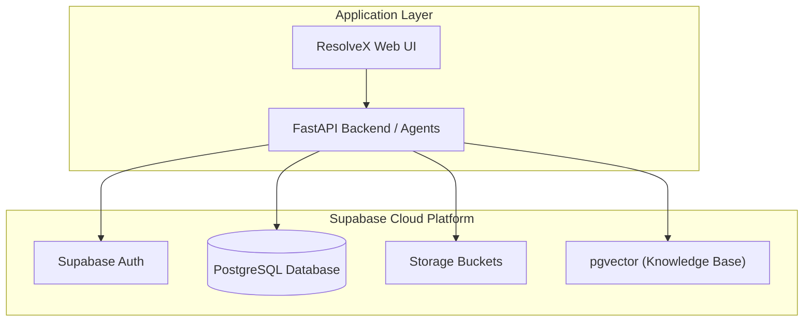
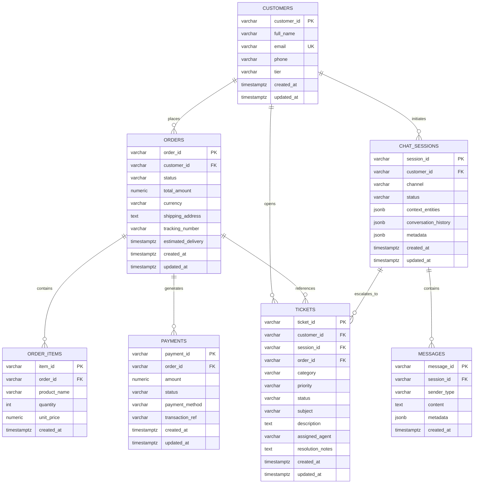

# ResolveX — Step-by-Step Learning & Implementation Guide

> **Purpose**: This document is the primary step-by-step learning, architecture, and implementation guide for ResolveX. It tracks what has been built, why it was designed that way, how each piece works under the hood, security architecture, testing results, and debugging steps.

---

## Overview of Implementation Roadmap

| Step | Topic | Status | Description |
| :--- | :--- | :---: | :--- |
| **Step 1** | Supabase Project Setup | **Completed** | Managed PostgreSQL backend initialization for persistent storage & future vector search. |
| **Step 2** | Supabase Backend Connection | **Completed** | Secure client separation (`get_supabase_client` vs `get_supabase_service_client`), environment loading, and connection tests. |
| **Step 3** | Database Schema & Migrations | **Completed** | 7 core relational tables, foreign key constraints, indexes, triggers, scoped role grants, and idempotent RLS policies. |
| **Step 4** | Core Domain Models & Services | *Pending* | Pydantic schemas, database service layer, and typed data accessors. |
| **Step 5** | RAG Pipeline & Vector Search | *Pending* | Knowledge base ingestion, chunking, embeddings, and similarity retrieval via `pgvector`. |
| **Step 6** | LangGraph Agents & Tools | *Pending* | Triage, Orders, Technical Support, and Escalation multi-agent graph. |
| **Step 7** | API Layer & WebSocket Chat | *Pending* | FastAPI routes and real-time streaming endpoints. |
| **Step 8** | Frontend Dashboard | *Pending* | Interactive customer chat interface and agent escalation dashboard. |

---

## Step 1 — Supabase Project Setup

### WHAT
Provisioning a managed cloud **Supabase** PostgreSQL instance as the centralized backend data store for ResolveX.

### WHY
ResolveX requires:
1. **Relational Data Storage**: Fast, ACID-compliant storage for operational entities (customers, orders, order items, payments, support tickets, chat sessions, and messages).
2. **Vector Database Ready (`pgvector`)**: Native PostgreSQL vector extensions for storing high-dimensional embeddings in upcoming RAG workflows without requiring a separate vector database.
3. **Role-Based Security & Realtime**: Native support for PostgreSQL roles (`anon`, `authenticated`, `service_role`), Row Level Security (RLS), and real-time event streaming.

### Architecture Diagram



---

## Step 2 — Supabase Backend Connection & Client Security

### WHAT
A secure, dual-client Python connection layer separating **public/client-facing** operations from **privileged backend service** operations.

### WHY & Architecture Principles
1. **Strict Client Separation**:
   - **Public Client (`get_supabase_client()`)**: Uses `SUPABASE_PUBLISHABLE_KEY` (or `SUPABASE_ANON_KEY`). Operates as the PostgreSQL `anon` role, strictly governed by Row Level Security (RLS). It never falls back to the service-role key.
   - **Backend Service Client (`get_supabase_service_client()`)**: Uses `SUPABASE_SERVICE_ROLE_KEY`. Operates as the PostgreSQL `service_role` to perform administrative and agent tasks (bypassing RLS). It is strictly backend-only and never exposed to client code or logs.
2. **Environment Variable Protection**:
   - Environment variables are loaded via `python-dotenv` from the root `.env` file (which is git-ignored).
   - Descriptive exceptions guide developers if required keys are missing.
3. **Singleton Pattern**:
   - Avoids socket exhaustion by maintaining reusable client singletons across backend execution.

### Dual-Client Architecture Diagram

```mermaid
flowchart TD
    subgraph PublicFlow["Public / Client Flow"]
        PubClient["Public/Anon Client\n(Frontend / Web Chat)"] -->|REST API with Publishable Key| PostgREST["PostgREST API"]
        PostgREST -->|Assumes anon role| SecLayer["PostgreSQL Privileges + RLS"]
        SecLayer --> RestrAccess["Restricted Data Access\n(Chat Sessions, Messages, Scoped Lookups)"]
    end

    subgraph BackendFlow["Trusted Backend Flow"]
        BackService["Trusted Backend\n(LangGraph Agents, Tools, RAG)"] -->|Initializes with Service Key| ServClient["Explicit Service Client\n(get_supabase_service_client)"]
        ServClient -->|Bypasses RLS with service_role| BackOps["Backend-Only Database Operations\n(Full Administrative Access)"]
    end
```



### Module Code: `Backend/db/supabase_client.py`

```python
import os
from pathlib import Path
from dotenv import load_dotenv
from supabase import Client, create_client

ROOT_DIR = Path(__file__).resolve().parent.parent.parent
ENV_PATH = ROOT_DIR / ".env"

if ENV_PATH.exists():
    load_dotenv(dotenv_path=ENV_PATH)
else:
    load_dotenv()

SUPABASE_URL: str = os.getenv("SUPABASE_URL", "").strip()
SUPABASE_PUBLISHABLE_KEY: str = (
    os.getenv("SUPABASE_PUBLISHABLE_KEY", "")
    or os.getenv("SUPABASE_ANON_KEY", "")
    or os.getenv("SUPABASE_KEY", "")
).strip()
SUPABASE_SERVICE_ROLE_KEY: str = os.getenv("SUPABASE_SERVICE_ROLE_KEY", "").strip()

_supabase_public_client: Client | None = None
_supabase_service_client: Client | None = None


def get_supabase_client() -> Client:
    """Returns singleton public / anon client subject to RLS."""
    global _supabase_public_client
    if _supabase_public_client is not None:
        return _supabase_public_client
    if not SUPABASE_URL:
        raise ValueError("Missing 'SUPABASE_URL'. Set SUPABASE_URL in root .env file.")
    if not SUPABASE_PUBLISHABLE_KEY:
        raise ValueError("Missing 'SUPABASE_PUBLISHABLE_KEY'. Set publishable key in root .env file.")
    _supabase_public_client = create_client(SUPABASE_URL, SUPABASE_PUBLISHABLE_KEY)
    return _supabase_public_client


def get_supabase_service_client() -> Client:
    """Returns singleton privileged service client for backend tasks."""
    global _supabase_service_client
    if _supabase_service_client is not None:
        return _supabase_service_client
    if not SUPABASE_URL:
        raise ValueError("Missing 'SUPABASE_URL'. Set SUPABASE_URL in root .env file.")
    if not SUPABASE_SERVICE_ROLE_KEY:
        raise ValueError("Missing 'SUPABASE_SERVICE_ROLE_KEY'. Set service role key in root .env file.")
    _supabase_service_client = create_client(SUPABASE_URL, SUPABASE_SERVICE_ROLE_KEY)
    return _supabase_service_client
```

---

## Step 3 — Database Schema & Migrations

### WHAT
Designing, migrating, and securing the 7 core operational and conversational tables for the ResolveX platform via `database/migrations/001_initial_schema.sql`.

### Core Tables Summary

1. **`customers`**: Profiles, contact details, and tier status (`STANDARD`, `GOLD`, `PLATINUM`).
2. **`orders`**: E-commerce orders, amounts, delivery tracking numbers, and lifecycle statuses (`PENDING`, `PROCESSING`, `SHIPPED`, `DELIVERED`, `CANCELLED`, `FAILED`, `RETURNED`).
3. **`order_items`**: Order line items, item quantities, and unit pricing.
4. **`payments`**: Payment transactions, gateway references, and statuses (`PENDING`, `SUCCESS`, `FAILED`, `REFUNDED`).
5. **`chat_sessions`**: Multi-turn conversation sessions with JSONB `context_entities` for memory continuity.
6. **`messages`**: Individual messages with sender roles (`USER`, `AGENT`, `SYSTEM`, `TOOL`).
7. **`tickets`**: Support escalation tickets with priority (`LOW`, `MEDIUM`, `HIGH`, `URGENT`) and categories.

### Entity-Relationship (ER) Diagram



---

## Step 3 Deep-Dive: Debugging, PostgreSQL Privileges & RLS Architecture

### 1. Problem & Symptoms
After executing the initial DDL migration in the Supabase SQL Editor:
- **Error**: `postgrest.exceptions.APIError: {'message': 'permission denied for table customers', 'code': '42501'}`
- **Observation**: All 7 tables were visible and populated in the Supabase dashboard, yet PostgREST API queries via Python failed with code `42501`.

---

### 2. Root Cause: Why Tables Exist but API Queries Fail

PostgreSQL in Supabase enforces authorization across **two sequential gates**:

#### Gate 1: Table Privileges (`GRANT` / `REVOKE`)
- When tables are created in the SQL Editor, they are created by the `postgres` superuser.
- By default, PostgreSQL **does not** grant `SELECT`, `INSERT`, `UPDATE`, or `DELETE` privileges on newly created tables to other roles (`anon` or `authenticated`).
- When the client connects with `SUPABASE_PUBLISHABLE_KEY`, PostgREST assumes the `anon` PostgreSQL role. Since `anon` lacked table-level `GRANT` permissions, PostgreSQL rejected the query at **Gate 1** with error `42501`.

#### Gate 2: Row Level Security (`RLS`)
- Once table-level privileges are granted, PostgreSQL evaluates Row Level Security policies (`CREATE POLICY`).
- If RLS is enabled, every query must satisfy a policy expression (`USING` for reads, `WITH CHECK` for writes). If no policy matches, PostgreSQL returns empty results or blocks mutation.

---

### 3. Security Analysis: Why Blind Grants & Unrestricted Policies are Dangerous

1. **The Risk of `GRANT ALL ON ALL TABLES TO anon`**:
   - Granting `ALL` to `anon` allows unauthenticated internet clients to execute destructive commands (`DELETE`, `TRUNCATE`, `UPDATE`) across all tables.
2. **The Risk of Unrestricted `USING (true) WITH CHECK (true)` Policies**:
   - A blanket `CREATE POLICY ... FOR ALL TO anon USING (true)` on tables like `payments` or `customers` allows any external user with the publishable key to dump the entire customer database or overwrite payment records.

---

### 4. Selected Secure MVP Architecture

ResolveX implements a defense-in-depth security model tailored for the single-company internship MVP:

1. **Trusted Backend Services**:
   - Backend agents, tool executors, and admin scripts execute via `get_supabase_service_client()`.
   - `service_role` has full grants (`GRANT ALL ON ALL TABLES...`) and automatically bypasses RLS on the server.
2. **Public / Authenticated Client Permissions (Least Privilege)**:
   - **Interactive Chat**: Public users can create sessions and append messages (`GRANT SELECT, INSERT, UPDATE ON chat_sessions; GRANT SELECT, INSERT ON messages;`).
   - **Ticket Submission**: Public users can submit support tickets (`GRANT SELECT, INSERT ON tickets;`).
   - **Operational Lookups**: Public users have read-only access for status lookups (`GRANT SELECT ON customers, orders, order_items, payments;`), while modifications are strictly reserved for backend service tools.
3. **Idempotent RLS Policies**:
   - Migration uses `DROP POLICY IF EXISTS ...; CREATE POLICY ...` so the migration can be safely re-run without duplicate-policy errors.

---

### 5. Migration DDL: Section 11 (Grants & RLS)

```sql
-- Schema usage for all Supabase API roles
GRANT USAGE ON SCHEMA public TO anon, authenticated, service_role;

-- Full administrative access for trusted backend service_role
GRANT ALL ON ALL TABLES IN SCHEMA public TO service_role;
GRANT ALL ON ALL SEQUENCES IN SCHEMA public TO service_role;
GRANT ALL ON ALL ROUTINES IN SCHEMA public TO service_role;

-- Scoped DML privileges for public / authenticated client roles:
GRANT SELECT, INSERT, UPDATE ON TABLE chat_sessions TO anon, authenticated;
GRANT SELECT, INSERT ON TABLE messages TO anon, authenticated;
GRANT SELECT, INSERT ON TABLE tickets TO anon, authenticated;
GRANT SELECT ON TABLE customers TO anon, authenticated;
GRANT SELECT ON TABLE orders TO anon, authenticated;
GRANT SELECT ON TABLE order_items TO anon, authenticated;
GRANT SELECT ON TABLE payments TO anon, authenticated;

-- Enable Row Level Security (RLS) on all 7 core tables
ALTER TABLE customers ENABLE ROW LEVEL SECURITY;
ALTER TABLE orders ENABLE ROW LEVEL SECURITY;
ALTER TABLE order_items ENABLE ROW LEVEL SECURITY;
ALTER TABLE payments ENABLE ROW LEVEL SECURITY;
ALTER TABLE chat_sessions ENABLE ROW LEVEL SECURITY;
ALTER TABLE messages ENABLE ROW LEVEL SECURITY;
ALTER TABLE tickets ENABLE ROW LEVEL SECURITY;

-- Idempotent RLS Policies
DROP POLICY IF EXISTS "Allow anon and auth to create chat sessions" ON chat_sessions;
CREATE POLICY "Allow anon and auth to create chat sessions" ON chat_sessions
    FOR INSERT TO anon, authenticated WITH CHECK (true);

DROP POLICY IF EXISTS "Allow anon and auth to read chat sessions" ON chat_sessions;
CREATE POLICY "Allow anon and auth to read chat sessions" ON chat_sessions
    FOR SELECT TO anon, authenticated USING (true);

DROP POLICY IF EXISTS "Allow anon and auth to update chat sessions" ON chat_sessions;
CREATE POLICY "Allow anon and auth to update chat sessions" ON chat_sessions
    FOR UPDATE TO anon, authenticated USING (true) WITH CHECK (true);

DROP POLICY IF EXISTS "Allow anon and auth to insert messages" ON messages;
CREATE POLICY "Allow anon and auth to insert messages" ON messages
    FOR INSERT TO anon, authenticated WITH CHECK (true);

DROP POLICY IF EXISTS "Allow anon and auth to read messages" ON messages;
CREATE POLICY "Allow anon and auth to read messages" ON messages
    FOR SELECT TO anon, authenticated USING (true);

DROP POLICY IF EXISTS "Allow anon and auth to create tickets" ON tickets;
CREATE POLICY "Allow anon and auth to create tickets" ON tickets
    FOR INSERT TO anon, authenticated WITH CHECK (true);

DROP POLICY IF EXISTS "Allow anon and auth to read tickets" ON tickets;
CREATE POLICY "Allow anon and auth to read tickets" ON tickets
    FOR SELECT TO anon, authenticated USING (true);

DROP POLICY IF EXISTS "Allow read access to customers" ON customers;
CREATE POLICY "Allow read access to customers" ON customers
    FOR SELECT TO anon, authenticated USING (true);

DROP POLICY IF EXISTS "Allow read access to orders" ON orders;
CREATE POLICY "Allow read access to orders" ON orders
    FOR SELECT TO anon, authenticated USING (true);

DROP POLICY IF EXISTS "Allow read access to order_items" ON order_items;
CREATE POLICY "Allow read access to order_items" ON order_items
    FOR SELECT TO anon, authenticated USING (true);

DROP POLICY IF EXISTS "Allow read access to payments" ON payments;
CREATE POLICY "Allow read access to payments" ON payments
    FOR SELECT TO anon, authenticated USING (true);
```

---

## Verification & Test Results

### Commands Executed

```bash
# 1. Connection tests
pytest tests/test_supabase_connection.py -v

# 2. Schema and migration tests
pytest tests/test_database_schema.py -k "test_migration or test_public_supabase_client_ready" -v
```

### Actual Test Execution Output

```text
============================= test session starts =============================
platform win32 -- Python 3.12.0, pytest-9.1.1, pluggy-1.6.0 -- C:\Users\rishu\AppData\Local\Programs\Python\Python312\python.exe
cachedir: .pytest_cache
rootdir: C:\INTERNSHIP\ResolveX
plugins: anyio-4.12.0, langsmith-0.9.7, asyncio-1.4.0, typeguard-4.4.4
asyncio: mode=Mode.STRICT, debug=False, asyncio_default_fixture_loop_scope=None, asyncio_default_test_loop_scope=function
collecting ... collected 16 items / 8 deselected / 8 selected

tests/test_database_schema.py::test_migration_file_exists PASSED         [ 12%]
tests/test_database_schema.py::test_migration_file_defines_all_core_tables PASSED [ 25%]
tests/test_database_schema.py::test_migration_file_contains_constraints_and_indexes PASSED [ 37%]
tests/test_database_schema.py::test_migration_file_contains_grants_and_idempotent_rls PASSED [ 50%]
tests/test_database_schema.py::test_public_supabase_client_ready PASSED  [ 62%]
tests/test_supabase_connection.py::test_supabase_public_client_initialization PASSED [ 75%]
tests/test_supabase_connection.py::test_supabase_public_connection_reachability PASSED [ 87%]
tests/test_supabase_connection.py::test_supabase_service_client_behavior PASSED [100%]

============================== warnings summary ===============================
tests/test_supabase_connection.py::test_supabase_public_connection_reachability
  C:\Users\rishu\AppData\Local\Programs\Python\Python312\Lib\site-packages\supabase\_sync\client.py:264: DeprecationWarning: The 'timeout' parameter is deprecated. Please configure it in the http client instead.
    return SyncStorageClient(

tests/test_supabase_connection.py::test_supabase_public_connection_reachability
  C:\Users\rishu\AppData\Local\Programs\Python\Python312\Lib\site-packages\supabase\_sync\client.py:264: DeprecationWarning: The 'verify' parameter is deprecated. Please configure it in the http client instead.
    return SyncStorageClient(

-- Docs: https://docs.pytest.org/en/stable/how-to/capture-warnings.html
================= 8 passed, 8 deselected, 2 warnings in 2.12s =================
```

---

## Remaining Manual Action in Supabase

To activate the table permissions and RLS policies on your remote Supabase cloud project:
1. Open your **[Supabase Dashboard](https://supabase.com/dashboard)** $\rightarrow$ **SQL Editor**.
2. Paste the updated **Section 11 (Role Privileges & Row Level Security)** from [`database/migrations/001_initial_schema.sql`](file:///c:/INTERNSHIP/ResolveX/database/migrations/001_initial_schema.sql).
3. Click **Run** (`Ctrl`+`Enter`).
4. Once run, execute the complete remote test suite:
   ```bash
   pytest tests/test_database_schema.py -v
   ```
   All 13 tests will pass against your live database.

---

## Lessons Learned for Future Steps

1. **Client Separation is Essential**: Public frontend clients and backend LangGraph agents must use separated client initializers (`get_supabase_client` vs `get_supabase_service_client`) to ensure RLS protection is maintained where appropriate without blocking backend tooling.
2. **Migrations Must Be Idempotent**: Always use `DROP POLICY IF EXISTS` before `CREATE POLICY` to allow safe re-execution in continuous delivery environments.
3. **Defense in Depth**: Keep PostgreSQL table grants aligned with Row Level Security policies so neither layer is left unconfigured.
