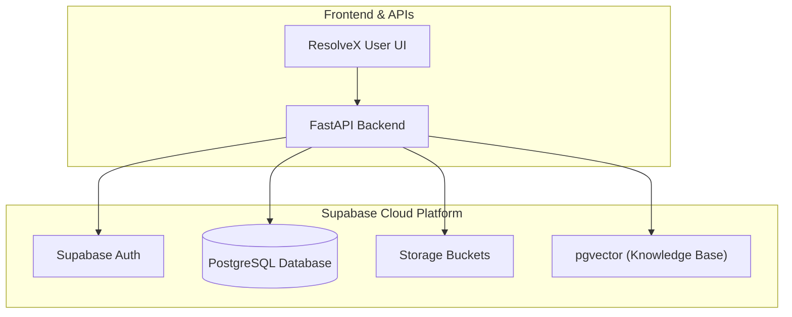
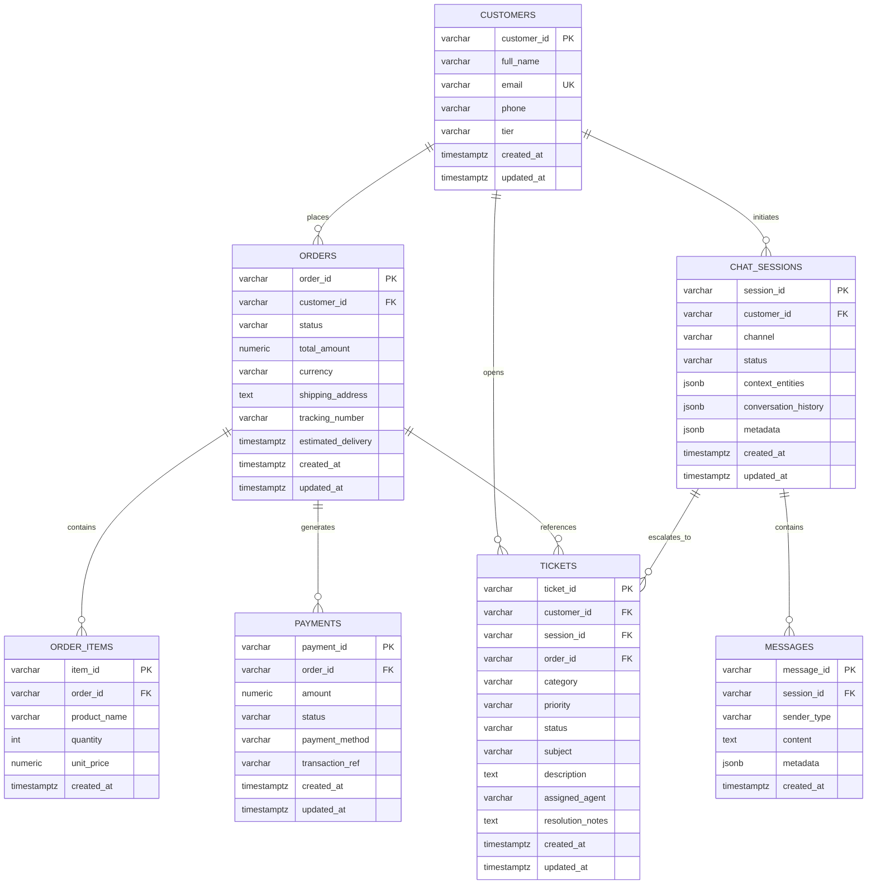
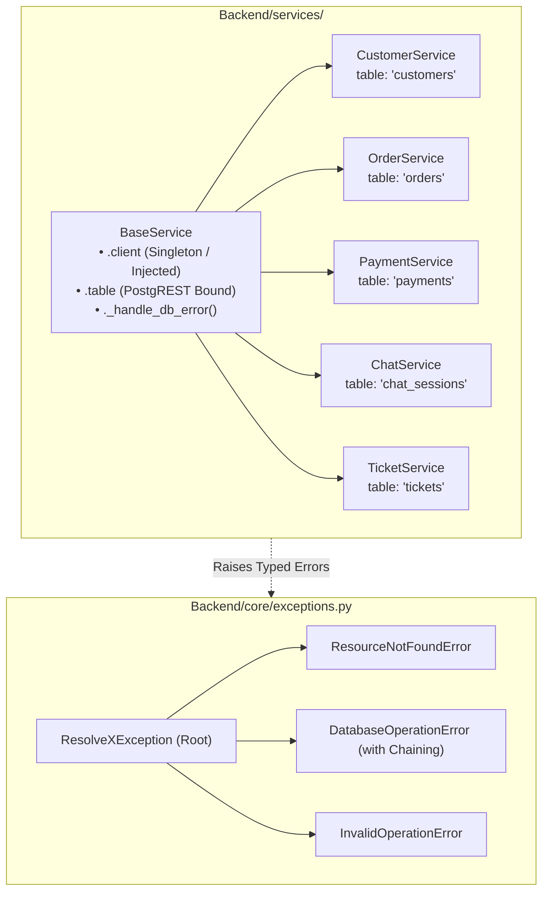

# ResolveX — Step-by-Step Learning & Implementation Guide

> **Purpose**: This document is the single step-by-step learning and implementation guide for ResolveX. It tracks what has been built, why it was designed that way, how each piece works under the hood, key code concepts, testing results, and debugging steps. This guide is updated continuously as each implementation step is completed.

---

## Overview of Implementation Roadmap

| Step | Topic | Status | Description |
| :--- | :--- | :---: | :--- |
| **Step 1** | Supabase Project Setup | **Completed** | Managed PostgreSQL backend initialization for persistent storage & vector search. |
| **Step 2** | Supabase Backend Connection | **Completed** | Reusable Python Supabase client module, environment variable loading, and connectivity test. |
| **Step 3** | Database Schema & Migrations | **Completed** | Core relational tables (customers, orders, items, payments, chat sessions, messages, tickets) and indexes. |
| **Step 4** | Core Domain Models & Services | **In Progress** | Pydantic v2 domain schemas (Phases 1-2) and Service Layer Foundation & Custom Exceptions (Phase 3). |
| **Step 5** | RAG Pipeline & Vector Search | *Pending* | Document ingestion, chunking, embeddings, and similarity retrieval. |
| **Step 6** | LangGraph Agents & Tools | *Pending* | Triage, Orders, Technical Support, and Escalation agents. |
| **Step 7** | API Layer & WebSocket Chat | *Pending* | FastAPI routes and real-time streaming endpoints. |
| **Step 8** | Frontend Dashboard | *Pending* | Interactive user and support agent interfaces. |

---

## Step 1 — Supabase Project Setup

### WHAT
Setting up a managed **Supabase** cloud PostgreSQL project as the core backend data store for ResolveX.

### WHY
ResolveX requires:
1. **Relational Data Storage**: Fast, ACID-compliant storage for operational data (customer orders, support tickets, conversation transcripts, and user audit logs).
2. **Vector Database Ready (`pgvector`)**: Native PostgreSQL vector extension for storing high-dimensional embeddings used in RAG (Retrieval-Augmented Generation) without needing a separate external vector database.
3. **Realtime & Auth Ready**: Built-in authentication, Row Level Security (RLS), and webhook capabilities for scalable event-driven workflows.

### Architecture & Data-Flow Diagram



---

## Step 2 — Supabase Backend Connection

### WHAT
A secure, reusable, and testable Python connection layer between the backend application and the remote Supabase instance.

### WHY
All upcoming backend services (ticket management, order lookups, agent tool executions, and RAG vector queries) require a single, consistent, and authenticated client connection. Centralizing client initialization ensures:
- No duplicate client instances consuming excessive sockets.
- No exposed credentials in source code.
- Graceful validation and error messages when environment variables are missing.

---

### Key Code Concepts Explained

```mermaid
flowchart LR
    ENV[".env (Root File)"] -->|1. load_dotenv()| LOADER["python-dotenv"]
    LOADER -->|2. os.getenv()| VARS["SUPABASE_URL\nSUPABASE_PUBLISHABLE_KEY"]
    VARS -->|3. Validation & Singleton| CLIENT["Backend.db.get_supabase_client()"]
    CLIENT -->|4. verify_connection()| SUPABASE[("Supabase Remote Project")]
```

1. **`load_dotenv(dotenv_path)`**:
   - Locates the project's root `.env` file using path resolution (`Path(__file__).resolve().parent.parent.parent / ".env"`).
   - Injects key-value pairs into `os.environ` so secrets remain outside version control.

2. **`os.getenv("KEY_NAME")`**:
   - Safely reads environment variables without hardcoding secret keys into source code.
   - Reads `SUPABASE_URL` and `SUPABASE_PUBLISHABLE_KEY` with fallback support for `SUPABASE_KEY` / `SUPABASE_ANON_KEY`.

3. **Singleton Pattern (`get_supabase_client()`)**:
   - Reuses a module-level `_supabase_client` instance across the entire backend lifetime rather than instantiating a new client on every request.

4. **Input Validation & Exception Handling**:
   - Explicitly validates that `SUPABASE_URL` and `SUPABASE_PUBLISHABLE_KEY` are non-empty before calling `create_client`.
   - Raises descriptive `ValueError` exceptions guiding the developer if configurations are missing.

5. **Connection Verification (`verify_connection()`)**:
   - Performs a lightweight API check against Supabase storage (`client.storage.list_buckets()`) to confirm network reachability and API key validity without requiring any pre-existing database tables.

---

### Files Implemented & Modified

#### 1. `Backend/db/supabase_client.py` [NEW]
Reusable Supabase client provider and connectivity check.

#### 2. `Backend/db/__init__.py` [NEW / UPDATED]
Exports clean public interfaces for database operations.

#### 3. `tests/test_supabase_connection.py` [NEW]
Verification test compatible with direct Python execution and Pytest.

#### 4. `requirements.txt` [UPDATED]
Added required core dependencies (`supabase>=2.0.0`, `python-dotenv>=1.0.0`).

#### 5. `.env.example` [UPDATED]
Clean template for configuring environment variables.

---

## Step 3 — Database Schema & Migrations

### WHAT
Designing and creating the initial PostgreSQL relational database schema for ResolveX using a version-controlled SQL migration file (`database/migrations/001_initial_schema.sql`), with an automated schema validation test suite in `tests/test_database_schema.py`.

The schema encompasses the 7 core operational and conversational tables:
1. **`customers`**: Customer identity, contact information, and membership tier (`STANDARD`, `GOLD`, `PLATINUM`).
2. **`orders`**: E-commerce purchase orders, tracking codes, estimated delivery timestamps, and order lifecycle statuses.
3. **`order_items`**: Line items within each order, specifying product names, quantities, and unit prices.
4. **`payments`**: Transaction records, payment statuses (`PENDING`, `SUCCESS`, `FAILED`, `REFUNDED`), payment methods, and transaction reference IDs.
5. **`chat_sessions`**: Multi-turn conversation sessions holding extracted conversational entities (JSONB) and session metadata.
6. **`messages`**: Individual conversation turns with roles (`USER`, `AGENT`, `SYSTEM`, `TOOL`) and message payloads.
7. **`tickets`**: Support tickets generated for human escalation, agent assignment, issue categorization, and priority tracking.

---

### Entity-Relationship (ER) Diagram



---

## Step 4 — Core Domain Models & Services

### Step 4 Roadmap Breakdown
- **Phase 1 & Phase 2 — Domain Models & Pydantic Schemas**: Centralized validation schemas for all domain entities (`Customer`, `Order`, `Payment`, `ChatSession`, `Message`, `Ticket`). [Completed]
- **Phase 3 — Service Layer Foundation & Custom Exceptions**: Reusable `BaseService`, custom exception hierarchy with exception chaining, and domain service class foundations. [Completed]
- **Phase 4 — Domain CRUD Service Implementations**: Typed database query and mutation methods for operational business workflows. [*Upcoming*]

---

### Step 4 — Phase 3: Service Layer Foundation & Custom Exceptions

#### WHAT
Establishing the foundational Python service layer architecture and domain exception hierarchy:
1. **Custom Exception Hierarchy (`Backend/core/exceptions.py`)**:
   - `ResolveXException`: Base exception class for all application errors with structured `message` and `details` dictionary.
   - `ResourceNotFoundError`: Raised when a specific entity (Customer, Order, Ticket, etc.) is missing.
   - `DatabaseOperationError`: Raised when database queries fail, supporting exception chaining (`raise ... from original_exc`).
   - `InvalidOperationError`: Raised when invalid business operations or state transitions occur.
2. **Reusable Base Service (`Backend/services/base.py`)**:
   - `BaseService`: Provides dependency-injected or singleton Supabase client access, bound `.table` PostgREST query access, and structured `_handle_db_error` exception wrapping.
3. **Domain Service Foundations (`Backend/services/`)**:
   - `CustomerService` (bound to `customers`)
   - `OrderService` (bound to `orders` and `order_items`)
   - `PaymentService` (bound to `payments`)
   - `ChatService` (bound to `chat_sessions` and `messages`)
   - `TicketService` (bound to `tickets`)
4. **Focused Unit Test Suite (`tests/test_services_foundation.py`)**:
   - 15 unit tests verifying exception formatting, metadata merging, chaining behavior, `BaseService` client injection, table binding, and error mapping.

---

#### WHY
A robust service foundation provides essential guarantees before implementing CRUD operations:
- **Clean Exception Separation**: Low-level database connection or PostgREST errors are not leaked directly to the API or AI layer; they are caught, wrapped in typed domain exceptions (`DatabaseOperationError`), and chained to preserve tracebacks.
- **Dependency Injection**: `BaseService(client=mock_client)` allows unit testing business logic in isolation without making live database network calls.
- **Table Name Encapsulation**: Domain services own their database table names, ensuring single-point-of-change configuration.

---

#### Service Layer Architecture Diagram



---

#### Key Code Concepts Explained

1. **Structured Exception Chaining (`__cause__`)**:
   ```python
   try:
       result = self.table.select("*").execute()
   except Exception as exc:
       raise self._handle_db_error("SELECT", exc, details={"filter": "id"})
   ```
   The `_handle_db_error` method attaches `__cause__ = exc` to ensure the original low-level exception traceback remains fully inspectable by debuggers and APM tools.

2. **Lazy Client Acquisition & Dependency Injection**:
   ```python
   def __init__(self, client: Client | None = None) -> None:
       self._client = client

   @property
   def client(self) -> Client:
       if self._client is None:
           self._client = get_supabase_client()
       return self._client
   ```
   Production code seamlessly defaults to the shared singleton client, while unit tests can supply a `MagicMock()` client.

---

#### Files Implemented in Phase 3

| File | Type | Description |
| :--- | :---: | :--- |
| [`Backend/core/exceptions.py`](file:///c:/INTERNSHIP/ResolveX/Backend/core/exceptions.py) | **NEW** | Custom domain exception classes (`ResolveXException`, `ResourceNotFoundError`, `DatabaseOperationError`, `InvalidOperationError`). |
| [`Backend/core/__init__.py`](file:///c:/INTERNSHIP/ResolveX/Backend/core/__init__.py) | **UPDATED** | Centralized exports for core exceptions. |
| [`Backend/services/base.py`](file:///c:/INTERNSHIP/ResolveX/Backend/services/base.py) | **NEW** | `BaseService` providing Supabase client access, table binding, and error wrapping. |
| [`Backend/services/customer_service.py`](file:///c:/INTERNSHIP/ResolveX/Backend/services/customer_service.py) | **NEW** | `CustomerService` foundation bound to `customers`. |
| [`Backend/services/order_service.py`](file:///c:/INTERNSHIP/ResolveX/Backend/services/order_service.py) | **NEW** | `OrderService` foundation bound to `orders` and `order_items`. |
| [`Backend/services/payment_service.py`](file:///c:/INTERNSHIP/ResolveX/Backend/services/payment_service.py) | **NEW** | `PaymentService` foundation bound to `payments`. |
| [`Backend/services/chat_service.py`](file:///c:/INTERNSHIP/ResolveX/Backend/services/chat_service.py) | **NEW** | `ChatService` foundation bound to `chat_sessions` and `messages`. |
| [`Backend/services/ticket_service.py`](file:///c:/INTERNSHIP/ResolveX/Backend/services/ticket_service.py) | **NEW** | `TicketService` foundation bound to `tickets`. |
| [`Backend/services/__init__.py`](file:///c:/INTERNSHIP/ResolveX/Backend/services/__init__.py) | **UPDATED** | Centralized exports for all domain services and `BaseService`. |
| [`tests/test_services_foundation.py`](file:///c:/INTERNSHIP/ResolveX/tests/test_services_foundation.py) | **NEW** | 15 unit tests validating exceptions, inheritance, and client injection. |

---

#### Test Results

```text
============================= test session starts =============================
platform win32 -- Python 3.12.0, pytest-9.1.1, pluggy-1.6.0
rootdir: C:\INTERNSHIP\ResolveX
collected 51 items

tests/test_database_schema.py .............                              [ 25%]
tests/test_domain_models.py .....................                        [ 66%]
tests/test_services_foundation.py ...............                        [ 96%]
tests/test_supabase_connection.py ..                                     [100%]

======================= 51 passed, 4 warnings in 4.47s ========================
```
