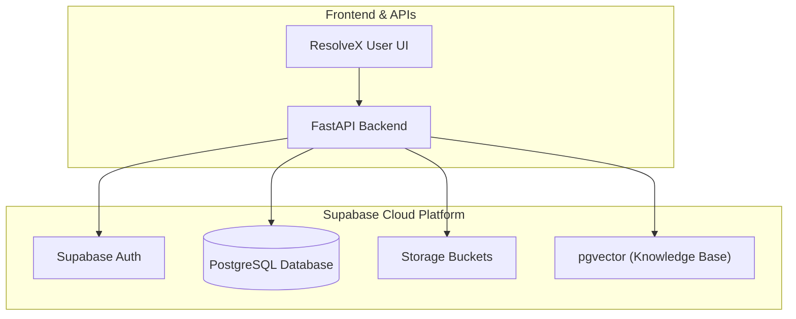

# ResolveX — Step-by-Step Learning & Implementation Guide

> **Purpose**: This document is the single step-by-step learning and implementation guide for ResolveX. It tracks what has been built, why it was designed that way, how each piece works under the hood, key code concepts, testing results, and debugging steps. This guide is updated continuously as each implementation step is completed.

---

## Overview of Implementation Roadmap

| Step | Topic | Status | Description |
| :--- | :--- | :---: | :--- |
| **Step 1** | Supabase Project Setup | Completed | Cloud PostgreSQL backend initialization for persistent storage & vector search. |
| **Step 2** | Supabase Backend Connection | Completed | Reusable Python Supabase client module, environment variable loading, and connectivity test. |
| **Step 3** | Database Schema & Migrations | *Pending* | Orders, tickets, conversations, and pgvector knowledge-base tables. |
| **Step 4** | Core Domain Models & Services | *Pending* | Pydantic schemas and database service layer. |
| **Step 5** | RAG Pipeline & Vector Search | *Pending* | Document ingestion, chunking, embeddings, and similarity retrieval. |
| **Step 6** | LangGraph Agents & Tools | *Pending* | Triage, Orders, Technical Support, and Escalation agents. |
| **Step 7** | API Layer & WebSocket Chat | *Pending* | FastAPI routes and real-time streaming endpoints. |
| **Step 8** | Frontend Dashboard | *Pending* | Interactive user and support agent interfaces. |

---

## Step 1 — Supabase Project Setup

### WHAT
Setting up a managed **Supabase** cloud PostgreSQL project as the core backend data store for ResolveX.

### WHY
ResolveX requires:
1. **Relational Data Storage**: Fast, ACID-compliant storage for operational data (customer orders, support tickets, conversation transcripts, and user audit logs).
2. **Vector Database (`pgvector`)**: Native PostgreSQL vector extension for storing high-dimensional embeddings used in RAG (Retrieval-Augmented Generation) without needing a separate external vector database.
3. **Realtime & Auth Ready**: Built-in authentication, Row Level Security (RLS), and webhook capabilities for scalable event-driven workflows.

### Architecture & Data-Flow Diagram



---

## Step 2 — Supabase Backend Connection

### WHAT
A secure, reusable, and testable Python connection layer between the backend application and the remote Supabase instance.

### WHY
All upcoming backend services (ticket management, order lookups, agent tool executions, and RAG vector queries) require a single, consistent, and authenticated client connection. Centralizing client initialization ensures:
- No duplicate client instances consuming excessive sockets.
- No exposed credentials in source code.
- Graceful validation and error messages when environment variables are missing.

---

### Key Code Concepts Explained

```mermaid
flowchart LR
    ENV[".env (Root File)"] -->|1. load_dotenv()| LOADER["python-dotenv"]
    LOADER -->|2. os.getenv()| VARS["SUPABASE_URL\nSUPABASE_PUBLISHABLE_KEY"]
    VARS -->|3. Validation & Singleton| CLIENT["Backend.db.get_supabase_client()"]
    CLIENT -->|4. verify_connection()| SUPABASE[("Supabase Remote Project")]
```

1. **`load_dotenv(dotenv_path)`**:
   - Locates the project's root `.env` file using path resolution (`Path(__file__).resolve().parent.parent.parent / ".env"`).
   - Injects key-value pairs into `os.environ` so secrets remain outside version control.

2. **`os.getenv("KEY_NAME")`**:
   - Safely reads environment variables without hardcoding secret keys into source code.
   - Reads `SUPABASE_URL` and `SUPABASE_PUBLISHABLE_KEY` with fallback support for `SUPABASE_KEY` / `SUPABASE_ANON_KEY`.

3. **Singleton Pattern (`get_supabase_client()`)**:
   - Reuses a module-level `_supabase_client` instance across the entire backend lifetime rather than instantiating a new client on every request.

4. **Input Validation & Exception Handling**:
   - Explicitly validates that `SUPABASE_URL` and `SUPABASE_PUBLISHABLE_KEY` are non-empty before calling `create_client`.
   - Raises descriptive `ValueError` exceptions guiding the developer if configurations are missing.

5. **Connection Verification (`verify_connection()`)**:
   - Performs a lightweight API check against Supabase storage (`client.storage.list_buckets()`) to confirm network reachability and API key validity without requiring any pre-existing database tables.

---

### Files Implemented & Modified

#### 1. `Backend/db/supabase_client.py` [NEW]
Reusable Supabase client provider and connectivity check:
```python
import os
from pathlib import Path
from dotenv import load_dotenv
from supabase import Client, create_client

# Locate project root and load environment variables from .env
ROOT_DIR = Path(__file__).resolve().parent.parent.parent
ENV_PATH = ROOT_DIR / ".env"

if ENV_PATH.exists():
    load_dotenv(dotenv_path=ENV_PATH)
else:
    load_dotenv()

# Read environment variables
SUPABASE_URL: str = os.getenv("SUPABASE_URL", "").strip()
SUPABASE_PUBLISHABLE_KEY: str = (
    os.getenv("SUPABASE_PUBLISHABLE_KEY", "")
    or os.getenv("SUPABASE_KEY", "")
    or os.getenv("SUPABASE_ANON_KEY", "")
).strip()

_supabase_client: Client | None = None


def get_supabase_client() -> Client:
    """Returns an initialized singleton instance of the Supabase client."""
    global _supabase_client

    if _supabase_client is not None:
        return _supabase_client

    if not SUPABASE_URL:
        raise ValueError(
            "Missing 'SUPABASE_URL'. Please set SUPABASE_URL in your root .env file."
        )

    if not SUPABASE_PUBLISHABLE_KEY:
        raise ValueError(
            "Missing 'SUPABASE_PUBLISHABLE_KEY'. Please set SUPABASE_PUBLISHABLE_KEY in your root .env file."
        )

    _supabase_client = create_client(SUPABASE_URL, SUPABASE_PUBLISHABLE_KEY)
    return _supabase_client


def verify_connection() -> bool:
    """Performs a lightweight connectivity check to verify Supabase reachability."""
    client = get_supabase_client()
    client.storage.list_buckets()
    return True
```

#### 2. `Backend/db/__init__.py` [NEW / UPDATED]
Exports clean public interfaces for database operations:
```python
"""Database package initialization."""

from Backend.db.supabase_client import get_supabase_client, verify_connection

__all__ = ["get_supabase_client", "verify_connection"]
```

#### 3. `tests/test_supabase_connection.py` [NEW]
Verification test compatible with direct Python execution and Pytest:
```python
"""Minimal test to verify Supabase client reachability and connectivity."""

import sys
from pathlib import Path

ROOT_DIR = Path(__file__).resolve().parent.parent
if str(ROOT_DIR) not in sys.path:
    sys.path.insert(0, str(ROOT_DIR))

from Backend.db.supabase_client import get_supabase_client, verify_connection


def test_supabase_client_initialization():
    """Verify that get_supabase_client initializes successfully."""
    client = get_supabase_client()
    assert client is not None


def test_supabase_connection_reachability():
    """Verify that the client can communicate with the remote Supabase instance."""
    is_connected = verify_connection()
    assert is_connected is True
```

#### 4. `requirements.txt` [UPDATED]
Added required core dependencies:
```text
supabase>=2.0.0
python-dotenv>=1.0.0
```

#### 5. `.env.example` [UPDATED]
Clean template for configuring environment variables:
```env
# Supabase Configuration
SUPABASE_URL=https://your-project-id.supabase.co
SUPABASE_PUBLISHABLE_KEY=your-supabase-publishable-or-anon-key
```

---

### Dependencies Added

| Package | Version | Purpose |
| :--- | :--- | :--- |
| **`supabase`** | `>=2.0.0` (`supabase-py`) | Official Python client library for Supabase REST, Auth, PostgREST, and Storage APIs. |
| **`python-dotenv`** | `>=1.0.0` | Reads key-value pairs from `.env` file and sets them as environment variables. |

---

### How to Run the Connection Test

1. Ensure the root `.env` file contains your credentials:
   ```env
   SUPABASE_URL=https://your-project-id.supabase.co
   SUPABASE_PUBLISHABLE_KEY=your-publishable-or-anon-key
   ```

2. Run the test using either:
   ```bash
   # Direct script execution
   python tests/test_supabase_connection.py
   ```
   *or*
   ```bash
   # Pytest suite execution
   pytest tests/test_supabase_connection.py
   ```

---

### Test Results

```text
Running Supabase connection test...
 Supabase connection test passed successfully!
```

```text
============================= test session starts =============================
platform win32 -- Python 3.12.0, pytest-9.1.1, pluggy-1.6.0
collected 2 items

tests\test_supabase_connection.py ..                                     [100%]

======================== 2 passed, 2 warnings in 2.68s ========================
```

---

### Debugging Checklist

| Failure Scenario | Root Cause | Solution |
| :--- | :--- | :--- |
| **`ValueError: Missing 'SUPABASE_URL'`** | `.env` file not found or variable is empty | Check that `.env` is located in the root directory and contains `SUPABASE_URL=https://...` |
| **`ValueError: Missing 'SUPABASE_PUBLISHABLE_KEY'`** | Variable name typo or missing key value | Verify `.env` has `SUPABASE_PUBLISHABLE_KEY=...` |
| **`ModuleNotFoundError: No module named 'supabase'`** | Dependency not installed in environment | Run `pip install -r requirements.txt` |
| **`401 Unauthorized / Invalid API Key`** | Wrong key copied from dashboard | Go to Supabase Dashboard $\rightarrow$ Project Settings $\rightarrow$ API and copy the `anon` / `publishable` key |
| **`Connection Timeout / DNS Error`** | Network connectivity, VPN, or firewall block | Verify internet connectivity and ensure the Supabase project URL is reachable |
