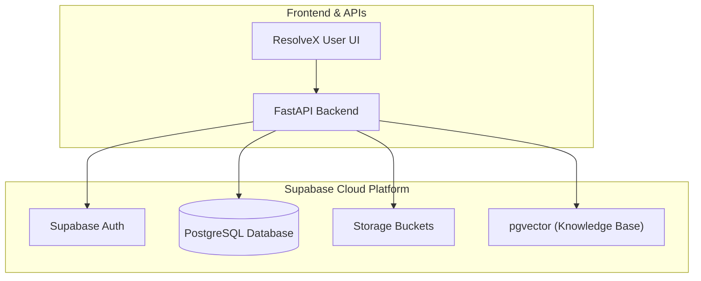
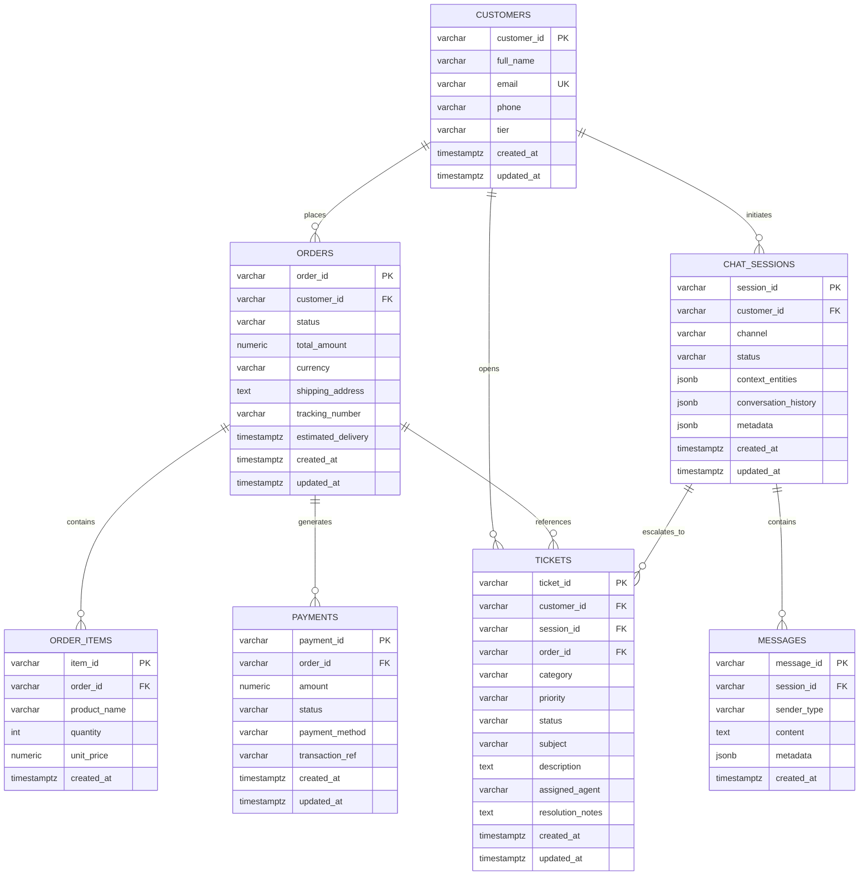

# ResolveX — Step-by-Step Learning & Implementation Guide

> **Purpose**: This document is the single step-by-step learning and implementation guide for ResolveX. It tracks what has been built, why it was designed that way, how each piece works under the hood, key code concepts, testing results, and debugging steps. This guide is updated continuously as each implementation step is completed.

---

## Overview of Implementation Roadmap

| Step | Topic | Status | Description |
| :--- | :--- | :---: | :--- |
| **Step 1** | Supabase Project Setup | Completed | Cloud PostgreSQL backend initialization for persistent storage & vector search. |
| **Step 2** | Supabase Backend Connection | Completed | Reusable Python Supabase client module, environment variable loading, and connectivity test. |
| **Step 3** | Database Schema & Migrations | Completed | Core relational tables (customers, orders, items, payments, chat sessions, messages, tickets) and indexes. |
| **Step 4** | Core Domain Models & Services | *Pending* | Pydantic schemas and database service layer. |
| **Step 5** | RAG Pipeline & Vector Search | *Pending* | Document ingestion, chunking, embeddings, and similarity retrieval. |
| **Step 6** | LangGraph Agents & Tools | *Pending* | Triage, Orders, Technical Support, and Escalation agents. |
| **Step 7** | API Layer & WebSocket Chat | *Pending* | FastAPI routes and real-time streaming endpoints. |
| **Step 8** | Frontend Dashboard | *Pending* | Interactive user and support agent interfaces. |

---

## Step 1 — Supabase Project Setup

### WHAT
Setting up a managed **Supabase** cloud PostgreSQL project as the core backend data store for ResolveX.

### WHY
ResolveX requires:
1. **Relational Data Storage**: Fast, ACID-compliant storage for operational data (customer orders, support tickets, conversation transcripts, and user audit logs).
2. **Vector Database (`pgvector`)**: Native PostgreSQL vector extension for storing high-dimensional embeddings used in RAG (Retrieval-Augmented Generation) without needing a separate external vector database.
3. **Realtime & Auth Ready**: Built-in authentication, Row Level Security (RLS), and webhook capabilities for scalable event-driven workflows.

### Architecture & Data-Flow Diagram



---

## Step 2 — Supabase Backend Connection

### WHAT
A secure, reusable, and testable Python connection layer between the backend application and the remote Supabase instance.

### WHY
All upcoming backend services (ticket management, order lookups, agent tool executions, and RAG vector queries) require a single, consistent, and authenticated client connection. Centralizing client initialization ensures:
- No duplicate client instances consuming excessive sockets.
- No exposed credentials in source code.
- Graceful validation and error messages when environment variables are missing.

---

### Key Code Concepts Explained

```mermaid
flowchart LR
    ENV[".env (Root File)"] -->|1. load_dotenv()| LOADER["python-dotenv"]
    LOADER -->|2. os.getenv()| VARS["SUPABASE_URL\nSUPABASE_PUBLISHABLE_KEY"]
    VARS -->|3. Validation & Singleton| CLIENT["Backend.db.get_supabase_client()"]
    CLIENT -->|4. verify_connection()| SUPABASE[("Supabase Remote Project")]
```

1. **`load_dotenv(dotenv_path)`**:
   - Locates the project's root `.env` file using path resolution (`Path(__file__).resolve().parent.parent.parent / ".env"`).
   - Injects key-value pairs into `os.environ` so secrets remain outside version control.

2. **`os.getenv("KEY_NAME")`**:
   - Safely reads environment variables without hardcoding secret keys into source code.
   - Reads `SUPABASE_URL` and `SUPABASE_PUBLISHABLE_KEY` with fallback support for `SUPABASE_KEY` / `SUPABASE_ANON_KEY`.

3. **Singleton Pattern (`get_supabase_client()`)**:
   - Reuses a module-level `_supabase_client` instance across the entire backend lifetime rather than instantiating a new client on every request.

4. **Input Validation & Exception Handling**:
   - Explicitly validates that `SUPABASE_URL` and `SUPABASE_PUBLISHABLE_KEY` are non-empty before calling `create_client`.
   - Raises descriptive `ValueError` exceptions guiding the developer if configurations are missing.

5. **Connection Verification (`verify_connection()`)**:
   - Performs a lightweight API check against Supabase storage (`client.storage.list_buckets()`) to confirm network reachability and API key validity without requiring any pre-existing database tables.

---

### Files Implemented & Modified

#### 1. `Backend/db/supabase_client.py` [NEW]
Reusable Supabase client provider and connectivity check:
```python
import os
from pathlib import Path
from dotenv import load_dotenv
from supabase import Client, create_client

# Locate project root and load environment variables from .env
ROOT_DIR = Path(__file__).resolve().parent.parent.parent
ENV_PATH = ROOT_DIR / ".env"

if ENV_PATH.exists():
    load_dotenv(dotenv_path=ENV_PATH)
else:
    load_dotenv()

# Read environment variables
SUPABASE_URL: str = os.getenv("SUPABASE_URL", "").strip()
SUPABASE_PUBLISHABLE_KEY: str = (
    os.getenv("SUPABASE_PUBLISHABLE_KEY", "")
    or os.getenv("SUPABASE_KEY", "")
    or os.getenv("SUPABASE_ANON_KEY", "")
).strip()

_supabase_client: Client | None = None


def get_supabase_client() -> Client:
    """Returns an initialized singleton instance of the Supabase client."""
    global _supabase_client

    if _supabase_client is not None:
        return _supabase_client

    if not SUPABASE_URL:
        raise ValueError(
            "Missing 'SUPABASE_URL'. Please set SUPABASE_URL in your root .env file."
        )

    if not SUPABASE_PUBLISHABLE_KEY:
        raise ValueError(
            "Missing 'SUPABASE_PUBLISHABLE_KEY'. Please set SUPABASE_PUBLISHABLE_KEY in your root .env file."
        )

    _supabase_client = create_client(SUPABASE_URL, SUPABASE_PUBLISHABLE_KEY)
    return _supabase_client


def verify_connection() -> bool:
    """Performs a lightweight connectivity check to verify Supabase reachability."""
    client = get_supabase_client()
    client.storage.list_buckets()
    return True
```

#### 2. `Backend/db/__init__.py` [NEW / UPDATED]
Exports clean public interfaces for database operations:
```python
"""Database package initialization."""

from Backend.db.supabase_client import get_supabase_client, verify_connection

__all__ = ["get_supabase_client", "verify_connection"]
```

#### 3. `tests/test_supabase_connection.py` [NEW]
Verification test compatible with direct Python execution and Pytest:
```python
"""Minimal test to verify Supabase client reachability and connectivity."""

import sys
from pathlib import Path

ROOT_DIR = Path(__file__).resolve().parent.parent
if str(ROOT_DIR) not in sys.path:
    sys.path.insert(0, str(ROOT_DIR))

from Backend.db.supabase_client import get_supabase_client, verify_connection


def test_supabase_client_initialization():
    """Verify that get_supabase_client initializes successfully."""
    client = get_supabase_client()
    assert client is not None


def test_supabase_connection_reachability():
    """Verify that the client can communicate with the remote Supabase instance."""
    is_connected = verify_connection()
    assert is_connected is True
```

#### 4. `requirements.txt` [UPDATED]
Added required core dependencies:
```text
supabase>=2.0.0
python-dotenv>=1.0.0
```

#### 5. `.env.example` [UPDATED]
Clean template for configuring environment variables:
```env
# Supabase Configuration
SUPABASE_URL=https://your-project-id.supabase.co
SUPABASE_PUBLISHABLE_KEY=your-supabase-publishable-or-anon-key
```

---

### Dependencies Added

| Package | Version | Purpose |
| :--- | :--- | :--- |
| **`supabase`** | `>=2.0.0` (`supabase-py`) | Official Python client library for Supabase REST, Auth, PostgREST, and Storage APIs. |
| **`python-dotenv`** | `>=1.0.0` | Reads key-value pairs from `.env` file and sets them as environment variables. |

---

### How to Run the Connection Test

1. Ensure the root `.env` file contains your credentials:
   ```env
   SUPABASE_URL=https://your-project-id.supabase.co
   SUPABASE_PUBLISHABLE_KEY=your-publishable-or-anon-key
   ```

2. Run the test using either:
   ```bash
   # Direct script execution
   python tests/test_supabase_connection.py
   ```
   *or*
   ```bash
   # Pytest suite execution
   pytest tests/test_supabase_connection.py
   ```

---

### Test Results

```text
Running Supabase connection test...
 Supabase connection test passed successfully!
```

```text
============================= test session starts =============================
platform win32 -- Python 3.12.0, pytest-9.1.1, pluggy-1.6.0
collected 2 items

tests\test_supabase_connection.py ..                                     [100%]

======================== 2 passed, 2 warnings in 2.68s ========================
```

---

### Debugging Checklist

| Failure Scenario | Root Cause | Solution |
| :--- | :--- | :--- |
| **`ValueError: Missing 'SUPABASE_URL'`** | `.env` file not found or variable is empty | Check that `.env` is located in the root directory and contains `SUPABASE_URL=https://...` |
| **`ValueError: Missing 'SUPABASE_PUBLISHABLE_KEY'`** | Variable name typo or missing key value | Verify `.env` has `SUPABASE_PUBLISHABLE_KEY=...` |
| **`ModuleNotFoundError: No module named 'supabase'`** | Dependency not installed in environment | Run `pip install -r requirements.txt` |
| **`401 Unauthorized / Invalid API Key`** | Wrong key copied from dashboard | Go to Supabase Dashboard $\rightarrow$ Project Settings $\rightarrow$ API and copy the `anon` / `publishable` key |
| **`Connection Timeout / DNS Error`** | Network connectivity, VPN, or firewall block | Verify internet connectivity and ensure the Supabase project URL is reachable |

---

## Step 3 — Database Schema & Migrations

### WHAT
Designing and creating the initial PostgreSQL relational database schema for ResolveX using a version-controlled SQL migration file (`database/migrations/001_initial_schema.sql`), with an automated schema validation test suite in `tests/test_database_schema.py`.

The schema encompasses the 7 core operational and conversational tables:
1. **`customers`**: Customer identity, contact information, and membership tier (`STANDARD`, `GOLD`, `PLATINUM`).
2. **`orders`**: E-commerce purchase orders, tracking codes, estimated delivery timestamps, and order lifecycle statuses.
3. **`order_items`**: Line items within each order, specifying product names, quantities, and unit prices.
4. **`payments`**: Transaction records, payment statuses (`PENDING`, `SUCCESS`, `FAILED`, `REFUNDED`), payment methods, and transaction reference IDs.
5. **`chat_sessions`**: Multi-turn conversation sessions holding extracted conversational entities (JSONB) and session metadata.
6. **`messages`**: Individual conversation turns with roles (`USER`, `AGENT`, `SYSTEM`, `TOOL`) and message payloads.
7. **`tickets`**: Support tickets generated for human escalation, agent assignment, issue categorization, and priority tracking.

> [!NOTE]
> `pgvector` knowledge base embeddings (`knowledge_embeddings`) are intentionally omitted from this step and will be introduced in **Step 5 (RAG Pipeline & Vector Search)**.

---

### WHY
ResolveX's AI agents, deterministic tools, and human support workflows rely on a structured, normalized, and performant data store:
- **Relational Integrity & Cascades**: Deleting an order automatically cleans up orphaned `order_items` and `payments` via `ON DELETE CASCADE`. Conversely, deleting a customer preserves ticket audit trails while setting foreign keys to `NULL` (`ON DELETE SET NULL`).
- **Deterministic Tool Execution**: LangGraph agent tools (such as `check_order_status`, `check_payment_status`, and `create_support_ticket`) require well-defined tables with explicit status enumerations, timestamps, and numeric types.
- **Context & Memory Continuity**: The `chat_sessions` table persists structured `context_entities` (e.g. active `order_id`, `ticket_id`) so conversational context is preserved across turns without requiring re-extraction.
- **Fast Lookups via Indexing**: Foreign key indexes (`customer_id`, `order_id`, `session_id`) and status indexes ensure sub-millisecond query latencies when AI agents execute operational tools.
- **Data Traceability**: Automatic `updated_at` triggers maintain accurate timestamps across record updates without requiring manual application-layer clock management.

---

### Entity-Relationship (ER) Diagram



---

### Table Relationships & Architecture Breakdown

| Table | Primary Key | Foreign Keys & Relationships | Key Constraints & Checks | Indexing Strategy |
| :--- | :--- | :--- | :--- | :--- |
| **`customers`** | `customer_id` (`VARCHAR(64)`) | None | `email` (`UNIQUE`), `tier IN ('STANDARD', 'GOLD', 'PLATINUM')` | Unique index on `email` |
| **`orders`** | `order_id` (`VARCHAR(64)`) | `customer_id -> customers(customer_id) ON DELETE CASCADE` | `total_amount >= 0`, `status IN ('PENDING', 'PROCESSING', 'SHIPPED', 'DELIVERED', 'CANCELLED', 'FAILED', 'RETURNED')` | `idx_orders_customer_id`, `idx_orders_status` |
| **`order_items`** | `item_id` (`VARCHAR(64)`) | `order_id -> orders(order_id) ON DELETE CASCADE` | `quantity > 0`, `unit_price >= 0` | `idx_order_items_order_id` |
| **`payments`** | `payment_id` (`VARCHAR(64)`) | `order_id -> orders(order_id) ON DELETE CASCADE` | `amount >= 0`, `status IN ('PENDING', 'SUCCESS', 'FAILED', 'REFUNDED')`, `payment_method IN ('CREDIT_CARD', 'DEBIT_CARD', 'PAYPAL', 'UPI', 'BANK_TRANSFER', 'WALLET')` | `idx_payments_order_id`, `idx_payments_status` |
| **`chat_sessions`** | `session_id` (`VARCHAR(64)`) | `customer_id -> customers(customer_id) ON DELETE SET NULL` | `status IN ('ACTIVE', 'CLOSED', 'ARCHIVED')`, `context_entities` (`JSONB`), `conversation_history` (`JSONB`) | `idx_chat_sessions_customer_id`, `idx_chat_sessions_status` |
| **`messages`** | `message_id` (`VARCHAR(64)`) | `session_id -> chat_sessions(session_id) ON DELETE CASCADE` | `sender_type IN ('USER', 'AGENT', 'SYSTEM', 'TOOL')` | `idx_messages_session_id`, `idx_messages_created_at` |
| **`tickets`** | `ticket_id` (`VARCHAR(64)`) | `customer_id -> customers(customer_id) ON DELETE SET NULL`<br/>`session_id -> chat_sessions(session_id) ON DELETE SET NULL`<br/>`order_id -> orders(order_id) ON DELETE SET NULL` | `category IN ('ORDER', 'BILLING', 'TECHNICAL', 'POLICY', 'GENERAL', 'REFUND', 'SHIPPING')`, `priority IN ('LOW', 'MEDIUM', 'HIGH', 'URGENT')`, `status IN ('OPEN', 'IN_PROGRESS', 'ESCALATED', 'RESOLVED', 'CLOSED')` | `idx_tickets_customer_id`, `idx_tickets_session_id`, `idx_tickets_order_id`, `idx_tickets_status`, `idx_tickets_priority` |

---

### Files Implemented & Modified

#### 1. `database/migrations/001_initial_schema.sql` [NEW]
Complete SQL migration file containing all table definitions, constraints, indexes, and trigger functions:
- Enables `uuid-ossp` extension for identifier utility.
- Creates `update_updated_at_column()` PostgreSQL trigger function.
- Creates all 7 relational tables with appropriate column types and strict check constraints.
- Creates 14 performance indexes across lookup keys and status fields.
- Sets up `BEFORE UPDATE` triggers on `customers`, `orders`, `payments`, `chat_sessions`, and `tickets`.

#### 2. `tests/test_database_schema.py` [NEW]
Pytest test suite validating both the local SQL migration file and remote Supabase tables:
- **`test_migration_file_exists`**: Ensures the migration file exists and is populated.
- **`test_migration_file_defines_all_core_tables`**: Asserts DDL declarations for all 7 required tables.
- **`test_migration_file_contains_constraints_and_indexes`**: Asserts check constraints, foreign keys, triggers, and indexes.
- **`test_supabase_client_ready`**: Verifies client connectivity.
- **`test_remote_table_exists_and_queryable`**: Parameterized test querying each table via PostgREST.
- **`test_remote_customer_lifecycle_integrity`**: Safe integration test performing isolated record insert, query, and cleanup.

---

### How to Apply the Migration to Supabase

#### Option A: Supabase Web Dashboard (Fastest & Recommended)
1. Open your [Supabase Dashboard](https://supabase.com/dashboard).
2. Select your ResolveX project.
3. In the left navigation menu, click **SQL Editor**.
4. Click **New query** (or `+`).
5. Open [`database/migrations/001_initial_schema.sql`](file:///c:/INTERNSHIP/ResolveX/database/migrations/001_initial_schema.sql), copy its entire content, and paste it into the editor.
6. Click **Run** (or press `Ctrl`+`Enter` / `Cmd`+`Enter`).
7. Confirm that the execution status shows **Success: No rows returned**.
8. Go to **Table Editor** to visually verify that all 7 tables (`customers`, `orders`, `order_items`, `payments`, `chat_sessions`, `messages`, `tickets`) are present.

#### Option B: Supabase CLI
```bash
# Link your local project to Supabase
supabase link --project-ref <your-project-ref>

# Apply the migration
supabase db push
```

---

### How to Run Database Schema Tests

1. Run the local migration structure and client readiness tests:
   ```bash
   pytest tests/test_database_schema.py -k "test_migration or test_supabase_client_ready" -v
   ```

2. Run the complete test suite against the remote Supabase database:
   ```bash
   pytest tests/test_database_schema.py -v
   ```

3. Run all project tests:
   ```bash
   pytest tests/ -v
   ```

---

### Test Results

```text
============================= test session starts =============================
platform win32 -- Python 3.12.0, pytest-9.1.1, pluggy-1.6.0 -- C:\Users\rishu\AppData\Local\Programs\Python\Python312\python.exe
cachedir: .pytest_cache
rootdir: C:\INTERNSHIP\ResolveX
plugins: anyio-4.12.0, langsmith-0.9.7, asyncio-1.4.0, typeguard-4.4.4
asyncio: mode=Mode.STRICT, debug=False, asyncio_default_fixture_loop_scope=None, asyncio_default_test_loop_scope=function
collecting ... collected 12 items / 8 deselected / 4 selected

tests/test_database_schema.py::test_migration_file_exists PASSED         [ 25%]
tests/test_database_schema.py::test_migration_file_defines_all_core_tables PASSED [ 50%]
tests/test_database_schema.py::test_migration_file_contains_constraints_and_indexes PASSED [ 75%]
tests/test_database_schema.py::test_supabase_client_ready PASSED         [100%]

======================= 4 passed, 8 deselected in 1.27s =======================
```

---

### Debugging Checklist

| Failure Scenario | Root Cause | Solution |
| :--- | :--- | :--- |
| **`PGRST205: Could not find table in schema cache`** | The SQL migration has not been applied to Supabase yet, or PostgREST schema cache has not refreshed. | Open Supabase Dashboard $\rightarrow$ SQL Editor, paste and run `001_initial_schema.sql`. In Project Settings $\rightarrow$ API, you can also trigger a schema cache reload if needed. |
| **`23503: foreign_key_violation`** | Attempting to insert a child row (e.g. `orders` or `tickets`) referencing a non-existent parent ID. | Ensure the referenced parent record (e.g. `customer_id` in `customers`) exists prior to inserting child records. |
| **`23514: check_violation`** | Inserting a value that violates a `CHECK` constraint (e.g. invalid `status`, negative `amount`, invalid `tier`). | Verify that string values match the exact permitted uppercase values (`STANDARD`, `GOLD`, `PLATINUM`, `PENDING`, `SHIPPED`, etc.). |
| **`23505: unique_violation`** | Duplicate value inserted into a column marked `UNIQUE` (such as `customers.email`). | Ensure customer emails are unique or perform an upsert query. |
| **`Permission Denied / RLS Block`** | Row Level Security (RLS) enabled without policies allowing anon/service role queries. | In development, ensure either RLS policies exist for table operations or appropriate service keys are configured for administrative scripts. |

