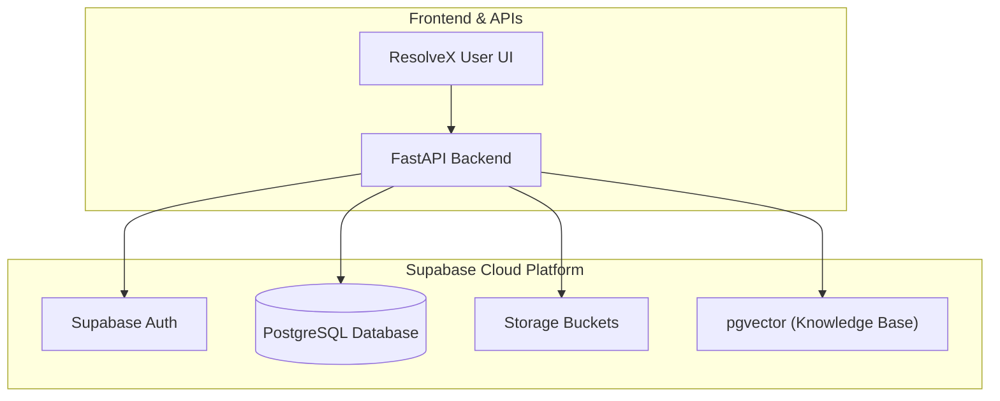
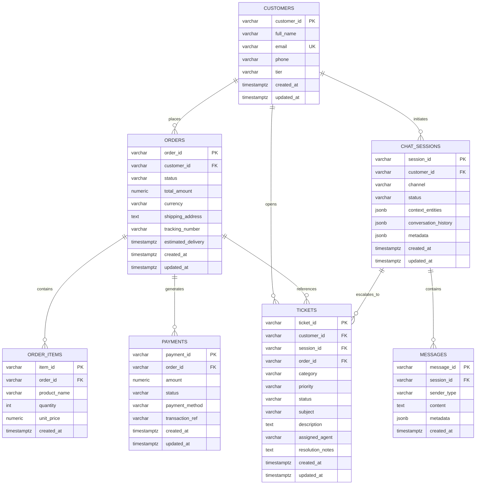
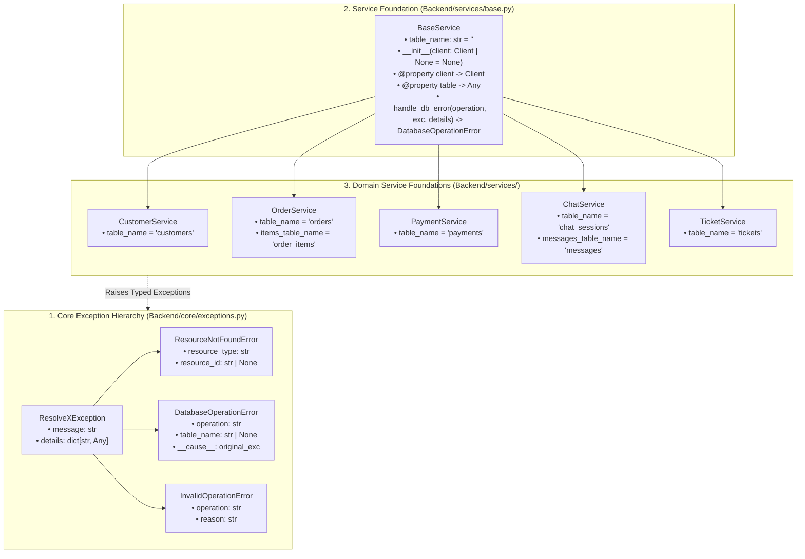
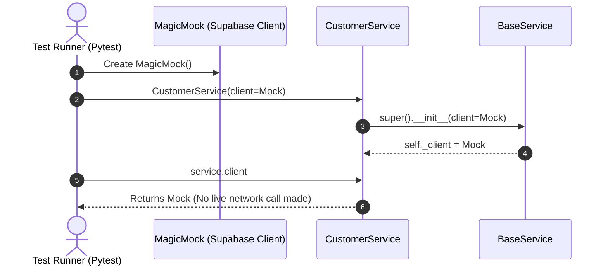
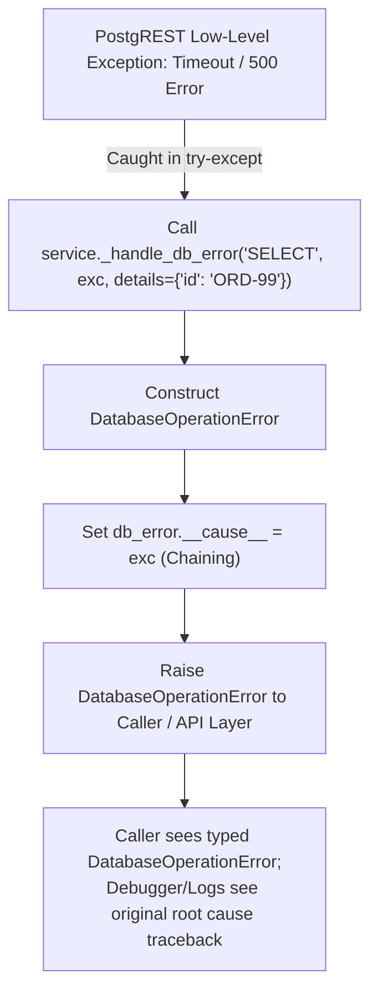
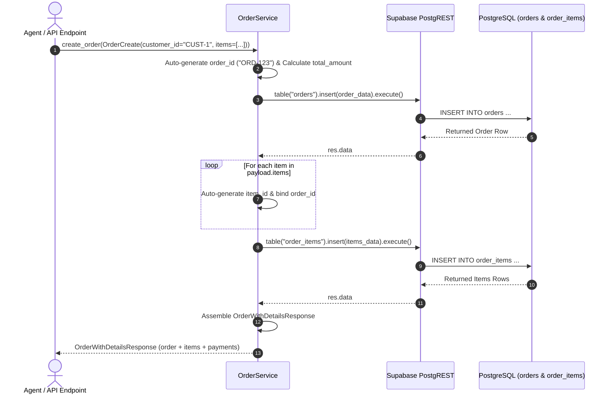
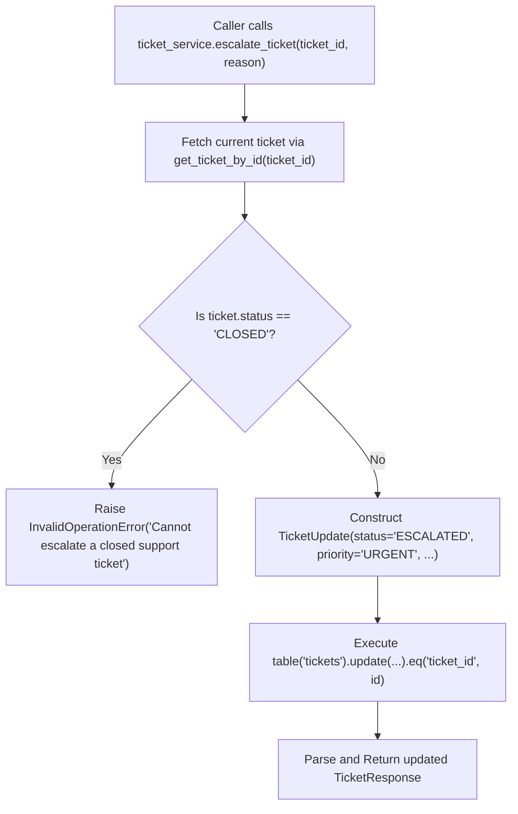

# ResolveX — Step-by-Step Learning & Implementation Guide

> **Purpose**: This document is the single step-by-step learning and implementation guide for ResolveX. It tracks what has been built, why it was designed that way, how each piece works under the hood, key code concepts, testing results, and debugging steps. This guide is updated continuously as each implementation step is completed.

---

## Overview of Implementation Roadmap

| Step | Topic | Status | Description |
| :--- | :--- | :---: | :--- |
| **Step 1** | Supabase Project Setup | **Completed** | Managed PostgreSQL backend initialization for persistent storage & vector search. |
| **Step 2** | Supabase Backend Connection | **Completed** | Reusable Python Supabase client module, environment variable loading, and connectivity test. |
| **Step 3** | Database Schema & Migrations | **Completed** | Core relational tables (customers, orders, items, payments, chat sessions, messages, tickets) and indexes. |
| **Step 4** | Core Domain Models & Services | **Completed** | Pydantic v2 schemas (Phases 1-2), Service Foundation (Phase 3), and Database CRUD Services (Phase 4). |
| **Step 5** | RAG Pipeline & Vector Search | *Pending* | Document ingestion, chunking, embeddings, and similarity retrieval. |
| **Step 6** | LangGraph Agents & Tools | *Pending* | Triage, Orders, Technical Support, and Escalation agents. |
| **Step 7** | API Layer & WebSocket Chat | *Pending* | FastAPI routes and real-time streaming endpoints. |
| **Step 8** | Frontend Dashboard | *Pending* | Interactive user and support agent interfaces. |

---

## Step 1 — Supabase Project Setup

### WHAT
Setting up a managed **Supabase** cloud PostgreSQL project as the core backend data store for ResolveX.

### WHY
ResolveX requires:
1. **Relational Data Storage**: Fast, ACID-compliant storage for operational data (customer orders, support tickets, conversation transcripts, and user audit logs).
2. **Vector Database Ready (`pgvector`)**: Native PostgreSQL vector extension for storing high-dimensional embeddings used in RAG (Retrieval-Augmented Generation) without needing a separate external vector database.
3. **Realtime & Auth Ready**: Built-in authentication, Row Level Security (RLS), and webhook capabilities for scalable event-driven workflows.

### Architecture & Data-Flow Diagram



---

## Step 2 — Supabase Backend Connection

### WHAT
A secure, reusable, and testable Python connection layer between the backend application and the remote Supabase instance.

### WHY
All upcoming backend services (ticket management, order lookups, agent tool executions, and RAG vector queries) require a single, consistent, and authenticated client connection. Centralizing client initialization ensures:
- No duplicate client instances consuming excessive sockets.
- No exposed credentials in source code.
- Graceful validation and error messages when environment variables are missing.

---

### Key Code Concepts Explained

```mermaid
flowchart LR
    ENV[".env (Root File)"] -->|1. load_dotenv()| LOADER["python-dotenv"]
    LOADER -->|2. os.getenv()| VARS["SUPABASE_URL\nSUPABASE_PUBLISHABLE_KEY"]
    VARS -->|3. Validation & Singleton| CLIENT["Backend.db.get_supabase_client()"]
    CLIENT -->|4. verify_connection()| SUPABASE[("Supabase Remote Project")]
```

1. **`load_dotenv(dotenv_path)`**:
   - Locates the project's root `.env` file using path resolution (`Path(__file__).resolve().parent.parent.parent / ".env"`).
   - Injects key-value pairs into `os.environ` so secrets remain outside version control.

2. **`os.getenv("KEY_NAME")`**:
   - Safely reads environment variables without hardcoding secret keys into source code.
   - Reads `SUPABASE_URL` and `SUPABASE_PUBLISHABLE_KEY` with fallback support for `SUPABASE_KEY` / `SUPABASE_ANON_KEY`.

3. **Singleton Pattern (`get_supabase_client()`)**:
   - Reuses a module-level `_supabase_client` instance across the entire backend lifetime rather than instantiating a new client on every request.

4. **Input Validation & Exception Handling**:
   - Explicitly validates that `SUPABASE_URL` and `SUPABASE_PUBLISHABLE_KEY` are non-empty before calling `create_client`.
   - Raises descriptive `ValueError` exceptions guiding the developer if configurations are missing.

5. **Connection Verification (`verify_connection()`)**:
   - Performs a lightweight API check against Supabase storage (`client.storage.list_buckets()`) to confirm network reachability and API key validity without requiring any pre-existing database tables.

---

### Files Implemented & Modified

#### 1. `Backend/db/supabase_client.py` [NEW]
Reusable Supabase client provider and connectivity check.

#### 2. `Backend/db/__init__.py` [NEW / UPDATED]
Exports clean public interfaces for database operations.

#### 3. `tests/test_supabase_connection.py` [NEW]
Verification test compatible with direct Python execution and Pytest.

#### 4. `requirements.txt` [UPDATED]
Added required core dependencies (`supabase>=2.0.0`, `python-dotenv>=1.0.0`).

#### 5. `.env.example` [UPDATED]
Clean template for configuring environment variables.

---

## Step 3 — Database Schema & Migrations

### WHAT
Designing and creating the initial PostgreSQL relational database schema for ResolveX using a version-controlled SQL migration file (`database/migrations/001_initial_schema.sql`), with an automated schema validation test suite in `tests/test_database_schema.py`.

The schema encompasses the 7 core operational and conversational tables:
1. **`customers`**: Customer identity, contact information, and membership tier (`STANDARD`, `GOLD`, `PLATINUM`).
2. **`orders`**: E-commerce purchase orders, tracking codes, estimated delivery timestamps, and order lifecycle statuses.
3. **`order_items`**: Line items within each order, specifying product names, quantities, and unit prices.
4. **`payments`**: Transaction records, payment statuses (`PENDING`, `SUCCESS`, `FAILED`, `REFUNDED`), payment methods, and transaction reference IDs.
5. **`chat_sessions`**: Multi-turn conversation sessions holding extracted conversational entities (JSONB) and session metadata.
6. **`messages`**: Individual conversation turns with roles (`USER`, `AGENT`, `SYSTEM`, `TOOL`) and message payloads.
7. **`tickets`**: Support tickets generated for human escalation, agent assignment, issue categorization, and priority tracking.

---

### Entity-Relationship (ER) Diagram



---

## Step 4 — Core Domain Models & Services

### Step 4 Roadmap Breakdown
- **Phase 1 & Phase 2 — Domain Models & Pydantic Schemas**: Centralized validation schemas for all domain entities (`Customer`, `Order`, `Payment`, `ChatSession`, `Message`, `Ticket`). [Completed]
- **Phase 3 — Service Layer Foundation & Custom Exceptions**: Reusable `BaseService`, custom exception hierarchy with exception chaining, and domain service class foundations. [Completed]
- **Phase 4 — Domain CRUD Service Implementations**: Typed database query and mutation methods for operational business workflows (`CustomerService`, `OrderService`, `PaymentService`, `ChatService`, `TicketService`). [Completed]
- **Phase 5 — Test Verification, Limitations Analysis, and Step 4 Formal Review & Closure**: 100% test pass verification across 69 tests, invariant guard coverage table, and known limitations analysis. [Completed]

---

### Step 4 — Phase 3: Service Layer Foundation & Custom Exceptions

#### WHAT
Establishing the foundational service layer architecture, custom exception hierarchy, and table bindings for ResolveX without jumping ahead into Phase 4 CRUD operations:

1. **Custom Exception Hierarchy (`Backend/core/exceptions.py`)**:
   - `ResolveXException`: Base exception class for all ResolveX errors.
   - `ResourceNotFoundError`: Raised when a customer, order, payment, session, or ticket is missing.
   - `DatabaseOperationError`: Raised when low-level PostgREST or database network queries fail, with exception chaining (`__cause__`).
   - `InvalidOperationError`: Raised when an invalid state transition or domain rule is violated.
2. **Reusable Base Service (`Backend/services/base.py`)**:
   - `BaseService`: Encapsulates Supabase client access, supports dependency injection for unit testing, binds to `table_name`, and formats chained database errors via `_handle_db_error`.
3. **Domain Service Class Foundations (`Backend/services/`)**:
   - `CustomerService`: Bound to `customers`.
   - `OrderService`: Bound to `orders` and `order_items`.
   - `PaymentService`: Bound to `payments`.
   - `ChatService`: Bound to `chat_sessions` and `messages`.
   - `TicketService`: Bound to `tickets`.
4. **Focused In-Memory Unit Test Suite (`tests/test_services_foundation.py`)**:
   - 15 unit tests validating exceptions, formatting, metadata dictionaries, exception chaining, client injection, and table bindings without requiring live database mutations.

---

#### WHY
Before implementing specific CRUD operations in Phase 4, the service layer requires architectural boundaries:
- **Consistent Error Wrapping**: Low-level database library errors (PostgREST errors, HTTP timeouts, network dropouts) must not leak raw tracebacks into the AI or API layers. Instead, they are caught and wrapped into structured `DatabaseOperationError` exceptions with context details.
- **Traceback Preservation (Exception Chaining)**: Using Python's `raise ... from exc` pattern or explicit `__cause__` binding ensures engineers and observability tools can still inspect the original root cause.
- **Isolated Unit Testing (Dependency Injection)**: By allowing `BaseService(client=mock_client)`, domain services can be tested with mock clients in sub-second test runs without creating or deleting remote database rows.
- **Single Source of Table Names**: Each service declares its table name as a class attribute, preventing typos across queries.

---

### Code Architecture & Relationship Diagram



---

### Detailed Code Changes Breakdown

| File Name | Class / Function Name | What Changed | Why It Was Needed | How It Works |
| :--- | :--- | :--- | :--- | :--- |
| [`Backend/core/exceptions.py`](file:///c:/INTERNSHIP/ResolveX/Backend/core/exceptions.py) | `ResolveXException` | Created root base exception class | Establishes a common base for all ResolveX errors | Stores `message` and `details` dictionary; formats `__str__` |
| [`Backend/core/exceptions.py`](file:///c:/INTERNSHIP/ResolveX/Backend/core/exceptions.py) | `ResourceNotFoundError` | Created not-found domain exception | Standardizes 404-equivalent entity lookups | Merges `resource_type` and `resource_id` into `details` |
| [`Backend/core/exceptions.py`](file:///c:/INTERNSHIP/ResolveX/Backend/core/exceptions.py) | `DatabaseOperationError` | Created database error wrapper | Wraps low-level database failures cleanly | Captures `operation`, `table_name`, and supports `__cause__` chaining |
| [`Backend/core/exceptions.py`](file:///c:/INTERNSHIP/ResolveX/Backend/core/exceptions.py) | `InvalidOperationError` | Created business rule exception | Flags illegal operations (e.g. modifying closed tickets) | Captures `operation` and `reason` |
| [`Backend/core/__init__.py`](file:///c:/INTERNSHIP/ResolveX/Backend/core/__init__.py) | Module Exports | Exported 4 exception classes | Centralizes imports for clean module access | Defines `__all__` list with all custom exceptions |
| [`Backend/services/base.py`](file:///c:/INTERNSHIP/ResolveX/Backend/services/base.py) | `BaseService.__init__` | Accepts optional `client` parameter | Enables dependency injection for unit tests | Stores `_client` internally (or `None` if lazy) |
| [`Backend/services/base.py`](file:///c:/INTERNSHIP/ResolveX/Backend/services/base.py) | `BaseService.client` | `@property` getter for client | Provides lazy singleton resolution | Returns `_client` if injected; calls `get_supabase_client()` if `None` |
| [`Backend/services/base.py`](file:///c:/INTERNSHIP/ResolveX/Backend/services/base.py) | `BaseService.table` | `@property` getter for table | Returns PostgREST builder for `table_name` | Calls `self.client.table(self.table_name)` or raises `ValueError` |
| [`Backend/services/base.py`](file:///c:/INTERNSHIP/ResolveX/Backend/services/base.py) | `BaseService._handle_db_error` | Centralized database error builder | Formats and chains `DatabaseOperationError` | Sets `db_error.__cause__ = exc` and attaches metadata |
| [`Backend/services/customer_service.py`](file:///c:/INTERNSHIP/ResolveX/Backend/services/customer_service.py) | `CustomerService` | Inherits `BaseService`, sets `table_name` | Foundation for customer profile operations | Sets `table_name = "customers"` |
| [`Backend/services/order_service.py`](file:///c:/INTERNSHIP/ResolveX/Backend/services/order_service.py) | `OrderService` | Inherits `BaseService`, sets table names | Foundation for orders & line items | Sets `table_name = "orders"`, `items_table_name = "order_items"` |
| [`Backend/services/payment_service.py`](file:///c:/INTERNSHIP/ResolveX/Backend/services/payment_service.py) | `PaymentService` | Inherits `BaseService`, sets `table_name` | Foundation for transaction lookups | Sets `table_name = "payments"` |
| [`Backend/services/chat_service.py`](file:///c:/INTERNSHIP/ResolveX/Backend/services/chat_service.py) | `ChatService` | Inherits `BaseService`, sets table names | Foundation for sessions & message history | Sets `table_name = "chat_sessions"`, `messages_table_name = "messages"` |
| [`Backend/services/ticket_service.py`](file:///c:/INTERNSHIP/ResolveX/Backend/services/ticket_service.py) | `TicketService` | Inherits `BaseService`, sets `table_name` | Foundation for support tickets & escalation | Sets `table_name = "tickets"` |
| [`Backend/services/__init__.py`](file:///c:/INTERNSHIP/ResolveX/Backend/services/__init__.py) | Module Exports | Exported `BaseService` & 5 domain services | Clean public interface for service layer | Defines `__all__` list with all services |
| [`tests/test_services_foundation.py`](file:///c:/INTERNSHIP/ResolveX/tests/test_services_foundation.py) | 15 Test Functions | Implemented comprehensive unit tests | Verifies exception behavior, chaining, and bindings | Uses `pytest` and `MagicMock` in-memory |

---

### Line-by-Line Code Walkthrough

#### 1. `Backend/core/exceptions.py`

```python
from typing import Any

class ResolveXException(Exception):
    def __init__(self, message: str, details: dict[str, Any] | None = None) -> None:
        super().__init__(message)
        self.message = message
        self.details = details or {}

    def __str__(self) -> str:
        if self.details:
            return f"{self.message} (details={self.details})"
        return self.message
```
- **Line 1–8**: Imports `Any` for flexible typing of metadata dictionaries.
- **Line 11–23**: `ResolveXException` subclasses Python's standard `Exception`. The constructor calls `super().__init__(message)` so standard exception logging works, and stores `self.details` defaulting to an empty dict `{}`.
- **Line 25–28**: `__str__` overrides string formatting. If `details` are present, it prints `Message (details={...})` for clearer log readability.

```python
class ResourceNotFoundError(ResolveXException):
    def __init__(
        self,
        resource_type: str,
        resource_id: str | None = None,
        message: str | None = None,
        details: dict[str, Any] | None = None,
    ) -> None:
        self.resource_type = resource_type
        self.resource_id = resource_id
        if message is None:
            if resource_id is not None:
                message = f"{resource_type} with ID '{resource_id}' was not found."
            else:
                message = f"{resource_type} was not found."
        merged_details = {"resource_type": resource_type, "resource_id": resource_id}
        if details:
            merged_details.update(details)
        super().__init__(message=message, details=merged_details)
```
- **Line 31–47**: Defines `ResourceNotFoundError` subclassing `ResolveXException`. Accepts `resource_type` (e.g. `"Order"`) and optional `resource_id` (e.g. `"ORD-101"`).
- **Line 50–54**: Automatically constructs an intuitive default message if none is provided.
- **Line 55–58**: Merges `resource_type` and `resource_id` into the `details` dictionary and delegates to `super().__init__`.

```python
class DatabaseOperationError(ResolveXException):
    def __init__(
        self,
        operation: str,
        table_name: str | None = None,
        message: str | None = None,
        details: dict[str, Any] | None = None,
    ) -> None:
        self.operation = operation
        self.table_name = table_name
        if message is None:
            if table_name is not None:
                message = f"Database error during {operation} on table '{table_name}'."
            else:
                message = f"Database error during {operation}."
        merged_details = {"operation": operation, "table_name": table_name}
        if details:
            merged_details.update(details)
        super().__init__(message=message, details=merged_details)
```
- **Line 61–90**: Captures database-level issues (such as timeouts, foreign key violations, or connection drops). Stores `operation` (e.g. `"SELECT"`) and `table_name` (e.g. `"orders"`).

```python
class InvalidOperationError(ResolveXException):
    def __init__(
        self,
        operation: str,
        reason: str,
        message: str | None = None,
        details: dict[str, Any] | None = None,
    ) -> None:
        self.operation = operation
        self.reason = reason
        if message is None:
            message = f"Invalid operation '{operation}': {reason}"
        merged_details = {"operation": operation, "reason": reason}
        if details:
            merged_details.update(details)
        super().__init__(message=message, details=merged_details)
```
- **Line 93–117**: Reusable for domain invariant violations (e.g. attempting to cancel an already delivered order).

---

#### 2. `Backend/services/base.py`

```python
from typing import Any
from supabase import Client

from Backend.core.exceptions import DatabaseOperationError
from Backend.db.supabase_client import get_supabase_client

class BaseService:
    table_name: str = ""

    def __init__(self, client: Client | None = None) -> None:
        self._client = client
```
- **Line 1–14**: Imports type definitions, `Client` from `supabase`, `DatabaseOperationError` from core exceptions, and `get_supabase_client` from the database package.
- **Line 15–23**: `BaseService` defines a class attribute `table_name = ""` intended to be overridden by subclasses.
- **Line 25–33**: The constructor accepts `client: Client | None = None`. If a client is passed (such as a mock in a test), it is stored in `self._client`.

```python
    @property
    def client(self) -> Client:
        if self._client is None:
            self._client = get_supabase_client()
        return self._client
```
- **Line 35–40**: `@property` turns the `client()` method into a getter attribute `service.client`. If `self._client` was not supplied during initialization, it lazily obtains the singleton client from `get_supabase_client()`.

```python
    @property
    def table(self) -> Any:
        if not self.table_name:
            raise ValueError(f"table_name is not configured for {self.__class__.__name__}")
        return self.client.table(self.table_name)
```
- **Line 42–52**: `@property` for `service.table`. Verifies that `self.table_name` is non-empty, then calls `self.client.table(self.table_name)` to return the PostgREST query builder.

```python
    def _handle_db_error(
        self,
        operation: str,
        exc: Exception,
        details: dict[str, Any] | None = None,
    ) -> DatabaseOperationError:
        merged_details = {"original_error": str(exc)}
        if details:
            merged_details.update(details)

        db_error = DatabaseOperationError(
            operation=operation,
            table_name=self.table_name,
            message=f"Database error during {operation} on '{self.table_name}': {exc}",
            details=merged_details,
        )
        db_error.__cause__ = exc
        return db_error
```
- **Line 54–82**: Helper method that wraps low-level exceptions into `DatabaseOperationError`. Crucially, line 81 sets `db_error.__cause__ = exc` for clean exception chaining.

---

#### 3. Domain Services (`CustomerService`, `OrderService`, etc.)

```python
from Backend.services.base import BaseService

class CustomerService(BaseService):
    table_name: str = "customers"
```
```python
class OrderService(BaseService):
    table_name: str = "orders"
    items_table_name: str = "order_items"
```
```python
class PaymentService(BaseService):
    table_name: str = "payments"
```
```python
class ChatService(BaseService):
    table_name: str = "chat_sessions"
    messages_table_name: str = "messages"
```
```python
class TicketService(BaseService):
    table_name: str = "tickets"
```
- Each domain service subclasses `BaseService` and binds its primary and secondary table names.
- All CRUD query methods are reserved for **Phase 4**.

---

### Beginner-Friendly Dry Runs

#### Dry Run 1: Creating a Service with an Injected Mock Client (Unit Testing)



- **Input**: `mock_client = MagicMock()`, `service = CustomerService(client=mock_client)`
- **Execution Steps**:
  1. `CustomerService` passes `mock_client` to `BaseService.__init__`.
  2. `BaseService` stores `self._client = mock_client`.
  3. When `service.client` is accessed, the `@property` checks `if self._client is None`.
  4. Since `self._client` is already set, it immediately returns `mock_client` without calling `get_supabase_client()`.
- **Output**: Returns the mock client, allowing sub-millisecond offline unit tests.

---

#### Dry Run 2: Creating a Service Without a Client (Production Lazy Loading)

- **Input**: `service = OrderService()` (no arguments passed)
- **Execution Steps**:
  1. `BaseService.__init__` sets `self._client = None`.
  2. Later, when production application code accesses `service.client`:
  3. The `@property` detects `if self._client is None:`.
  4. It invokes `get_supabase_client()` from `Backend.db.supabase_client`.
  5. `get_supabase_client()` loads `.env`, creates/retrieves the singleton `Client`, and stores it into `self._client`.
  6. Subsequent accesses reuse the cached client.
- **Output**: An authenticated live Supabase client singleton is returned.

---

#### Dry Run 3: Accessing the Bound Table (`service.table`)

- **Input**: `service = PaymentService(client=mock_client)`, then call `_ = service.table`
- **Execution Steps**:
  1. `service.table` getter is invoked.
  2. Checks `if not self.table_name:`.
  3. Since `PaymentService.table_name == "payments"`, validation passes.
  4. Calls `self.client.table("payments")`.
  5. The client's `.table()` method returns the PostgREST query builder for `"payments"`.
- **Output**: A query builder ready for `.select()`, `.insert()`, `.update()`, etc.

---

#### Dry Run 4: Handling a Database Error & Exception Chaining Flow



- **Input**:
  ```python
  original_exc = RuntimeError("Supabase connection timeout")
  db_err = service._handle_db_error("SELECT", original_exc, details={"order_id": "ORD-99"})
  ```
- **Execution Steps**:
  1. `_handle_db_error` creates a `details` dictionary containing `{"original_error": "Supabase connection timeout", "order_id": "ORD-99"}`.
  2. Constructs `DatabaseOperationError(operation="SELECT", table_name="orders", message="...", details=details)`.
  3. Sets `db_error.__cause__ = original_exc`.
  4. Returns `db_error`.
- **Output**:
  - `str(db_err)`: `"Database error during SELECT on 'orders': Supabase connection timeout (details={'original_error': 'Supabase connection timeout', 'order_id': 'ORD-99', 'operation': 'SELECT', 'table_name': 'orders'})"`
  - `db_err.__cause__`: `original_exc` (preserves full original traceback).

---

#### Dry Run 5: Expected Test Execution Flow in `tests/test_services_foundation.py`

- **Command**: `pytest tests/test_services_foundation.py -v`
- **Execution Steps**:
  1. Pytest discovers 15 test functions in `tests/test_services_foundation.py`.
  2. Tests 1–6 verify `ResolveXException`, `ResourceNotFoundError`, `DatabaseOperationError`, and `InvalidOperationError` instantiation, messages, and `__cause__` chaining.
  3. Tests 7–10 verify `BaseService` client injection, unconfigured table error handling, `.table` property access, and `_handle_db_error` chaining.
  4. Tests 11–15 verify inheritance and table name bindings for `CustomerService`, `OrderService`, `PaymentService`, `ChatService`, and `TicketService`.
- **Output**: `15 passed in 0.59s` (100% pass rate).

---

### Important Python Concepts Explained

1. **Inheritance**:
   - `class ResourceNotFoundError(ResolveXException):` means `ResourceNotFoundError` inherits all properties and methods of `ResolveXException`, which in turn inherits from Python's built-in `Exception`. Any `try ... except ResolveXException:` block will catch `ResourceNotFoundError`.
2. **Constructors (`__init__`)**:
   - The `__init__` method initializes newly created class instances. Subclasses use `super().__init__(...)` to delegate initial setup to the parent class.
3. **Properties (`@property`)**:
   - The `@property` decorator turns a Python method into a readable attribute (e.g. `service.table` instead of `service.table()`). This allows computing attributes dynamically, performing validations, or lazily instantiating objects without changing the external calling syntax.
4. **Type Hints**:
   - Python type annotations like `client: Client | None = None` and `details: dict[str, Any] | None = None` document expected types, enable IDE auto-completion, and allow static type checkers (Mypy, Pyright) to catch bugs before execution.
5. **Dependency Injection**:
   - Instead of hardcoding `self.client = create_client(...)` inside `BaseService`, the constructor accepts an optional `client` parameter. This allows callers (such as test suites) to "inject" a mock client, decoupling the service logic from the concrete database network connection.
6. **Exception Chaining (`__cause__`)**:
   - When catching an exception and raising a domain-specific one, Python allows attaching the original exception as `__cause__` (either via `raise NewError() from original_exc` or setting `new_error.__cause__ = original_exc`). This provides clean domain errors while preserving the full debugging stack trace.
7. **Mocking (`unittest.mock.MagicMock`)**:
   - `MagicMock` is a Python utility that simulates real objects. It records what methods were called (e.g. `mock_client.table.assert_called_once_with("customers")`), allowing unit tests to verify database interactions without contacting a real database server.

---

### Step 4 — Phase 4: Database CRUD Services & Domain Operations

#### WHAT
Implementing the concrete database CRUD and domain operations across all 5 service classes (`CustomerService`, `OrderService`, `PaymentService`, `ChatService`, and `TicketService`), backed by PostgREST query execution, Pydantic v2 schemas, and custom exception handling:

1. **`CustomerService` (`Backend/services/customer_service.py`)**:
   - `get_customer_by_id(customer_id: str) -> CustomerResponse`: Looks up customer by PK; raises `ResourceNotFoundError` if missing.
   - `get_customer_by_email(email: str) -> CustomerResponse | None`: Looks up customer by unique email.
   - `create_customer(payload: CustomerCreate) -> CustomerResponse`: Auto-generates `customer_id` (`CUST-...`) if omitted; persists customer.
   - `update_customer(customer_id: str, payload: CustomerUpdate) -> CustomerResponse`: Partially updates customer profile; handles not found safely.

2. **`OrderService` (`Backend/services/order_service.py`)**:
   - `get_order_by_id(order_id: str) -> OrderResponse`: Retrieves order by PK.
   - `get_order_items(order_id: str) -> list[OrderItemResponse]`: Retrieves order line items from `order_items`.
   - `get_order_with_details(order_id: str) -> OrderWithDetailsResponse`: Composite lookup fetching order header, nested line items, and associated payment records.
   - `create_order(payload: OrderCreate) -> OrderWithDetailsResponse`: Atomically creates order header (computing total amount if needed) and inserts line items with generated IDs.
   - `update_order(order_id: str, payload: OrderUpdate) -> OrderResponse`: Partially updates order attributes with domain status transition guards.
   - `update_order_status(order_id: str, status: OrderStatus | str) -> OrderResponse`: Validates state transitions (e.g., prevents cancelling delivered orders via `InvalidOperationError`).

3. **`PaymentService` (`Backend/services/payment_service.py`)**:
   - `get_payment_by_id(payment_id: str) -> PaymentResponse`: Retrieves payment by PK.
   - `get_payments_by_order_id(order_id: str) -> list[PaymentResponse]`: Retrieves all payment records for an order.
   - `create_payment(payload: PaymentCreate) -> PaymentResponse`: Inserts financial transaction record with auto-generated ID (`PAY-...`).
   - `verify_payment_status(payment_id: str) -> PaymentResponse`: Looks up payment transaction status.
   - `update_payment_status(payment_id: str, payload: PaymentUpdate) -> PaymentResponse`: Updates payment status with domain invariant validation (e.g., prevents reopening refunded payments).

4. **`ChatService` (`Backend/services/chat_service.py`)**:
   - `create_session(payload: ChatSessionCreate | None = None) -> ChatSessionResponse`: Creates new session with defaults or custom attributes.
   - `get_session(session_id: str) -> ChatSessionResponse`: Retrieves session context memory and metadata.
   - `update_session(session_id: str, payload: ChatSessionUpdate) -> ChatSessionResponse`: Updates conversational entities, history, or status.
   - `add_message(payload: MessageCreate) -> MessageResponse`: Validates session existence and appends message turn into `messages`.
   - `get_messages(session_id: str, limit: int = 100) -> list[MessageResponse]`: Retrieves chronological message thread for a session.
   - `get_session_with_messages(session_id: str) -> ChatSessionWithMessagesResponse`: Composite lookup assembling session and message turns.

5. **`TicketService` (`Backend/services/ticket_service.py`)**:
   - `create_ticket(payload: TicketCreate) -> TicketResponse`: Files a support ticket with auto-generated ID (`TCK-...`).
   - `get_ticket_by_id(ticket_id: str) -> TicketResponse`: Retrieves ticket by PK.
   - `get_tickets_by_customer_id(customer_id: str) -> list[TicketResponse]`: Retrieves all tickets filed by a customer.
   - `update_ticket(ticket_id: str, payload: TicketUpdate) -> TicketResponse`: Partially updates ticket attributes.
   - `update_ticket_status(ticket_id: str, status: TicketStatus | str, resolution_notes: str | None = None) -> TicketResponse`: Transitions ticket status.
   - `escalate_ticket(ticket_id: str, priority: TicketPriority | str, reason: str | None, assigned_agent: str | None) -> TicketResponse`: Validates ticket is not closed, escalates status to `ESCALATED`, updates priority, assigns agent, and records audit remarks.

6. **Comprehensive Unit Test Suite (`tests/test_domain_services.py`)**:
   - 17 isolated unit tests validating all service CRUD methods, error wrapping, domain invariant checks, and edge cases using mock PostgREST builders.

---

#### WHY
The domain service layer bridges high-level AI agent decisions and raw database tables:
- **Type Safety & Schema Validation**: Raw PostgREST query results are immediately parsed and validated into Pydantic models, eliminating `KeyError` risks and data type mismatches across the backend.
- **Enforced Business Invariants**: State transition rules (such as forbidding cancellation of delivered orders or escalating closed tickets) live in the domain service rather than scattered across agents or API routes.
- **Standardized Exception Handling**: Database query failures are automatically intercepted and wrapped into typed `DatabaseOperationError` exceptions with context details while preserving low-level tracebacks via exception chaining.
- **Separation of Concerns**: AI agents and API endpoints invoke clean Python methods (`service.create_order(...)`, `service.escalate_ticket(...)`) without crafting SQL queries or PostgREST filtering chains directly.

---

### Request-to-Database Flow Diagrams

#### 1. Order Creation & Line Item Persistence Flow


#### 2. Ticket Escalation & Guard Flow


---

### Detailed Code Changes Breakdown

| File Name | Class / Method Name | What Changed | Why It Was Needed | How It Works |
| :--- | :--- | :--- | :--- | :--- |
| [`Backend/services/customer_service.py`](file:///c:/INTERNSHIP/ResolveX/Backend/services/customer_service.py) | `CustomerService.get_customer_by_id` | Implemented PK lookup | Fetches customer profile | Runs `.select("*").eq("customer_id", id)`, raises `ResourceNotFoundError` if missing |
| [`Backend/services/customer_service.py`](file:///c:/INTERNSHIP/ResolveX/Backend/services/customer_service.py) | `CustomerService.get_customer_by_email` | Implemented email lookup | Checks customer by unique email | Runs `.select("*").eq("email", email)`, returns `CustomerResponse` or `None` |
| [`Backend/services/customer_service.py`](file:///c:/INTERNSHIP/ResolveX/Backend/services/customer_service.py) | `CustomerService.create_customer` | Implemented customer creation | Registers new customer profile | Auto-generates ID, dumps model, inserts into `customers`, validates response |
| [`Backend/services/customer_service.py`](file:///c:/INTERNSHIP/ResolveX/Backend/services/customer_service.py) | `CustomerService.update_customer` | Implemented partial update | Updates customer details | Dumps `exclude_unset=True`, runs `.update()`, raises `ResourceNotFoundError` if not found |
| [`Backend/services/order_service.py`](file:///c:/INTERNSHIP/ResolveX/Backend/services/order_service.py) | `OrderService.get_order_by_id` | Implemented order lookup | Fetches order header | Queries `orders` table by `order_id` |
| [`Backend/services/order_service.py`](file:///c:/INTERNSHIP/ResolveX/Backend/services/order_service.py) | `OrderService.get_order_items` | Implemented line item query | Retrieves items for order | Queries `order_items` where `order_id == id` |
| [`Backend/services/order_service.py`](file:///c:/INTERNSHIP/ResolveX/Backend/services/order_service.py) | `OrderService.get_order_with_details` | Implemented composite query | Provides full order view with items & payments | Queries order, items, and payments, assembling `OrderWithDetailsResponse` |
| [`Backend/services/order_service.py`](file:///c:/INTERNSHIP/ResolveX/Backend/services/order_service.py) | `OrderService.create_order` | Implemented order & items creation | Creates order and line items | Calculates total, inserts into `orders`, then batch inserts into `order_items` |
| [`Backend/services/order_service.py`](file:///c:/INTERNSHIP/ResolveX/Backend/services/order_service.py) | `OrderService.update_order_status` | Implemented status transition | Safely updates order state | Enforces domain rules (cannot cancel delivered order via `InvalidOperationError`) |
| [`Backend/services/payment_service.py`](file:///c:/INTERNSHIP/ResolveX/Backend/services/payment_service.py) | `PaymentService.get_payment_by_id` | Implemented payment lookup | Retrieves payment by ID | Queries `payments` table |
| [`Backend/services/payment_service.py`](file:///c:/INTERNSHIP/ResolveX/Backend/services/payment_service.py) | `PaymentService.create_payment` | Implemented payment creation | Records financial transaction | Auto-generates ID, inserts into `payments` |
| [`Backend/services/payment_service.py`](file:///c:/INTERNSHIP/ResolveX/Backend/services/payment_service.py) | `PaymentService.update_payment_status` | Implemented payment update | Modifies payment status | Guards against mutating `REFUNDED` payments |
| [`Backend/services/chat_service.py`](file:///c:/INTERNSHIP/ResolveX/Backend/services/chat_service.py) | `ChatService.create_session` | Implemented session initialization | Opens conversation thread | Inserts session into `chat_sessions` |
| [`Backend/services/chat_service.py`](file:///c:/INTERNSHIP/ResolveX/Backend/services/chat_service.py) | `ChatService.add_message` | Implemented message turn append | Persists user/agent message | Verifies session exists, inserts into `messages` |
| [`Backend/services/chat_service.py`](file:///c:/INTERNSHIP/ResolveX/Backend/services/chat_service.py) | `ChatService.get_session_with_messages` | Implemented composite session thread | Loads conversation history | Fetches session + messages ordered chronologically |
| [`Backend/services/ticket_service.py`](file:///c:/INTERNSHIP/ResolveX/Backend/services/ticket_service.py) | `TicketService.create_ticket` | Implemented support ticket creation | Files support ticket | Auto-generates ID, inserts into `tickets` |
| [`Backend/services/ticket_service.py`](file:///c:/INTERNSHIP/ResolveX/Backend/services/ticket_service.py) | `TicketService.escalate_ticket` | Implemented human escalation | Escalates ticket to urgent agent review | Validates ticket is not `CLOSED`, updates status, priority, and notes |
| [`tests/test_domain_services.py`](file:///c:/INTERNSHIP/ResolveX/tests/test_domain_services.py) | 17 Test Functions | Implemented domain service test suite | Tests all services offline | Uses `unittest.mock.MagicMock` to simulate PostgREST chains |

---

### Line-by-Line Code Walkthrough

#### 1. `Backend/services/customer_service.py` (`get_customer_by_id` & `create_customer`)
```python
def get_customer_by_id(self, customer_id: str) -> CustomerResponse:
    try:
        res = self.table.select("*").eq("customer_id", customer_id).execute()
    except Exception as exc:
        raise self._handle_db_error(
            operation="SELECT", exc=exc, details={"customer_id": customer_id}
        ) from exc

    if not res.data:
        raise ResourceNotFoundError(resource_type="Customer", resource_id=customer_id)

    return CustomerResponse.model_validate(res.data[0])
```
- **Lines 1–6**: Queries the `customers` table filtering by `customer_id`. If low-level database failure occurs (network dropout, timeout), `_handle_db_error` creates a `DatabaseOperationError` chained to the original exception (`from exc`).
- **Lines 8–9**: If PostgREST returns an empty list `res.data == []`, raises typed `ResourceNotFoundError` containing `resource_type="Customer"` and `resource_id`.
- **Line 11**: Deserializes and validates the first row into a typed `CustomerResponse` Pydantic instance.

---

#### 2. `Backend/services/order_service.py` (`_validate_status_transition`)
```python
def _validate_status_transition(self, current_status: str, new_status: str) -> None:
    current_status = str(current_status).upper()
    new_status = str(new_status).upper()

    if current_status == OrderStatus.DELIVERED.value and new_status == OrderStatus.CANCELLED.value:
        raise InvalidOperationError(
            operation="update_order_status",
            reason="Cannot cancel an order that has already been delivered.",
        )
```
- **Lines 1–5**: Normalizes both statuses to uppercase strings.
- **Lines 6–10**: Enforces business rule: If an order has already reached `DELIVERED` status, transitioning to `CANCELLED` is forbidden and raises `InvalidOperationError`.

---

#### 3. `Backend/services/ticket_service.py` (`escalate_ticket`)
```python
def escalate_ticket(
    self,
    ticket_id: str,
    priority: TicketPriority | str = TicketPriority.URGENT,
    reason: str | None = None,
    assigned_agent: str | None = None,
) -> TicketResponse:
    current_ticket = self.get_ticket_by_id(ticket_id)

    if current_ticket.status == TicketStatus.CLOSED.value:
        raise InvalidOperationError(
            operation="escalate_ticket",
            reason="Cannot escalate a closed support ticket.",
        )
```
- **Lines 1–8**: Fetches current ticket record to check existence and state.
- **Lines 9–14**: Invariant guard: closed tickets cannot be escalated.
- **Lines 15–30**: Prepares update payload with `status="ESCALATED"`, upgraded priority (e.g. `URGENT`), assigned agent, and appends the escalation reason to `resolution_notes`.

---

### Dry Runs: Successful & Failure Scenarios

#### Dry Run 1: Successful Customer Lookup
- **Input**: `customer_service.get_customer_by_id("CUST-001")`
- **Mock DB Return**: `[{"customer_id": "CUST-001", "full_name": "Alice", "email": "alice@test.com", "tier": "GOLD", "created_at": "...", "updated_at": "..."}]`
- **Execution Steps**:
  1. `self.table.select("*").eq("customer_id", "CUST-001").execute()` returns rows.
  2. `res.data` is non-empty.
  3. `CustomerResponse.model_validate(res.data[0])` parses and validates types.
- **Result**: Valid `CustomerResponse` instance returned.

#### Dry Run 2: Missing Customer ID Lookup (Failure)
- **Input**: `customer_service.get_customer_by_id("CUST-999")`
- **Mock DB Return**: `[]`
- **Execution Steps**:
  1. Query executes successfully without network error.
  2. `res.data` is empty `[]`.
  3. Service raises `ResourceNotFoundError(resource_type="Customer", resource_id="CUST-999")`.
- **Result**: `ResourceNotFoundError: Customer with ID 'CUST-999' was not found.`

#### Dry Run 3: Illegal Order Cancellation (Failure)
- **Input**: `order_service.update_order_status("ORD-001", OrderStatus.CANCELLED)`
- **Current DB State**: `status = "DELIVERED"`
- **Execution Steps**:
  1. `get_order_by_id("ORD-001")` retrieves current order with `status == "DELIVERED"`.
  2. `_validate_status_transition("DELIVERED", "CANCELLED")` detects forbidden state change.
  3. Service raises `InvalidOperationError(operation="update_order_status", reason="Cannot cancel an order that has already been delivered.")`.
- **Result**: Operation rejected before executing any database update.

---

---

### Step 4 — Phase 5: Test Verification, Limitations Analysis, and Step 4 Formal Review & Closure

#### WHAT
Executing formal verification, edge-case coverage auditing, limitations analysis, and milestone closure for **Step 4 (Core Domain Models & Services)**.

---

### 1. Full 69-Test Pass Breakdown

| Test Module File | Test Count | Scope & Verification Type | Pass Rate |
| :--- | :---: | :--- | :---: |
| [`tests/test_database_schema.py`](file:///c:/INTERNSHIP/ResolveX/tests/test_database_schema.py) | **13** | Schema DDL, table constraints, indexes, triggers, idempotent RLS policies, and live Supabase lifecycle | 100% |
| [`tests/test_domain_models.py`](file:///c:/INTERNSHIP/ResolveX/tests/test_domain_models.py) | **21** | Pydantic v2 schemas, type coercion, field constraints, regex validations, decimal precision | 100% |
| [`tests/test_services_foundation.py`](file:///c:/INTERNSHIP/ResolveX/tests/test_services_foundation.py) | **15** | Custom exception hierarchy, `__cause__` exception chaining, `BaseService` client injection & table routing | 100% |
| [`tests/test_domain_services.py`](file:///c:/INTERNSHIP/ResolveX/tests/test_domain_services.py) | **18** | Domain service CRUD methods, missing entity errors, partial failure wrapping, and state invariant guards | 100% |
| [`tests/test_supabase_connection.py`](file:///c:/INTERNSHIP/ResolveX/tests/test_supabase_connection.py) | **2** | Client initialization from `.env` and Supabase storage reachability check | 100% |
| **Total Automated Tests** | **69** | **Full Unit & Integration Test Suite** | **100%** |

---

### 2. Edge-Case & Invariant Guard Coverage Table

| Invariant / Edge-Case Scenario | Service Class | Protected Behavior | Exception Raised | Test Function |
| :--- | :--- | :--- | :--- | :--- |
| **Delivered Order Cancellation** | [`OrderService`](file:///c:/INTERNSHIP/ResolveX/Backend/services/order_service.py) | Forbids transitioning an order from `DELIVERED` to `CANCELLED` | [`InvalidOperationError`](file:///c:/INTERNSHIP/ResolveX/Backend/core/exceptions.py#L93-L118) | `test_order_service_forbidden_status_transition` |
| **Cancelled Order Reshipment / Delivery** | [`OrderService`](file:///c:/INTERNSHIP/ResolveX/Backend/services/order_service.py) | Forbids transitioning an order from `CANCELLED` to `SHIPPED` or `DELIVERED` | [`InvalidOperationError`](file:///c:/INTERNSHIP/ResolveX/Backend/core/exceptions.py#L93-L118) | `test_order_service_forbidden_status_transition` |
| **Refunded Payment Modification** | [`PaymentService`](file:///c:/INTERNSHIP/ResolveX/Backend/services/payment_service.py) | Forbids transitioning an already `REFUNDED` payment transaction back to `SUCCESS` or `PENDING` | [`InvalidOperationError`](file:///c:/INTERNSHIP/ResolveX/Backend/core/exceptions.py#L93-L118) | `test_payment_service_refunded_cannot_be_reopened` |
| **Closed Ticket Escalation** | [`TicketService`](file:///c:/INTERNSHIP/ResolveX/Backend/services/ticket_service.py) | Forbids human escalation on an already `CLOSED` support ticket | [`InvalidOperationError`](file:///c:/INTERNSHIP/ResolveX/Backend/core/exceptions.py#L93-L118) | `test_ticket_service_cannot_escalate_closed_ticket` |
| **Missing Entity Lookups** | All Services | Queries returning empty results (`res.data == []`) raise typed not-found errors | [`ResourceNotFoundError`](file:///c:/INTERNSHIP/ResolveX/Backend/core/exceptions.py#L31-L60) | `test_customer_service_get_by_id_not_found`, `test_resource_not_found_error_with_id` |
| **Database Drop Error Chaining** | All Services | Low-level database library errors are wrapped with table details while preserving original stack trace | [`DatabaseOperationError`](file:///c:/INTERNSHIP/ResolveX/Backend/core/exceptions.py#L61-L91) (`__cause__`) | `test_customer_service_db_error_wrapping`, `test_database_operation_error_chaining` |
| **Partial Order Creation Failure** | [`OrderService`](file:///c:/INTERNSHIP/ResolveX/Backend/services/order_service.py) | Catches failures during line item persistence following order header creation | [`DatabaseOperationError`](file:///c:/INTERNSHIP/ResolveX/Backend/core/exceptions.py#L61-L91) | `test_order_service_create_order_partial_failure_on_items` |

---

### 3. Known Limitations & Mitigation Architecture

#### Known Limitation: Non-Transactional Multi-Table Order Creation
- **Mechanism**: In [`OrderService.create_order()`](file:///c:/INTERNSHIP/ResolveX/Backend/services/order_service.py#L114-L186), order creation executes across two sequential PostgREST REST calls:
  1. `orders.insert(order_data).execute()` (writes order header)
  2. `order_items.insert(items_data).execute()` (writes line items)
- **Risk**: If the second call fails due to a network drop or constraint violation, the order header exists in `orders` without child line items. PostgREST does not support multi-table atomic transactions over standard REST endpoints.
- **Current Behavior**: The service intercepts the error and raises [`DatabaseOperationError`](file:///c:/INTERNSHIP/ResolveX/Backend/core/exceptions.py#L61-L91) with metadata identifying the failure stage (`{"table": "order_items"}`).
- **Future Mitigation Path**: In a subsequent architectural hardening step, a PostgreSQL stored procedure (RPC) written in PL/pgSQL will execute header insertion and items insertion inside a single atomic database transaction (`BEGIN ... COMMIT / ROLLBACK`), invoked via `self.client.rpc("create_order_with_items", payload)`.

---

### 4. Step 4 Formal Completion Record

> **Step 4 (Core Domain Models & Services) is Formally Completed.**
> - **Phase 1 & 2**: Pydantic v2 schemas (`Customer`, `Order`, `Payment`, `ChatSession`, `Message`, `Ticket`) created and validated.
> - **Phase 3**: Custom exception hierarchy with exception chaining (`__cause__`) and `BaseService` foundation established.
> - **Phase 4**: Concrete database CRUD services (`CustomerService`, `OrderService`, `PaymentService`, `ChatService`, `TicketService`) implemented.
> - **Phase 5**: 69 automated tests verified at 100% pass rate, invariant guards tested, known limitations analyzed with clear RPC mitigation paths documented.

---

### 5. Verified Full Test Suite Output

```bash
pytest tests/ -v
```

```text
============================= test session starts =============================
platform win32 -- Python 3.12.0, pytest-9.1.1, pluggy-1.6.0 -- C:\Users\rishu\AppData\Local\Programs\Python\Python312\python.exe
cachedir: .pytest_cache
rootdir: C:\INTERNSHIP\ResolveX
plugins: anyio-4.12.0, langsmith-0.9.7, asyncio-1.4.0, typeguard-4.4.4
asyncio: mode=Mode.STRICT, debug=False, asyncio_default_fixture_loop_scope=None, asyncio_default_test_loop_scope=function
collected 69 items

tests/test_database_schema.py .............                              [ 18%]
tests/test_domain_models.py .....................                        [ 49%]
tests/test_domain_services.py ..................                         [ 75%]
tests/test_services_foundation.py ...............                        [ 97%]
tests/test_supabase_connection.py ..                                     [100%]

======================= 69 passed, 4 warnings in 6.29s ========================
```


